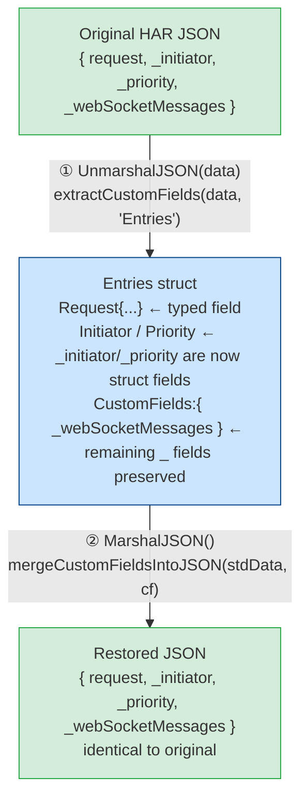
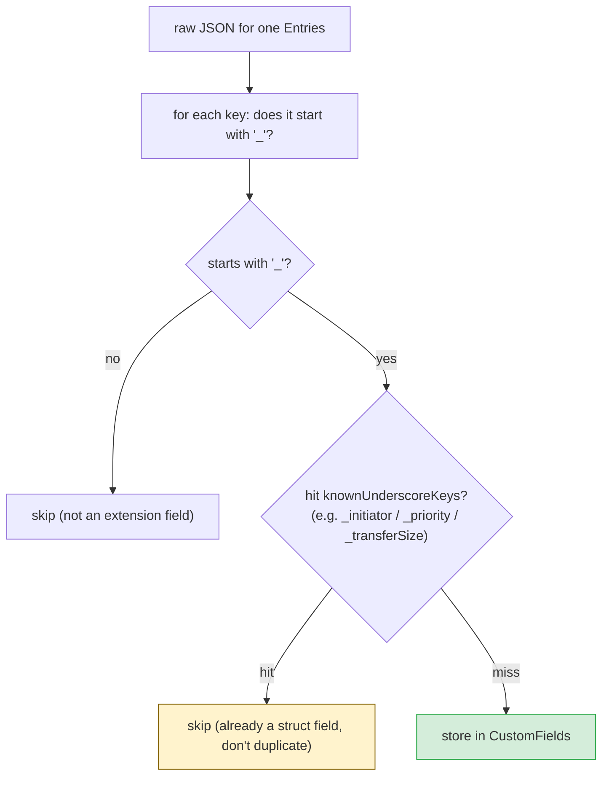
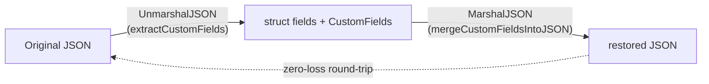

# Custom Fields Round-trip (Extension Field Fidelity)

The HAR spec allows any field whose name starts with `_` to carry custom extension
data — for example Chrome DevTools writes `_initiator`, `_priority`,
`_resourceType`, `_transferSize`. These fields are invaluable for debugging and
deep analysis. This page explains how har-skills performs a **lossless round-trip**
of these extension fields without sacrificing type safety.

## 1. The Problem: Standard `UnmarshalJSON` Drops Unknown Fields

Go's `encoding/json`, when decoding into a struct, silently **discards** keys that
have no corresponding struct field (unless `DisallowUnknownFields` is set). So:

```mermaid
graph LR
  subgraph SRC["Original HAR JSON"]
    direction TB
    J1["&#34;_initiator&#34;: {...}"]
    J2["&#34;_priority&#34;: &#34;High&#34;"]
    J3["&#34;_resourceType&#34;: &#34;xhr&#34;"]
    J4["&#34;request&#34;: {...}"]
  end
  SRC -->|"json.Unmarshal"| DST
  subgraph DST["Parsed into *Har (stdlib default)"]
    direction TB
    D1["// _initiator gone!"]:::bad
    D2["// _priority gone!"]:::bad
    D3["// _resourceType gone!"]:::bad
    D4["Request: Request{...}"]
  end
  classDef bad fill:#f8d7da,stroke:#dc3545
```



For a Chrome HAR file, that means throwing away half the diagnostic value.

## 2. Solution: Custom `UnmarshalJSON`/`MarshalJSON` + `CustomFields`

har-skills implements custom encoding for 9 core types:

| Type        | Carrier                 | Notes                                |
|-------------|-------------------------|--------------------------------------|
| `Har`       | `Har.CustomFields`      | Top-level object                     |
| `Log`       | `Log.CustomFields`      | Log container                        |
| `Entries`   | `Entries.CustomFields`  | A single request/response            |
| `Request`   | `Request.CustomFields`  | Request side                         |
| `Response`  | `Response.CustomFields` | Response side                        |
| `Content`   | `Content.CustomFields`  | Response body                        |
| `Cookie`    | `Cookie.CustomFields`   | Cookie                               |
| `Pages`     | `Pages.CustomFields`    | Page                                 |
| `Timings`   | `Timings.CustomFields`  | Timings                              |
| `Cache`     | `Cache.CustomFields`    | Cache metadata                       |

`CustomFields` is simply a map with convenience methods:

```go
// Collection of custom extension fields; keys start with "_" (HAR spec)
type CustomFields map[string]interface{}
```

### 2.1 Round-trip Flow



<details>
<summary>ASCII backup diagram</summary>

```text
        Original HAR JSON
 ┌───────────────────────────────┐
 │ {                             │
 │   "request": {...},           │   standard JSON fields
 │   "_initiator": {...},        │ ├── handled by struct field → into struct
 │   "_priority": "High",        │ ├── remaining _ fields  → into CustomFields
 │   "_webSocketMessages": [...] │
 │ }                             │
 └───────────────┬───────────────┘
                 │ ① UnmarshalJSON(data)
                 │    extractCustomFields(data, "Entries")
                 ▼
 ┌───────────────────────────────┐
 │ Entries {                     │
 │   Request: Request{...},      │   ← typed field
 │   Initiator: ...,             │   ← _initiator is now a struct field
 │   Priority: "High",           │   ← _priority  is now a struct field
 │   CustomFields: {             │
 │     "_webSocketMessages":...  │   ← remaining _ fields preserved here
 │   }                           │
 │ }                             │
 └───────────────┬───────────────┘
                 │ ② MarshalJSON()
                 │    mergeCustomFieldsIntoJSON(stdData, cf)
                 ▼
 ┌───────────────────────────────┐
 │ {                             │
 │   "request": {...},           │   ← standard fields restored
 │   "_initiator": {...},        │   ← struct fields serialized
 │   "_priority": "High",        │
 │   "_webSocketMessages": [...] │   ← CustomFields merged back
 │ }                             │
 └───────────────────────────────┘
            Restored JSON (identical to original)
```
</details>

The key: **no field is dropped**. Typed fields and extension fields each play their
part.

## 3. `knownUnderscoreKeys`: Avoiding Double Storage

Some `_` fields have been promoted to typed struct fields. For example:

- `Response._transferSize` → `Response.TransferSize` (`int64`)
- `Response._error` → `Response.Error` (`string`)
- `Timings._blocked_queueing` → `Timings.BlockedQueueing`
- `Timings._blocked_proxy` → `Timings.BlockedProxy`
- `Entries._initiator` / `_priority` / `_resourceType` → existing struct fields

If these keys went into **both** the struct and `CustomFields`, serialization would
emit duplicate keys. The `knownUnderscoreKeys` table records "which `_` keys have
already been consumed by a struct field", and `extractCustomFields` skips them:

```go
var knownUnderscoreKeys = map[string]map[string]bool{
    "Response": {"_transferSize": true, "_error": true},
    "Timings":  {"_blocked_queueing": true, "_blocked_proxy": true},
    "Entries":  {"_initiator": true, "_priority": true, "_resourceType": true},
}
```



<details>
<summary>ASCII backup diagram</summary>

```text
                  raw JSON for one Entries
                            │
                            ▼
        ┌───────────────────┴───────────────────┐
        │  for each key: does it start with "_"?│
        └───────────────────┬───────────────────┘
                            │
            ┌───────────────┴───────────────┐
            ▼                               ▼
   hit knownUnderscoreKeys?         remaining _ keys
   (e.g. _initiator / _priority)
            │                               │
            ▼                               ▼
        skip (already a                 store in CustomFields
        struct field, don't duplicate)
```
</details>

## 4. Internal Functions

### `extractCustomFields(data, typeName)`

Pulls `_`-prefixed fields out of raw JSON, skipping known keys:

```go
func extractCustomFields(data []byte, typeName string) CustomFields {
    var raw map[string]json.RawMessage
    if err := json.Unmarshal(data, &raw); err != nil {
        return nil
    }
    known := knownUnderscoreKeys[typeName]
    cf := make(CustomFields)
    for key, value := range raw {
        if !strings.HasPrefix(key, "_") {
            continue
        }
        if known != nil && known[key] {
            continue // handled by a struct field
        }
        var v interface{}
        if err := json.Unmarshal(value, &v); err != nil {
            cf[key] = string(value) // fallback to raw text
        } else {
            cf[key] = v
        }
    }
    if len(cf) == 0 {
        return nil
    }
    return cf
}
```

### `mergeCustomFieldsIntoJSON(stdData, cf)`

Merges `CustomFields` back into standard JSON output during serialization:

```go
func mergeCustomFieldsIntoJSON(stdData []byte, cf CustomFields) ([]byte, error) {
    if len(cf) == 0 {
        return stdData, nil
    }
    var result map[string]json.RawMessage
    if err := json.Unmarshal(stdData, &result); err != nil {
        return nil, WrapJSONUnmarshalError(err)
    }
    for key, value := range cf {
        v, err := json.Marshal(value)
        if err != nil {
            return nil, NewJSONParseError("JSON serialization failed", err)
        }
        result[key] = v
    }
    data, _ := json.Marshal(result)
    return data, nil
}
```

Each type's `UnmarshalJSON`/`MarshalJSON` uses the **type-alias trick** to avoid
recursive calls to itself:

```go
func (e *Entries) UnmarshalJSON(data []byte) error {
    type Alias Entries
    aux := &struct{ *Alias }{Alias: (*Alias)(e)}
    if err := json.Unmarshal(data, aux); err != nil {
        return WrapJSONUnmarshalError(err)
    }
    e.CustomFields = extractCustomFields(data, "Entries")
    return nil
}

func (e Entries) MarshalJSON() ([]byte, error) {
    type Alias Entries
    data, err := json.Marshal(Alias(e)) // alias routes to standard marshaling
    if err != nil {
        return nil, NewJSONParseError("JSON serialization failed", err)
    }
    return mergeCustomFieldsIntoJSON(data, e.CustomFields)
}
```

> Note `MarshalJSON` uses a **value receiver** so that `json.Marshal(h)` hits the
> custom logic whether `h` is a value or a pointer.

## 5. Public API: Reading & Writing Extension Fields

Every type that carries `CustomFields` exposes a consistent accessor set:

| Method                     | Purpose                                |
|----------------------------|----------------------------------------|
| `GetCustomField(name)`     | Get value; returns `nil` if absent     |
| `SetCustomField(name, v)`  | Set (auto-initializes the map)         |
| `HasCustomField(name)`     | Presence check                         |
| `DeleteCustomField(name)`  | Remove                                 |
| `CustomFieldsKeys()`       | All key names                          |

Example: read Chrome's `_webSocketMessages`, then add a custom marker.

```go
package main

import (
    "fmt"
    har "github.com/waystreamer/har-skills"
)

func main() {
    h, err := har.ParseHarFile("chrome-capture.har")
    if err != nil {
        panic(err)
    }

    for i := range h.Log.Entries {
        e := &h.Log.Entries[i]

        // Read a browser extension field
        if v := e.GetCustomField("_webSocketMessages"); v != nil {
            fmt.Printf("[%d] WebSocket messages: %v\n", i, v)
        }

        // Write a custom marker (CustomFields auto-initialized)
        e.SetCustomField("_analyzedBy", "har-skills/v1")
    }

    // Serialize back to JSON; all _ fields (including the new one) are preserved
    out, _ := h.ToJSON(true)
    _ = out
}
```

## 6. Verifying Fidelity via CLI

Use `info` to confirm the file parses, then round-trip with `export json` and check
the `_` keys are still there:

```bash
# 1. Original Chrome HAR (with _initiator / _priority / _resourceType / _transferSize)
har -f chrome.har info

# 2. Export to JSON; extension fields must not be lost
har -f chrome.har export json --index 0 -o entry0.json

# 3. Inspect _ keys with jq
jq 'keys[] | select(startswith("_"))' entry0.json
```

```text
Expected output (example):
"_initiator"
"_priority"
"_resourceType"
"_transferSize"
"_error"
```

## 7. Use Cases

| Scenario                                    | Value                                              |
|---------------------------------------------|----------------------------------------------------|
| Preserve Chrome DevTools extension fields   | Debug resource load order, initiator chains        |
| Preserve Firefox `_sec-fetch-*` metadata    | Security analysis, fingerprinting research         |
| Write custom `_analyzedBy` markers          | Pipeline dedup, provenance tracking                |
| Re-write HAR without losing fields          | Use as intermediate format (redact → transform → …)|

## 8. Caveats

- `CustomFields` values are `interface{}`; nested structures decode into
  `map[string]interface{}` / `[]interface{}` and need type assertions when used.
- `SetCustomField` does not enforce the `_` prefix. The HAR spec only recognizes
  `_`-prefixed keys; non-`_` keys won't be dropped by har-skills but downstream
  tools may not understand them.
- `_` keys already consumed by a struct (see `knownUnderscoreKeys`) do **not**
  appear in `CustomFields`. Access them via the typed field (e.g. `e.Priority`,
  not `e.GetCustomField("_priority")`).

## Summary



With "typed fields for spec keys + `CustomFields` as the `_` extension fallback +
`knownUnderscoreKeys` for dedup", har-skills keeps a strongly-typed API while
preserving arbitrary browser/tool extension fields with full fidelity.
