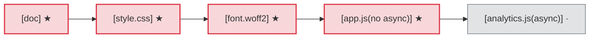
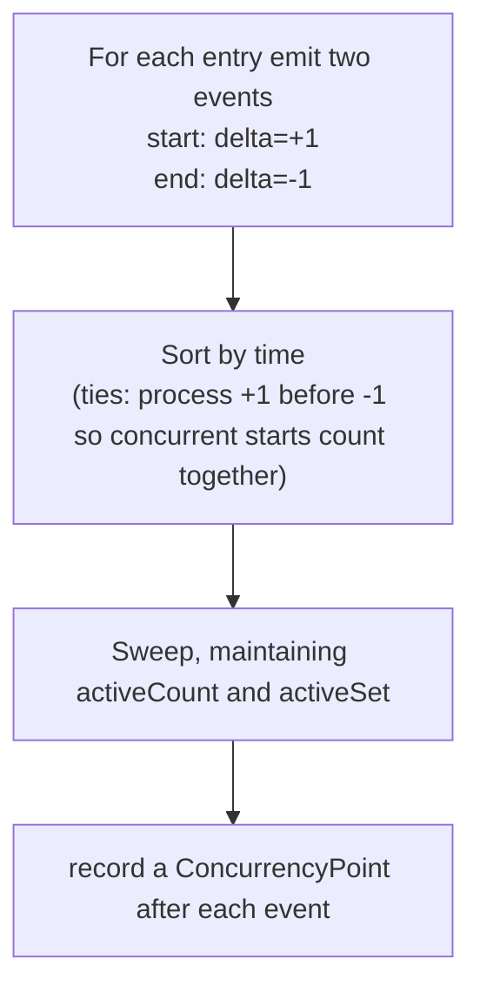
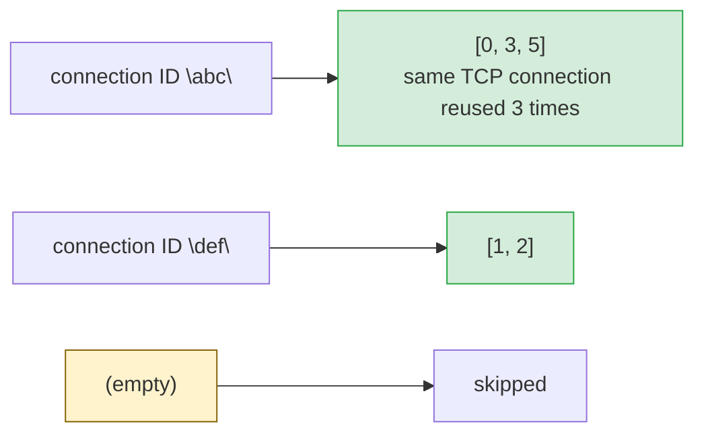

# Waterfall Layering Algorithm

`Waterfall()` is the heart of har-skills' timeline analysis. It reshapes each HAR
entry's timing data into a waterfall structure carrying a **Depth** value, so that
overlapping concurrent requests are **placed on separate layers** instead of
painting over each other. This page breaks down the layering algorithm, critical
path, concurrency timeline, and SLA checking.

## 1. Data Structures

```go
// Per-request timing breakdown
type TimingPhases struct {
    DNS, Connect, SSL, Send, Wait, Receive, Blocked time.Duration
}

// One waterfall record
type WaterfallEntry struct {
    Index      int
    URL        string
    Method     string
    StatusCode int
    StartTime  time.Duration // offset from the first request
    EndTime    time.Duration
    Duration   time.Duration
    Phases     TimingPhases
    Depth      int           // for layered visualization
}
```

All times are **offsets relative to the first request's start**, making horizontal
alignment meaningful.

## 2. The Depth Layering Algorithm

### 2.1 Intuition

If two requests **overlap** in time (the second starts before the first ends),
they should not occupy the same row — otherwise they obscure each other. The
algorithm assigns each entry a `Depth` such that **overlapping requests have
different depths**.

### 2.2 Strict Definition

> For entry `i`: iterate over all `j < i`. If `j`'s `EndTime > i`'s `StartTime`
> (i.e. `j` is still running when `i` starts, so they overlap), then
> `depth_i = max(depth_i, depth_j + 1)`.

Source (`timeline.go`):

```go
for i := range result {
    depth := 0
    for j := 0; j < i; j++ {
        // j overlaps i iff j's end > i's start
        if result[j].EndTime > result[i].StartTime {
            if result[j].Depth+1 > depth {
                depth = result[j].Depth + 1
            }
        }
    }
    result[i].Depth = depth
}
```

### 2.3 Diagram: X-axis = time, Y-axis = Depth

Five requests where e0 overlaps e1 and e2, and e2 partially overlaps e3:

```mermaid
gantt
  title Waterfall layering (X-axis = time ms, Y-axis = Depth)
  dateFormat X
  axisFormat %Lms
  section Depth 0
  e0 (t0→t2) :0, 200
  e4 (t6→t7) :0, 600, 700
  section Depth 1
  e1 (t1→t4) :1, 100, 400
  section Depth 2
  e2 (t2→t5) :2, 200, 500
  section Depth 3
  e3 (t4→t6) :3, 400, 600
```



<details>
<summary>ASCII backup diagram</summary>

```text
Depth
 3 │              ┌──────┐
 2 │        ┌─────┘ e2  │       ┌──────┐
 1 │  ┌─────┘ e1        │ ┌─────┘ e3   │
 0 │──┘e0               └─┘            │──e4──
   └─────────────────────────────────────────── time
     t0    t1    t2    t3    t4    t5    t6
```
</details>

Step-by-step:

| entry | StartTime | EndTime | overlapping j (EndTime>Start_i) | Depth |
|-------|-----------|---------|----------------------------------|-------|
| e0    | t0        | t2      | none (no j<0)                    | 0     |
| e1    | t1        | t4      | e0 (End t2 > t1)                 | max(0, depth_e0+1)=1 |
| e2    | t2        | t5      | e0(t2>t2? no), e1(t4>t2)         | max(0, depth_e1+1)=2 |
| e3    | t4        | t6      | e1(t4>t4? no), e2(t5>t4)         | max(0, depth_e2+1)=3 |
| e4    | t6        | t7      | none (all prior ended)           | 0     |

> Note: the comparison is strict `>`. If `j` ends exactly when `i` starts
> (EndTime == Start), they are considered non-overlapping and may share a layer.

## 3. `CriticalPath()` Critical Rendering Path

Returns `[]WaterfallEntry`, heuristically selecting the **render-blocking** chain:

1. The first (document) request is **always** on the critical path.
2. Each subsequent entry is tested with `isCriticalResource`:
   - **CSS** (`text/css`) → render-blocking, critical;
   - **JS** (`javascript`) → critical only without `async`/`defer` (parser-blocking);
   - **Fonts** (`font/*`, `.woff2`, etc.) → referenced by CSS, critical;
   - Images, `async`/`defer` scripts → **not** critical.



> ★ critical (render-blocking, serially affects LCP), · non-critical

<details>
<summary>ASCII backup diagram</summary>

```text
Critical path example (★ critical, · non-critical):

[doc] ──► [style.css] ──► [font.woff2] ──► [app.js(no async)] ──► [analytics.js(async)]
  ★          ★                 ★                ★                      ·
   └─────────┴─────────────────┴────────────────┘
            critical rendering chain (blocks render, serially affects LCP)
```
</details>

`hasAsyncOrDefer` checks both request headers (`X-Script-Async`/`X-Script-Defer`)
and `Entries.CustomFields` boolean `async`/`defer` markers.

## 4. `ConcurrencyTimeline()` Concurrency Timeline

Returns `[]ConcurrencyPoint`, sampling the live request count at each start/end
event:

```go
type ConcurrencyPoint struct {
    Time          time.Duration
    ActiveCount   int   // concurrent requests at this moment
    ActiveEntries []int // entry indices
}
```

Algorithm: **event stream + sweep line**:

```mermaid
gantt
  title Concurrency timeline (X-axis = time, active requests per row)
  dateFormat X
  axisFormat %Lms
  section e0
  e0 active :0,0, 200
  section e1
  e1 active :1,100, 400
  section e2
  e2 active :2,200, 500
  section e3
  e3 active :3,400, 600
```





<details>
<summary>ASCII backup diagram</summary>

```text
active count
  3 │         ┌──┐              ← peak of e1/e2/e3 overlap
  2 │    ┌────┘  └────┐
  1 │────┘            └────
  0 └──────────────────────► time
       e0              e1 end
         e1 start  e2 start  e3 start
```
</details>

Use cases: spot concurrency spikes, connection-pool saturation, rate-limit triggers.

## 5. `SLACheck(rules) []SLAResult`

```go
type SLARule struct {
    Name       string        // rule name
    URLPattern string        // regex to match URLs; empty = all
    Method     string        // HTTP method filter; empty = all
    MaxTime    time.Duration // max allowed duration
}

type SLAResult struct {
    Rule      SLARule
    Entry     Entries
    Actual    time.Duration
    Passed    bool
    Overshoot time.Duration // how far over the limit
}
```

For each rule, iterate matching entries (URL regex + method), compare
`actual = msToDuration(entry.Time)` against `rule.MaxTime`; on timeout set
`Passed=false` and compute `Overshoot`. A rule with an invalid regex is skipped
without aborting the whole check.

## 6. `PageTimingMetrics()` Page Timings

```go
type PageTimingMetrics struct {
    TTFB             time.Duration // TTFB of the first document request
    DOMContentLoaded time.Duration // from Page.PageTimings.OnContentLoad
    OnLoad           time.Duration // from Page.PageTimings.OnLoad
    TotalTime        time.Duration // earliest start → latest end
    DNSLookup        time.Duration // sum of DNS across all entries
    ConnectTime      time.Duration
    SSLTime          time.Duration
}
```

`TTFB` is the sum of the first entry's `Blocked+DNS+Connect+SSL+Send+Wait` (all
phases before the first byte). `DOMContentLoaded`/`OnLoad` come from the first
`Pages.PageTimings`.

## 7. `ConnectionReuse()` Connection Reuse

```go
func (h *Har) ConnectionReuse() map[string][]int
```

Groups entries by `Entries.Connection` (connection ID); values are entry index
slices. Entries with an empty connection ID are excluded. Use it to analyze
keep-alive pool hits and HTTP/2 multiplexing.



<details>
<summary>ASCII backup diagram</summary>

```text
connection ID "abc"  → [0, 3, 5]   same TCP connection reused 3 times
connection ID "def"  → [1, 2]
(empty)              → skipped
```
</details>

## 8. Negative Values & Unit Conversion

HAR timing fields are stored as **millisecond floats**, with `-1` meaning
"unknown". `msToDuration` converts:

```go
func msToDuration(ms float64) time.Duration {
    if ms < 0 {
        return 0 // -1 etc. collapse to 0, no negative durations pollute the waterfall
    }
    return time.Duration(ms * float64(time.Millisecond))
}
```

## 9. CLI Overview

```bash
# ASCII waterfall (with Depth layering)
har -f capture.har waterfall

# Critical rendering path
har -f capture.har waterfall --critical-path

# Concurrency timeline
har -f capture.har waterfall --concurrency

# Page timing metrics
har -f capture.har waterfall --page-timings

# SLA checks: name:urlPattern:maxDurationMs
har -f capture.har waterfall --sla "API:/api/:2000" "Static:/static/:500"
```

## 10. SDK Example

```go
package main

import (
    "fmt"
    "time"
    har "github.com/waystreamer/har-skills"
)

func main() {
    h, _ := har.ParseHarFile("capture.har")

    // Waterfall (with layered Depth)
    for _, w := range h.Waterfall() {
        fmt.Printf("%*s[%d] %s %dms depth=%d\n",
            w.Depth*2, "", w.Index, w.URL, w.Duration.Milliseconds(), w.Depth)
    }

    // Critical path
    cp := h.CriticalPath()
    fmt.Printf("Critical path: %d requests\n", len(cp))

    // Concurrency timeline peak
    var peak int
    for _, p := range h.ConcurrencyTimeline() {
        if p.ActiveCount > peak {
            peak = p.ActiveCount
        }
    }
    fmt.Println("Concurrency peak:", peak)

    // SLA check
    results := h.SLACheck([]har.SLARule{
        {Name: "API", URLPattern: "/api/", MaxTime: 2 * time.Second},
    })
    for _, r := range results {
        if !r.Passed {
            fmt.Printf("SLA breach: %s %s over by %v\n",
                r.Rule.Name, r.Entry.Request.URL, r.Overshoot)
        }
    }
}
```

## Summary

| Capability              | Data Structure          | Key Algorithm                    |
|-------------------------|-------------------------|----------------------------------|
| Waterfall layering      | `[]WaterfallEntry`      | `depth_i=max(depth_j+1)` overlap |
| Critical path           | `[]WaterfallEntry`      | CSS/sync-JS/font heuristics      |
| Concurrency timeline    | `[]ConcurrencyPoint`    | event stream + sweep line        |
| SLA check               | `[]SLAResult`           | URL regex + duration threshold   |
| Page timings            | `*PageTimingMetrics`    | first-entry TTFB + PageTimings   |
| Connection reuse        | `map[string][]int`      | group by connection ID           |

The core idea: **use Depth to spread time-overlapping requests across layers**,
reconstructing HAR's one-dimensional time series into a readable 2D waterfall.
