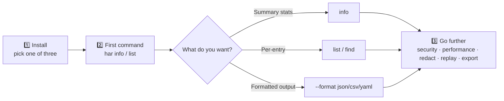
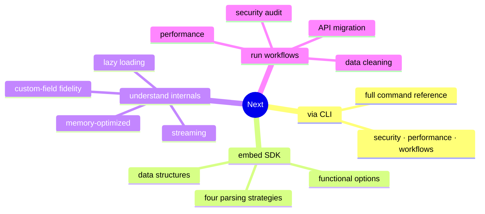

# Quick Start

You can drive HAR Skills in three steps: install the `har` binary → run a summary command on a real HAR → switch output formats or pipe via stdin. Every command below works from the repository root.



## Step 1: Install

Pick any one — full comparison in [Installation](./install.md).

::: code-group

```bash [go install]
go install github.com/waystreamer/har-skills/cmd/har@latest
```

```bash [Pre-built binary (recommended)]
# Linux x86_64
curl -sL https://github.com/waystreamer/har-skills/releases/latest/download/har-skills_0.1.0_linux_x86_64.tar.gz | tar xz
sudo mv har /usr/local/bin/
```

```bash [Build from source]
git clone https://github.com/waystreamer/har-skills.git
cd har-skills
go build -o har ./cmd/har/
```

:::

Verify the install:

```bash
har --version
```

::: tip Make sure it's on PATH
The pre-built path drops `har` into `/usr/local/bin/`, which is usually on PATH. If `har --version` says command not found, add `/usr/local/bin` to PATH, or place the binary in `~/.local/bin` instead.
:::

## Step 2: Your first command

The repo ships `testdata/example.har` — a real, usable sample. Start with a summary:

```bash
har -f testdata/example.har info
```

`info` prints the HAR version, creator, entry count, transfer size, timing percentiles, status-code distribution, method distribution, domain distribution, and content-type distribution.

Now list the first 5 entries:

```bash
har -f testdata/example.har list --limit 5
```

Common filters:

```bash{1,4}
# Only GET requests with 200 responses
har -f testdata/example.har list --method GET --status 200

# Sort by response size, descending
har -f testdata/example.har list --sort size --order desc
```

::: warning Don't forget `-f`
`-f` is a global flag — every command needs the HAR file first (or `-f -` for stdin). Omitting it gives a "no input file" error. You can also pin it with the `HAR_FILE` env var.
:::

## Step 3: stdin and output formats

### Read from stdin

Use `-f -` or omit `-f` to pipe input:

```bash
cat capture.har | har info
cat capture.har | har list --limit 10
```

This is especially handy in CI — one stage produces a HAR, the next hands it straight to `har` without touching disk.

### Output formats

`--format` controls output: `text` (default), `json`, `csv`, `yaml`:

```bash{1,3}
har -f testdata/example.har info --format json
har -f testdata/example.har list --format csv --no-header
har -f testdata/example.har list --format yaml
```

| Format | When to use |
| --- | --- |
| `text` (default) | Reading in a terminal, tabular overview |
| `json` | Piping to `jq` / programmatic consumption / API handoff |
| `csv` | Loading into Excel / spreadsheets for pivots |
| `yaml` | Config-as-data, Git-diff friendly |

### Write to a file

`-o` / `--output` writes results to a file instead of stdout:

```bash{1}
har -f testdata/example.har info --format json -o report.json
har -f testdata/example.har list --format csv -o entries.csv
```

::: tip Environment variables
`HAR_FILE`, `HAR_FORMAT`, and `HAR_OUTPUT` mirror `-f`, `--format`, and `-o` respectively — convenient for pinning formats in CI:

```bash
export HAR_FILE=capture.har HAR_FORMAT=json
har info
```
:::

## Next steps

After the three steps, branch out by your goal:



- All commands: [CLI Reference](./cli/global-flags.md)
- Embed in a Go program: [Go SDK Guide](./sdk/data-structures.md)
- End-to-end scenarios: [Security Audit Workflow](./workflows/security-audit.md), [Performance Workflow](./workflows/performance.md)
- Unfamiliar with HAR fields? Read [HAR Format Primer](./har-basics.md) first
