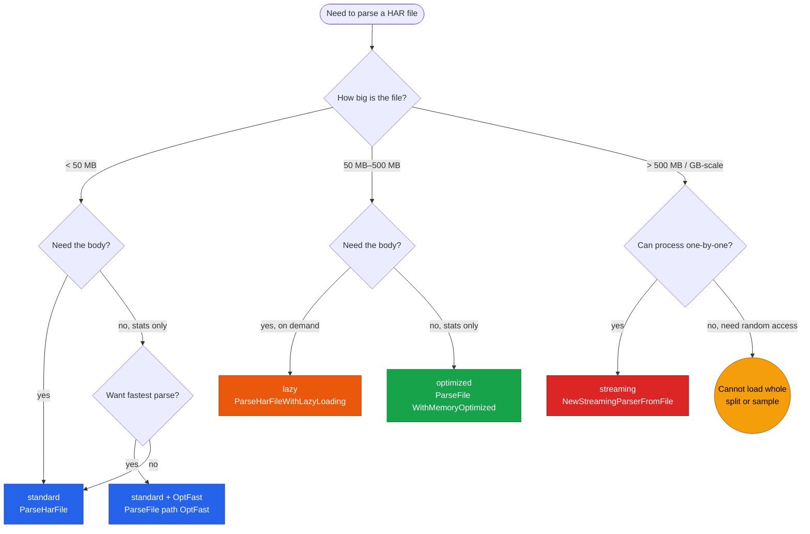
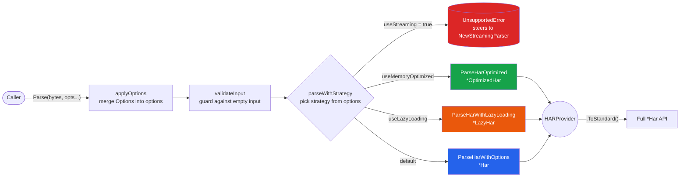

# Parsing Strategies

har-skills offers four parsing strategies for different file sizes and access patterns. They all return values satisfying the `HARProvider` interface, but differ in memory footprint, parse speed, and when response bodies are materialized. Picking the right strategy can compress memory from tens of GB down to tens of MB on a multi-GB file.

## The four strategies at a glance

| Strategy | Entry function | Return type | When body is parsed | Typical scenario |
|----------|----------------|-------------|---------------------|------------------|
| standard | `ParseHarFile` / `ParseHar` | `*Har` | eagerly, in full | small files, default |
| optimized | `ParseHarOptimized` / `ParseHarFileOptimized` | `*OptimizedHar` | eagerly, in full | large files, statistical analysis |
| lazy | `ParseHarWithLazyLoading` / `ParseHarFileWithLazyLoading` | `*LazyHar` | on first access | huge bodies but only metadata needed |
| streaming | `NewStreamingParser` / `NewStreamingParserFromFile` | `EntryIterator` | one entry at a time | GB-scale very large files |

### Strategy decision diagram

Decide along three dimensions — "file size → need body? → memory budget" — layer by layer. Read this diagram first, then cross-check with the decision table below:



::: details The four strategies are not four separate codebases
They are the same type under different storage/access conventions: standard reads and writes the spec structs directly; optimized compresses their representation; lazy defers response bodies to on-demand parsing; streaming drives a `json.Decoder` incrementally and never builds a complete top-level object at all.
:::

## standard: zero-overhead direct read

`standard_impl.go` makes `*Har` itself implement `HARProvider`; the fields are exactly the spec structs — no wrapping, no conversion, no laziness. This is the default path of `ParseHarFile`, and the final destination of every `ToStandard()` call.

```go
import har "github.com/waystreamer/har-skills"

// Parse from a file (standard by default)
h, err := har.ParseHarFile("capture.har")
if err != nil {
    log.Fatal(err)
}
// h is *Har; all fields are immediately accessible
fmt.Println(h.Log.Creator.Name, len(h.Log.Entries))
```

In `standard_impl.go`, `*Har` implements the interface methods directly:

```go
func (h *Har) GetVersion() string         { return h.Log.Version }
func (h *Har) GetEntries() []EntryProvider { ... }
func (h *Har) ToStandard() *Har           { return h } // it IS the standard form
```

`ToStandard()` is the identity operation for the standard implementation — the "zero-overhead" promise: when you do not need to switch strategies, you never pay for abstraction.

## optimized: enum + map + pointer to compress memory

`memory.go` and `optimized_impl.go` rewrite the spec structs into the more compact `*OptimizedHar`:

- **HTTPMethod enum**: `HTTPMethod` is a `uint8`; `ParseMethod("GET")` maps the string to a small integer. Request methods repeat heavily in high-cardinality files, so replacing `string` with `uint8` saves meaningful memory.
- **Headers as map**: `[]Headers` becomes `map[string][]string`, dropping name lookup from O(n) to O(1) — this is why `FindByHeader` stays fast on large files.
- **Optional values as pointers**: `PostData` and `Cache.BeforeRequest` are already pointers; optimized generalizes this idea to more fields, removing the "zero value vs absent" ambiguity.

```go
// Memory-optimized parse
oh, err := har.ParseHarFileOptimized("large.har")
if err != nil {
    log.Fatal(err)
}
// oh is *OptimizedHar and still satisfies HARProvider
fmt.Println(oh.GetVersion(), len(oh.GetEntries()))

// Search by method enum (internally uint8, no string comparison)
gets := oh.SearchByMethod(har.ParseMethod("GET"))
```

`ParseHarOptimized` is implemented as "parse standard first, then convert" — it calls `ParseHar` internally to get a `*Har`, then compresses via `ToOptimizedHar`. So optimized is not faster to parse; its advantage is **subsequent access and resident memory**: when running `Statistics()`, `DomainSummary()`, `FindByDomain()` and similar traversals, smaller objects mean less GC pressure and fewer cache misses.

When you need the full `*Har` API, call `ToStandard()` (or its alias `ToStandardHar()`).

## lazy: defer response bodies

`lazy.go` and `lazy_impl.go`'s `*LazyHar` parses only metadata and defers `Content.Text` (the response body) until first access. It uses a `sync.RWMutex` double-checked lock so concurrent access is safe and parsing happens at most once.

The scenario: each response body is several MB, the whole file is hundreds of MB, but you only care about URLs, status codes, and timings — the bodies will never be read. standard loads all bodies into memory eagerly; lazy allocates that memory on demand.

```go
// Lazy parse
lh, err := har.ParseHarFileWithLazyLoading("big.har")
if err != nil {
    log.Fatal(err)
}

// At this point response bodies are not yet parsed; memory is mostly metadata
for _, ep := range lh.GetEntries() {
    fmt.Println(ep.GetRequest().GetMethod(), ep.GetResponse().GetStatus())
    // Calling GetText() for the first time actually parses that entry's body
    // txt := ep.GetResponse().GetContent().GetText()
}
```

`ToStandard()` on `lazyContentWrapper` / `LazyContent` triggers parsing at conversion time; once parsed, the result is cached and later reads hit the cache. The double-checked lock pattern is roughly:

```go
// Conceptual sketch (simplified from lazy_impl.go)
func (c *LazyContent) GetText() string {
    if c.cached != "" {            // fast path under read lock
        return c.cached
    }
    c.mu.Lock()
    defer c.mu.Unlock()
    if c.cached != "" {            // re-check: another goroutine may have parsed it
        return c.cached
    }
    c.cached = parseBodyNow(c.raw) // actual parse
    return c.cached
}
```

## streaming: json.Decoder incremental advance

`streaming.go` uses `encoding/json`'s `Decoder.Token()` to advance incrementally, yielding one `*Entries` at a time and **never building a top-level `*Har` object**. It returns the `EntryIterator` interface, not `HARProvider` — because streaming fundamentally does not support "get all entries" random access.

The scenario: GB-scale files, you only want to process entries one by one (e.g. importing into a database, running a compliance scan), and memory is very tight.

```go
// Streaming parse
iter, err := har.NewStreamingParserFromFile("huge.har")
if err != nil {
    log.Fatal(err)
}
defer iter.Close()

var count int
for iter.Next() {
    e := iter.Entry() // *Entries
    if e.Response.Status >= 400 {
        count++
        fmt.Println("error entry:", e.Request.URL)
    }
}
if err := iter.Err(); err != nil { // always check iteration errors
    log.Fatal(err)
}
```

The `EntryIterator` interface (`streaming.go`):

```go
type EntryIterator interface {
    Next() bool       // advance to next entry; false when none remain
    Entry() *Entries  // current entry
    Err() error       // error encountered during iteration
    Close() error     // release resources
}
```

::: tip Streaming does not return HARProvider
`streaming` is the only strategy that does not return `HARProvider`. It has no `GetEntries()` / `ToStandard()`, because those would materialize all entries into memory — defeating the purpose. `Parse([]byte, WithStreaming())` returns an `UnsupportedError` that steers you to `NewStreamingParser` instead.
:::

## How Parse() dispatches

`Parse([]byte, opts ...Option)` (`parse.go`) is the functional-style unified entry point. It selects a strategy based on the `Option`s passed and returns `HARProvider`. The data-flow diagram below shows the dispatch path `applyOptions` → `validateInput` → `parseWithStrategy`, with four branches mapping to the four implementations:



```go
func Parse(harFileBytes []byte, opts ...Option) (HARProvider, error) {
    options := applyOptions(opts...)
    if err := validateInput(harFileBytes); err != nil {
        return nil, err
    }
    return parseWithStrategy(harFileBytes, options)
}
```

The dispatch logic of `parseWithStrategy`:

```go
func parseWithStrategy(b []byte, o options) (HARProvider, error) {
    if o.useStreaming {
        return nil, NewUnsupportedError("...please use NewStreamingParser")
    }
    if o.useMemoryOptimized {
        return ParseHarOptimized(b)        // -> *OptimizedHar
    } else if o.useLazyLoading {
        return ParseHarWithLazyLoading(b)  // -> *LazyHar
    }
    return ParseHarWithOptions(b, o.toParseOptions()) // -> *Har
}
```

`ParseFile(path, opts...)` is the file-based wrapper around `Parse`: it reads the file, delegates to `Parse`, and attaches file-path context to errors.

```go
// Pick a strategy with functional options
p, err := har.ParseFile("capture.har", har.WithMemoryOptimized(), har.WithSkipValidation())
if err != nil {
    log.Fatal(err)
}
// p is HARProvider; when you need the full *Har API
h := p.ToStandard()
fmt.Println(h.Statistics().TotalEntries)
```

## Decision table

| File size | Need body? | Memory budget | Recommended strategy | Recommended entry |
|-----------|-----------|---------------|----------------------|-------------------|
| < 50 MB | yes | loose | standard | `ParseHarFile` |
| 50 MB–500 MB | no (stats only) | medium | optimized | `ParseFile(path, WithMemoryOptimized())` |
| 50 MB–500 MB | yes (on demand) | medium | lazy | `ParseHarFileWithLazyLoading` |
| > 500 MB / GB-scale | no (one-by-one) | tight | streaming | `NewStreamingParserFromFile` |
| any | yes, fastest | loose | standard + `OptFast` | `ParseFile(path, OptFast...)` |

A few rules of thumb:

- **When in doubt, use standard.** It is the default, the easiest to reason about for correctness, and every analysis method works on it directly.
- **For heavy statistical analysis on larger files**, prefer optimized. Methods like `SearchByMethod` / `SearchByURL` / `SearchByStatusCode` are faster on maps and enums.
- **When bodies are huge but you probably will not read them**, use lazy. Note: once you call `ToStandard()` and walk the response bodies, the laziness benefit is gone.
- **When the file is too large to load whole**, streaming is the only option. The cost is losing random access and most aggregation methods; process entries one at a time with `iter.Next()` and accumulate stats yourself.

## Next steps

- For the `HARProvider` / `EntryProvider` interface family returned by each strategy, see [Provider interfaces](./providers).
- For the `WithMemoryOptimized` / `WithLazyLoading` / `WithStreaming` options and preset combos, see [Functional options](./functional-options).
