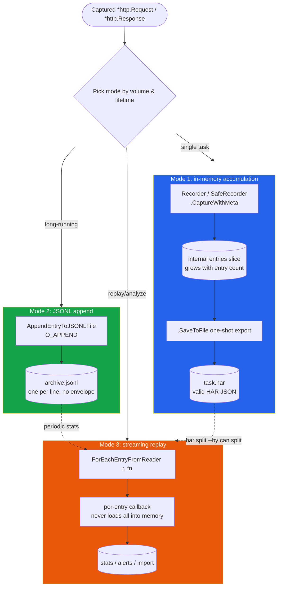
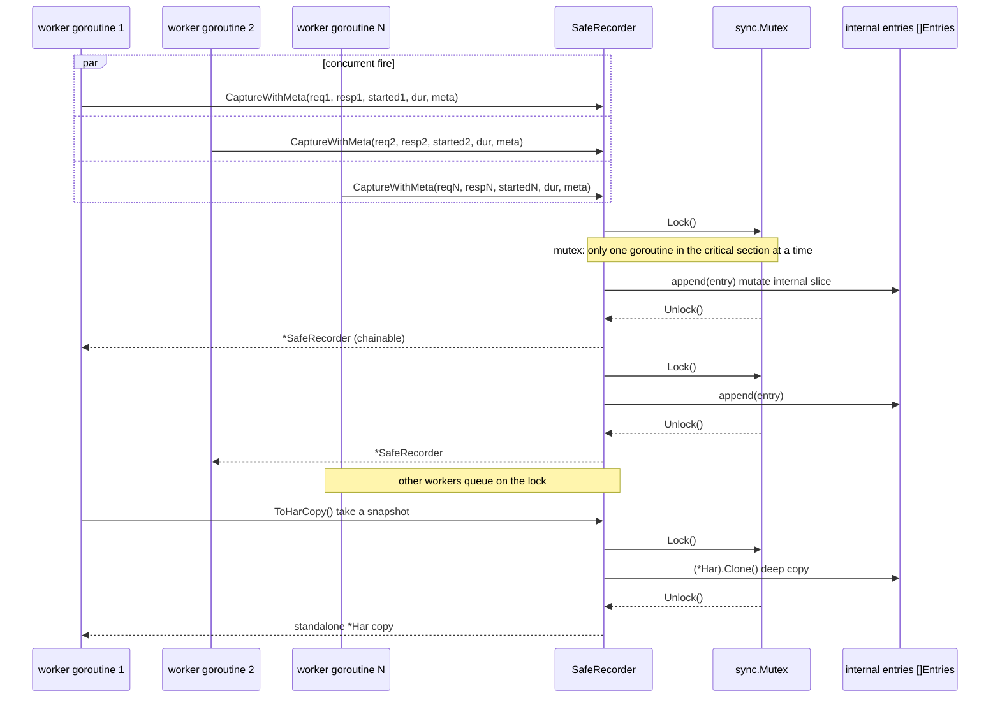
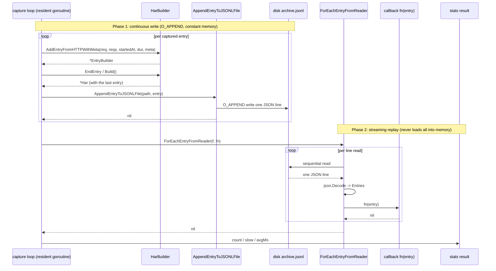

# Recording Requests

`builder.go` and `http_convert.go` provide a set of APIs purpose-built for the "upper-layer capture → archive as HAR" scenario. When this library is wrapped as a low-level library by network security / cyberspace mapping systems, the upper-layer system can hand a captured `*http.Request` / `*http.Response` to it and persist a HAR 1.2-compliant entry in a single call, with no hand-written HAR field mapping. Centered on the "archiving" action, the SDK offers three complementary modes — in-memory accumulation, JSONL continuous append, and streaming replay — covering three deployment shapes: single-task, long-running resident, and ultra-large archives.

## Applicable Scenarios

This library is not typically deployed directly to end users. Instead, it serves as a **low-level library wrapped by upper-layer network security / cyberspace mapping systems**:

- The upper-layer system owns its own capture channel (passive proxy, traffic mirroring, eBPF probe, browser extension CDP...) and already holds a pair of `*http.Request` / `*http.Response`;
- The upper layer often also holds information beyond req/resp — the real request start time, server IP, connection ID, owning page, initiator source (script / parser) — that cannot be reverse-derived from req/resp;
- The archiving target may be "one HAR file per task", or "a 7×24 resident process continuously appending to a JSONL archive".

The APIs on this page are designed exactly for this: `AddEntryFromHTTPWithMeta` accepts the real start time and metadata; `SafeRecorder` ships with a mutex to support multi-goroutine concurrent capture; `AppendEntryToJSONLFile` / `ForEachEntryFromReader` solve the memory and replay problems of long-term archiving.

## Three Archiving Modes

Choose a mode by "entry volume + process lifetime":

```
┌─────────────────────────────────────────────────────────────────────┐
│           Where should the captured req / resp be written?          │
└─────────────────────────────────────────────────────────────────────┘
        │
        │ Bounded entries (single task < tens of thousands)? ── yes ──→ Mode 1
        │                                                        In-memory accumulation
        │                                                        + one-shot export
        │                                                        Recorder / SafeRecorder
        │                                                        .CaptureWithMeta(...)
        │                                                        .SaveToFile("task.har")
        │
        │ Long-running, write one per capture, constant memory? ── yes ──→ Mode 2
        │                                                        JSONL continuous append
        │                                                        AppendEntryToJSONLFile
        │                                                        ("archive.jsonl", entry)
        │
        │ Need to replay/analyze a huge JSONL archive? ──────── yes ──→ Mode 3
                                                       Streaming read of archive
                                                       ForEachEntryFromReader
                                                       (r, fn(entry) error)
```

Comparison of the three modes:

| Dimension | Mode 1 In-memory | Mode 2 JSONL append | Mode 3 Streaming replay |
|-----------|------------------|---------------------|--------------------------|
| Best for | Single task, bounded entries | Long-running, low memory | Replay/analyze huge archives |
| Core API | `Recorder` / `SafeRecorder` | `AppendEntryToJSONLFile` | `ForEachEntryFromReader` |
| Memory | Grows linearly with entry count | Constant (single entry size) | Constant (single entry size) |
| Output | Valid HAR JSON (with envelope) | JSONL (one per line, no envelope) | Produces nothing, only consumes |
| Write timing | One-shot `SaveToFile` after batching | Write each entry immediately on capture | No writes, read only |
| Concurrency-safe | Use `SafeRecorder` | File-level `O_APPEND` atomic append | Single reader, sequential |
| Crash cost | All unsaved entries lost | At most the entry being written | Read-only, no write risk |

### Data-flow comparison of the three modes

The decision tree above, drawn as Mermaid — all three modes start from the same "captured req/resp" entry point and diverge into different storage and replay paths:



::: tip Modes compose
Real deployments often combine them: a resident process uses Mode 2 to continuously append JSONL; periodically uses Mode 3 for streaming statistics; for split tasks uses `har split --by` to convert the JSONL into multiple standard HAR files (Mode 1 output) for downstream analysis.
:::

## Archiving from \*http.Request / \*http.Response

`HarBuilder` exposes two entry points; the difference is "whether you can pass the real start time and metadata":

| Entry point | startedDateTime | Metadata | Returns | Best for |
|-------------|-----------------|----------|---------|----------|
| `AddEntryFromHTTP(req, resp, duration)` | Hardcoded `time.Now()` | Not accepted | `*HarBuilder` | Quick compatibility, timing not important |
| `AddEntryFromHTTPWithMeta(req, resp, startedAt, duration, meta)` | Caller supplies real value | `EntryMeta` | `*EntryBuilder` | Mapping-system archiving (recommended) |

The fatal limitation of the legacy entry `AddEntryFromHTTP` is that `startedDateTime` is taken as "now" — by the time the upper layer captures req it may already be hundreds of milliseconds old, and under dense capture the timing of multiple entries gets scrambled. The new entry `AddEntryFromHTTPWithMeta` accepts `startedAt` (the moment the request was actually initiated) and `EntryMeta` (server IP / connection ID / pageref / initiator / priority / resourceType, etc.), and returns `*EntryBuilder` for post-hoc customization.

`EntryMeta` field overview:

```go
type EntryMeta struct {
    ServerIPAddress string // HAR field serverIPAddress
    Connection      string // HAR field connection, links entries reusing the same connection
    Pageref         string // Owning page reference, must match an id registered with AddPage
    InitiatorType   string // Chrome extension _initiator.type, e.g. "script"/"parser"/"other"
    InitiatorURL    string // _initiator.url
    InitiatorLine   int    // _initiator.lineNumber
    Priority        string // Chrome extension _priority, e.g. "High"/"Low"
    ResourceType    string // Chrome extension _resourceType, e.g. "xhr"/"script"
    Comment         string // Entry comment
}
```

Full example — the upper layer has `req / resp / startedAt / duration`, uses the new entry to archive and customize afterwards, then persists:

```go
package main

import (
    "fmt"
    "net/http"
    "os"
    "time"

    har "github.com/waystreamer/har-skills"
)

// capture is a bundle of data the upper mapping system captured:
// besides req/resp it also has the real start time, duration, and peer IP.
type capture struct {
    req       *http.Request
    resp      *http.Response
    startedAt time.Time
    duration  time.Duration
    serverIP  string
    connID    string
}

func archiveOne(c capture) error {
    b := har.NewHarBuilder().
        SetCreator("cyberprobe-agent", "1.4.2").
        SetBrowser("traffic-mirror", "0.3")

    // New entry: pass real startedAt + metadata, returns *EntryBuilder for post-hoc customization
    b.AddEntryFromHTTPWithMeta(
        c.req, c.resp, c.startedAt, c.duration,
        har.EntryMeta{
            ServerIPAddress: c.serverIP,
            Connection:      c.connID,
            ResourceType:    "xhr",
            Priority:        "High",
        },
    ).
        // Post-hoc customization: add a tracing header injected by the upper-layer proxy
        AddRequestHeader("X-Probe-Trace", "probe-42").
        EndEntry()

    return b.BuildAndSave("task.har", true)
}

func main() {
    // Pretend the upper layer captured one entry
    req, _ := http.NewRequest("GET", "https://api.example.com/v1/scan", nil)
    req.Header.Set("Authorization", "Bearer secret-token")
    resp := &http.Response{
        StatusCode: 200,
        Proto:      "HTTP/1.1",
        Header:     http.Header{"Content-Type": []string{"application/json"}},
        Body:       http.NoBody,
    }

    if err := archiveOne(capture{
        req:       req,
        resp:      resp,
        startedAt: time.Now().Add(-250 * time.Millisecond),
        duration:  120 * time.Millisecond,
        serverIP:  "203.0.113.10",
        connID:    "conn-7",
    }); err != nil {
        fmt.Fprintln(os.Stderr, err)
        os.Exit(1)
    }
}
```

::: tip Recorder vs HarBuilder
`Recorder` internally holds a `HarBuilder`; the `Capture*` family of methods forward to the builder and additionally provide convenience wrappers like `SaveToFile` / `EntryCount` / `ToHar`. But `Recorder` does not expose the internal builder — **to get the `*EntryBuilder` returned by `AddEntryFromHTTPWithMeta` for post-hoc customization, use `har.NewHarBuilder()` directly** — as the example above does. The two paths produce equivalent output; which to choose depends on whether you need to customize the entry afterwards.
:::

## Concurrent Archiving (SafeRecorder)

Cyberspace mapping systems typically do **multi-goroutine concurrent capture**: one goroutine per traffic-mirror tap, or multiple workers processing different sessions in parallel. `Recorder` is unlocked internally; concurrent `Capture` calls directly will trigger `map`/slice concurrent-read-write crashes. `SafeRecorder` adds a `sync.Mutex` to every read/write method, ready to use out of the box:

The diagram below shows how the mutex serializes concurrent access to the internal `entries` slice when multiple goroutines call `CaptureWithMeta`:



| `SafeRecorder` method | Purpose |
|-----------------------|---------|
| `NewSafeRecorder() *SafeRecorder` | Create a concurrency-safe recorder |
| `SetCreator(name, version) *SafeRecorder` | Set creator |
| `SetBrowser(name, version) *SafeRecorder` | Set browser |
| `Capture(req, resp, duration) *SafeRecorder` | Compatibility entry (startedDateTime is "now") |
| `CaptureWithMeta(req, resp, startedAt, duration, meta) *SafeRecorder` | With real start time + metadata |
| `CaptureEntry(entry Entries) *SafeRecorder` | Append a pre-built entry directly (never touches any body) |
| `EntryCount() int` | Number of recorded entries |
| `ToHar() *Har` | Internal pointer (may be mutated by later Capture, use with care) |
| `ToHarCopy() *Har` | Deep-copy snapshot (recommended for concurrent scenarios) |
| `SaveToFile(path) error` | Save as indented JSON |
| `SaveToFileWithOptions(path, indent, gzip) error` | Optional indent + gzip |

Full example — N worker goroutines capture concurrently, the main goroutine waits for all then exports:

```go
package main

import (
    "fmt"
    "net/http"
    "sync"
    "time"

    har "github.com/waystreamer/har-skills"
)

func main() {
    rec := har.NewSafeRecorder().
        SetCreator("cyberprobe-distributed", "2.0").
        SetBrowser("passive-mirror", "0.5")

    const workers = 8
    var wg sync.WaitGroup
    wg.Add(workers)

    for i := 0; i < workers; i++ {
        go func(id int) {
            defer wg.Done()

            // Each worker simulates capturing a handful of entries
            for j := 0; j < 50; j++ {
                req, _ := http.NewRequest("GET",
                    fmt.Sprintf("https://api.example.com/scan/%d", j), nil)
                resp := &http.Response{
                    StatusCode: 200,
                    Proto:      "HTTP/1.1",
                    Header:     http.Header{"Content-Type": []string{"application/json"}},
                    Body:       http.NoBody,
                }

                started := time.Now()
                // Multi-goroutine-safe archiving, with real start time + metadata
                rec.CaptureWithMeta(
                    req, resp, started, 80*time.Millisecond,
                    har.EntryMeta{
                        ServerIPAddress: fmt.Sprintf("203.0.113.%d", id),
                        Connection:      fmt.Sprintf("conn-%d-%d", id, j%4),
                        ResourceType:    "xhr",
                    },
                )
            }
        }(i)
    }

    wg.Wait()

    fmt.Printf("archived %d entries\n", rec.EntryCount())

    // One-shot export of standard HAR
    if err := rec.SaveToFile("distributed.har"); err != nil {
        fmt.Println("save failed:", err)
        return
    }

    // To take a stable snapshot mid-archive (without waiting for all workers), use ToHarCopy
    snapshot := rec.ToHarCopy()
    fmt.Printf("snapshot entries: %d\n", len(snapshot.Log.Entries))
}
```

::: warning ToHar vs ToHarCopy
`ToHar()` returns the internal `*Har` pointer — it is taken under the lock, but the lock is no longer held once returned. If another goroutine calls `Capture` at that moment, the slice you hold may be mid-mutation. **For snapshots during concurrent archiving, always use `ToHarCopy()`** (internally `(*Har).Clone()` deep copy). Only use `ToHar()` when all capture goroutines have stopped and you are sure no one is writing.
:::

## Long-term Continuous Archiving (JSONL Append)

The soft spot of Mode 1 is "you must batch everything before persisting": a resident process running for a week accumulates a million entries in memory before `SaveToFile` — that blows memory and makes the crash cost unbearable, with all unsaved entries lost.

Mode 2 solves this with JSON Lines (one entry's JSON object per line): capture one entry, immediately `O_APPEND` one line; if the process crashes you lose at most the entry being written. Core APIs:

| Function | Purpose |
|----------|---------|
| `WriteEntryToWriter(w, entry) error` | Write a single entry as one JSONL line to any `io.Writer` |
| `AppendEntryToJSONLFile(path, entry) error` | `O_APPEND` to a file; auto-creates if missing; constant memory |
| `ForEachEntryFromReader(r, fn) error` | Stream-read JSONL, invoke callback per entry, never loads all into memory |
| `ReadEntriesFromReader(r) ([]Entries, error)` | Read everything into a slice at once (only for small archives) |
| `WriteEntriesToWriter(har, w) error` | Write all entries of a `*Har` as JSONL |
| `(*Har).ToJSONLines() (string, error)` | Same as above but returns a string |

The sequence diagram below shows the full lifecycle of "resident capture loop → write to disk → later streaming replay"; writing and replaying are two independent phases:



Example — a resident loop captures one and writes one, then uses `ForEachEntryFromReader` for streaming statistics:

```go
package main

import (
    "fmt"
    "net/http"
    "os"
    "time"

    har "github.com/waystreamer/har-skills"
)

func main() {
    archivePath := "long-running.jsonl"
    _ = os.Remove(archivePath) // clean up last run

    // Pretend this is a resident capture loop: each captured request appends a line
    for i := 0; i < 10000; i++ {
        req, _ := http.NewRequest("GET",
            fmt.Sprintf("https://api.example.com/scan/%d", i), nil)
        resp := &http.Response{
            StatusCode: 200,
            Proto:      "HTTP/1.1",
            Header:     http.Header{"Content-Type": []string{"application/json"}},
            Body:       http.NoBody,
        }

        started := time.Now()
        // First build the entry with builder (consumes req/resp.body), then append to file
        b := har.NewHarBuilder()
        b.AddEntryFromHTTPWithMeta(
            req, resp, started, 50*time.Millisecond,
            har.EntryMeta{
                ServerIPAddress: "203.0.113.10",
                ResourceType:    "xhr",
            },
        ).EndEntry()

        // AddEntryFromHTTPWithMeta already placed the entry into the builder's har;
        // here we take the last one and append it to the JSONL file
        built := b.Build()
        if err := har.AppendEntryToJSONLFile(
            archivePath, built.Log.Entries[len(built.Log.Entries)-1],
        ); err != nil {
            fmt.Fprintln(os.Stderr, "append failed:", err)
        }
    }

    // Replay: streaming statistics, never loading all into memory
    f, err := os.Open(archivePath)
    if err != nil {
        fmt.Fprintln(os.Stderr, err)
        return
    }
    defer f.Close()

    var count, slow int
    var totalMs float64
    err = har.ForEachEntryFromReader(f, func(e har.Entries) error {
        count++
        totalMs += e.Time
        if e.Time > 40 {
            slow++
        }
        return nil
    })
    if err != nil {
        fmt.Fprintln(os.Stderr, "replay failed:", err)
        return
    }
    fmt.Printf("replayed %d entries, %d slow (>40ms), avg %.1fms\n",
        count, slow, totalMs/float64(count))
}
```

::: tip Write to any Writer
`AppendEntryToJSONLFile` wraps `os.OpenFile(O_APPEND)`; if your archive backend is not a local file (e.g. a network socket, a Kafka producer), use the lower-level `WriteEntryToWriter(w, entry)` to write a line directly.
:::

## Binary Response Body Handling

Archived responses are not always text JSON. Binary bodies like images, fonts, video, `octet-stream` — if you stuff them into HAR's `Content.Text` via `string(bodyBytes)` directly, JSON serialization will corrupt the bytes and the round-trip cannot restore them.

The new API auto-detects this inside `addEntryFromHTTPImpl`:

```go
// Internal logic in builder.go (excerpt)
mimeType := resp.Header.Get("Content-Type")
content := Content{Size: len(bodyBytes), MimeType: mimeType}
if isTextContentType(mimeType) {
    content.Text = string(bodyBytes)          // Text: store as-is
} else {
    content.Text = base64.StdEncoding.EncodeToString(bodyBytes)
    content.Encoding = "base64"              // Binary: base64-encoded
}
```

Detection rules of `isTextContentType` (see `http_convert.go`):

| Content-Type | Verdict |
|--------------|---------|
| `text/*`, or contains `json`/`xml`/`javascript`/`urlencoded`/`form-data` | Text |
| `application/*` and does not contain `image`/`audio`/`video`/`font`/`octet-stream`/`pdf`/`zip`/`gzip` | Text |
| `image/*`, `audio/*`, `video/*`, `font/*`, `application/octet-stream`, etc. | Binary (base64) |
| Empty value | Treated as text (backward-compatible) |

Callers do nothing — pass in `resp` and the SDK reads the body, detects, encodes, and `Close`s in one pass. Downstream HAR readers see `Content.Encoding == "base64"` and know to `base64.StdDecode` to restore.

## Assembling an Entry Yourself

`AddEntryFromHTTPWithMeta` consumes `req.Body` / `resp.Body` and completes all mapping. But some upper-layer systems have already parsed the fields themselves (e.g. reassembled headers, cookies, postData from a traffic mirror) and don't want the SDK to `io.ReadAll` again. For these cases, three exported helpers let you assemble manually:

| Helper | Input | Output | Side effect |
|--------|-------|--------|-------------|
| `HeadersFromHTTP(http.Header) []Headers` | `net/http` headers | HAR headers slice (multi-values expanded, case preserved) | None |
| `CookiesFromHTTP([]*http.Cookie) []Cookie` | `net/http` cookies | HAR cookies (Name/Value/Path/Domain/HTTPOnly/Secure) | None |
| `PostDataFromRequest(*http.Request) (*PostData, int)` | `http.Request` | PostData + body byte count | **Consumes and Closes `req.Body`** |

`PostDataFromRequest` auto-detects `Content-Type`: `application/x-www-form-urlencoded` is parsed into `PostData.Params`; everything else goes into `PostData.Text`.

Example — the upper layer already has parsed fields; assemble the entry manually and append to JSONL:

```go
package main

import (
    "bytes"
    "io"
    "net/http"
    "os"
    "time"

    har "github.com/waystreamer/har-skills"
)

func main() {
    // Pretend the upper layer has already reassembled headers and doesn't want the SDK to touch the body
    httpReq, _ := http.NewRequest("POST",
        "https://api.example.com/v1/report", nil)
    httpReq.Header = http.Header{
        "Content-Type":  []string{"application/x-www-form-urlencoded"},
        "Authorization": []string{"Bearer xyz"},
    }
    httpReq.Body = io.NopCloser(bytes.NewReader([]byte("id=42&src=probe")))
    // Note: PostDataFromRequest consumes req.Body; this is just a demo

    // Reuse the exported helpers without touching other entry fields
    headers := har.HeadersFromHTTP(httpReq.Header)
    postData, bodySize := har.PostDataFromRequest(httpReq)
    cookies := har.CookiesFromHTTP(httpReq.Cookies())

    entry := har.Entries{
        StartedDateTime: time.Now(),
        Time:            42,
        Request: har.Request{
            Method:      httpReq.Method,
            URL:         httpReq.URL.String(),
            HTTPVersion: httpReq.Proto,
            Headers:     headers,
            Cookies:     cookies,
            PostData:    postData,
            HeadersSize: har.EstimateHeaderSize(headers),
            BodySize:    bodySize,
        },
        Response: har.Response{HeadersSize: -1, BodySize: -1},
        Timings:   har.Timings{Wait: 42, Blocked: -1, DNS: -1, Connect: -1, Send: -1, Receive: -1, Ssl: -1},
    }

    // Manually append to a JSONL archive
    if err := har.AppendEntryToJSONLFile("manual.jsonl", entry); err != nil {
        os.Exit(1)
    }
}
```

::: tip Why BodySize must be fetched separately
The second value returned by `PostDataFromRequest` is the body byte count, which is exactly `Request.BodySize`. `AddEntryFromHTTPWithMeta` fills it the same way internally — don't forget to set this field when assembling yourself, or HAR's body size will default to `-1`.
:::

## Important Notes

::: warning AddEntryFromHTTP\* consumes and closes req.Body / resp.Body
`AddEntryFromHTTP` / `AddEntryFromHTTPWithMeta` / `PostDataFromRequest` all `io.ReadAll` then `Close` the request and response bodies internally. **If the upper layer still needs the response body after archiving (e.g. for content matching, writing another log), you must cache a copy before the call:**

```go
// Cache a copy of resp.Body: archive uses the original, the business uses the copy
bodyBytes, _ := io.ReadAll(resp.Body)
resp.Body.Close()

// Archive: the SDK will read and Close this reset body again
resp.Body = io.NopCloser(bytes.NewReader(bodyBytes))
rec.CaptureWithMeta(req, resp, startedAt, dur, meta)

// Business side continues to use the copy
useBody(bodyBytes)
```

Empty bodies like `http.NoBody` are unaffected (`isNilReader` detects nil and skips).
:::

::: warning ToHar() returns an internal pointer; use ToHarCopy() for concurrent scenarios
`SafeRecorder.ToHar()` takes the pointer under the lock but does not hold it after returning — another goroutine's `Capture` may be mutating the underlying slice. **For snapshots during concurrent archiving, always use `ToHarCopy()`** (internally `(*Har).Clone()` deep copy); only use `ToHar()` when you are sure all capture goroutines have stopped.
:::

::: warning JSONL is not valid HAR JSON
A JSONL archive has one independent `Entries` JSON object per line and **lacks the `{"log": {...}}` envelope required by the HAR spec** — parsing it directly with `har.ParseHarFile()` will fail. JSONL is for append-only archiving and streaming replay (`ForEachEntryFromReader` / `ReadEntriesFromReader`) only. To produce a spec-compliant standard HAR file consumable by any HAR tool, use `Recorder.SaveToFile` or `SafeRecorder.SaveToFile`.
:::

## Next Steps

- Hand the archive off to the analysis module: see [Filtering & Chaining](./filtering) to find specific entries, and [Export](./export) to convert to curl/Postman.
- Run a security audit after archiving: `SecurityAudit()` / `CookieAudit()`, see [Data Structures](./data-structures).
- Manage long-term archives by splitting: the CLI `har split --by time --interval 30m` breaks a large archive into manageable chunks.
