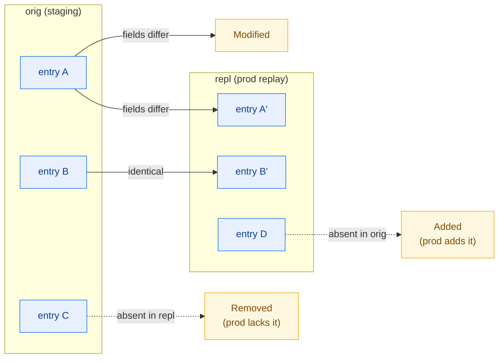
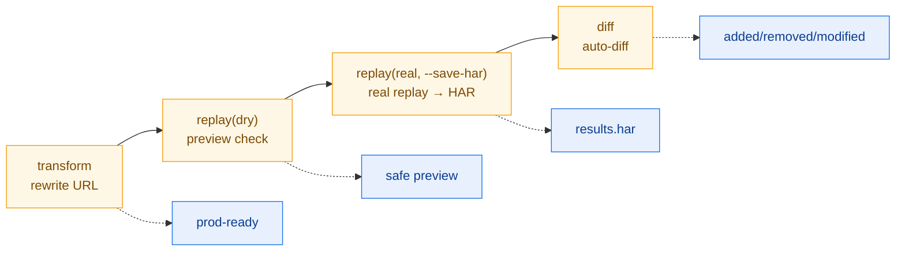

# API Migration Testing Workflow

Rewrite a staging capture to point at prod, dry-run the replay, then execute it
for real and save the results as a HAR — finally diffing against the original to
automatically surface behavioral differences. Suited to API version upgrades,
domain changes, and HTTP→HTTPS migrations.

## Workflow Overview

```mermaid
flowchart LR
    STG["staging.har<br/>(staging capture)"]:::input
    I["1. info<br/>inspect counts/domains/status"]:::step
    T["2. transform<br/>--rewrite-url to prod"]:::step
    PR["prod-ready.har<br/>(points at prod)"]:::art
    DR["3. replay --dry-run<br/>preview, no send"]:::step
    RP["4. replay --save-har<br/>real replay"]:::step
    RES["results.har<br/>(real responses)"]:::art
    DF["5. diff<br/>original vs replay"]:::step
    REP["behavioral diff report<br/>added/removed/modified"]:::done

    STG --> I --> T --> PR
    PR --> DR
    PR --> RP --> RES
    DR -. "verified" .-> RP
    RES --> DF
    PR -. "compare" .-> DF
    DF --> REP

    classDef input fill:#e8f0fe,stroke:#1a73e8,color:#0b3d91
    classDef step fill:#fff7e6,stroke:#f59e0b,color:#7c4a03
    classDef art fill:#f6f8fa,stroke:#6b7280,color:#24292f
    classDef done fill:#e6f4ea,stroke:#1e8e3e,color:#0d652d
```



::: warning This workflow sends real requests
Step 3's `--dry-run` sends no traffic, but step 4's `replay` (without `--dry-run`) issues real requests against prod. Always dry-run first to verify URLs and counts before firing for real.
:::

| Step | CLI command                                                    | SDK method                        |
|------|----------------------------------------------------------------|-----------------------------------|
| 1    | `har -f staging.har info`                                      | `h.Statistics()` / `h.Summary()`  |
| 2    | `har -f staging.har transform --rewrite-url "a->b" -o ...`     | `h.RewriteURL(from, to)`          |
| 3    | `har -f prod-ready.har replay --dry-run`                       | `e.Replay(opts)` (no send)        |
| 4    | `har -f prod-ready.har replay --timeout 10s --save-har ...`    | `e.Replay(opts)`                  |
| 5    | `har diff staging.har results.har --compare-by-url`           | `har.Diff(h1, h2, opts)`          |

## Step 1: Inspect the Staging Capture

### CLI

```bash
har -f staging.har info              # overview: counts, domains, statuses, timing pct
har -f staging.har info --format json
```

### SDK

```go
h, _ := har.ParseHarFile("staging.har")
fmt.Println(h.Summary())             // text summary
stats := h.Statistics()
fmt.Printf("requests=%d domains=%d\n", stats.RequestCount, len(stats.Domains))
```

Goal: confirm the capture is complete and covers the API paths you are migrating.

## Step 2: Rewrite URLs to prod

### CLI

```bash
har -f staging.har transform \
    --rewrite-url "http://staging.example.com->https://api.example.com" \
    -o prod-ready.har
```

`--rewrite-url` takes `from->to` and does a substring replace on every entry's
URL. Stack multiple `--rewrite-url`, plus `--change-scheme "http->https"`,
`--remove-header`, `--add-header "X-Env:prod"`, etc.

### SDK

```go
// Rewrites every URL; returns a new *Har (original untouched)
prodReady := h.RewriteURL(
    "http://staging.example.com",
    "https://api.example.com",
)
// layer more transforms
prodReady = prodReady.RemoveHeaders([]string{"Authorization"})
prodReady = prodReady.AddHeaders(map[string]string{"X-Env": "prod"}, "request")
```

`RewriteURL` returns a **cloned `*Har`** — the staging capture is not mutated
(har-skills' "return a new instance" convention). For complex batch transforms use
`h.Transform(rules)` with `[]TransformRule`
(`TransformURLRewrite`/`TransformHeaderRemove`/...).

## Step 3: Dry-Run Preview (no requests sent)

### CLI

```bash
har -f prod-ready.har replay --dry-run
```

`--dry-run` converts each entry to an `http.Request` and prints it **without
sending** — a final check that URL/Header/Body rewrites are correct.

### SDK equivalent

```go
for i := range prodReady.Log.Entries {
    e := &prodReady.Log.Entries[i]
    req, err := e.ToHTTPRequest()   // build only, don't send
    if err != nil {
        log.Printf("[%d] %v", i, err)
        continue
    }
    fmt.Printf("[%d] %s %s\n", i, req.Method, req.URL)
}
```

`ToHTTPRequest()` is an `Entries` method that rebuilds a stdlib `*http.Request`
(method, URL, Header, Cookie, PostData.Body, Content-Type).

## Step 4: Real Replay, Save as HAR

### CLI

```bash
har -f prod-ready.har replay \
    --timeout 10s \
    --skip-ssl \
    --header "Authorization:Bearer ${PROD_TOKEN}" \
    --save-har results.har \
    --filter "api/"
```

Key flags: `--timeout`, `--no-follow-redirects`, `--max-redirects`, `--skip-ssl`,
`--header "K:V"` (override request headers, repeatable), `--index N` (single
entry), `--filter pat` (URL substring filter), `--save-har` (write replay results
to a new HAR).

### SDK

```go
opts := har.DefaultReplayOptions()
opts.Timeout = 10 * time.Second
opts.SkipSSLVerify = true
opts.OverrideHeaders = map[string]string{
    "Authorization": "Bearer " + os.Getenv("PROD_TOKEN"),
}

for i := range prodReady.Log.Entries {
    e := &prodReady.Log.Entries[i]
    result, err := e.Replay(opts)   // actually send
    if err != nil {
        log.Printf("[%d] %v", i, err)
        continue
    }
    fmt.Printf("[%d] %d  %v\n", i, result.Response.StatusCode, result.Duration)
    _ = result.Response.Body.Close()
}
```

`Replay` is an `Entries` method returning `*ReplayResult`:

```go
type ReplayResult struct {
    Entry    *Entries       // original entry
    Response *http.Response // HTTP response
    Duration time.Duration  // actual elapsed
    Error    error
    Index    int
}
```

CLI's `--save-har` back-fills each `ReplayResult`'s response into a new `Entries`
and serializes it as a HAR — which is the input to step 5's diff.

## Step 5: Diff Original vs Replay Results

### CLI

```bash
har diff staging.har results.har --compare-by-url
```

Common flags: `--compare-by-url` (match by URL rather than index),
`--include-body` (compare response bodies), `--ignore-headers Cookie,Date`,
`--ignore-timings`, `--ignore-dates`.

### SDK

```go
orig, _ := har.ParseHarFile("staging.har")
repl, _ := har.ParseHarFile("results.har")

diffOpts := har.DefaultDiffOptions()
diffOpts.CompareByURL = true
diffOpts.IgnoreHeaders = []string{"Cookie", "Date", "Set-Cookie"}

d := har.Diff(orig, repl, diffOpts)
fmt.Println(d.Report("text"))   // or "json" / "csv" / "markdown"
fmt.Printf("total changes: %d\n", d.TotalChanges())
```

`Diff` returns `*HarDiff`, classifying changes into `Added`/`Removed`/`Modified`;
`Report(format)` outputs text/JSON/CSV/Markdown; `HasChanges()` is a clean CI-gate
boolean.

### Diff categories



## End-to-End Script

```bash
#!/usr/bin/env bash
# api-migration.sh — staging→prod URL rewrite + dry-run + replay + diff
set -euo pipefail

STAGING="${1:?staging.har path}"
PROD_BASE="${2:-https://api.example.com}"
STAGING_BASE="${3:-http://staging.example.com}"
WORKDIR="$(mktemp -d)"
trap 'rm -rf "$WORKDIR"' EXIT

PROD_READY="$WORKDIR/prod-ready.har"
RESULTS="$WORKDIR/results.har"
DIFF_REPORT="$WORKDIR/diff.txt"

echo "==> 1/5 staging overview"
har -f "$STAGING" info

echo "==> 2/5 rewrite URL: $STAGING_BASE -> $PROD_BASE"
har -f "$STAGING" transform \
    --rewrite-url "${STAGING_BASE}->${PROD_BASE}" \
    --change-scheme "http->https" \
    -o "$PROD_READY"

echo "==> 3/5 dry-run preview (no requests sent)"
har -f "$PROD_READY" replay --dry-run | head -20

echo "==> 4/5 real replay, save as HAR"
har -f "$PROD_READY" replay \
    --timeout 10s \
    --skip-ssl \
    --header "Authorization:Bearer ${PROD_TOKEN:-CHANGEME}" \
    --save-har "$RESULTS"

echo "==> 5/5 diff original vs replay (match by URL)"
har diff "$STAGING" "$RESULTS" \
    --compare-by-url \
    --ignore-headers Cookie,Date,Set-Cookie \
    --ignore-timings \
    | tee "$DIFF_REPORT"

cp "$RESULTS" ./results.har 2>/dev/null || true
cp "$DIFF_REPORT" ./diff.txt 2>/dev/null || true
echo "done: results.har + diff.txt"
```

Run it:

```bash
export PROD_TOKEN="eyJhbGciOi..."
./api-migration.sh staging.har https://api.example.com http://staging.example.com
```

## CI Gate Example

Turn "migration must not introduce behavioral changes" into a CI check.

::: warning CLI diff exit code is unreliable
The CLI `diff` exits 0 regardless of whether there are changes, so it cannot be used directly as a gate. For a strict gate, use the SDK's `HasChanges()`:
:::

```go
d := har.Diff(orig, repl, diffOpts)
if d.HasChanges() {
    fmt.Println(d.Report("text"))
    log.Fatalf("migration introduced %d changes", d.TotalChanges())
}
```

## SDK End-to-End Equivalent

```go
package main

import (
    "fmt"
    "log"
    "os"
    "time"
    har "github.com/waystreamer/har-skills"
)

func main() {
    // 1. Parse staging
    staging, err := har.ParseHarFile("staging.har")
    if err != nil {
        log.Fatal(err)
    }

    // 2. Rewrite URLs (cloned; original untouched)
    prodReady := staging.RewriteURL(
        "http://staging.example.com",
        "https://api.example.com",
    )

    // 3 & 4. Replay
    opts := har.DefaultReplayOptions()
    opts.Timeout = 10 * time.Second
    opts.OverrideHeaders = map[string]string{
        "Authorization": "Bearer " + os.Getenv("PROD_TOKEN"),
    }
    for i := range prodReady.Log.Entries {
        e := &prodReady.Log.Entries[i]
        res, err := e.Replay(opts)
        if err != nil {
            log.Printf("[%d] %v", i, err)
            continue
        }
        fmt.Printf("[%d] %d %v\n", i, res.Response.StatusCode, res.Duration)
        res.Response.Body.Close()
    }

    // 5. diff (real replay results come from the --save-har product)
    repl, _ := har.ParseHarFile("results.har")
    diffOpts := har.DefaultDiffOptions()
    diffOpts.CompareByURL = true
    d := har.Diff(staging, repl, diffOpts)
    fmt.Println(d.Report("text"))
    if d.HasChanges() {
        fmt.Printf("migration introduced %d changes\n", d.TotalChanges())
    }
}
```

## Output Artifacts

| File             | Source                        | Use                           |
|------------------|-------------------------------|-------------------------------|
| `prod-ready.har` | `transform --rewrite-url`     | Replayable capture aimed at prod |
| `results.har`    | `replay --save-har`           | Real prod response record     |
| `diff.txt`       | `har diff`                    | Behavioral diff report        |

## Summary



::: tip Four-step pipeline
- **transform** moves the capture from the staging domain to prod, fully cloned.
- **replay --dry-run** is the last check before pulling the trigger.
- **replay --save-har** freezes real prod responses into a diffable HAR.
- **diff** matches by URL to quantify "did migration change behavior?".

Together they turn migration from manual eyeballing into a repeatable, gated pipeline.
:::
