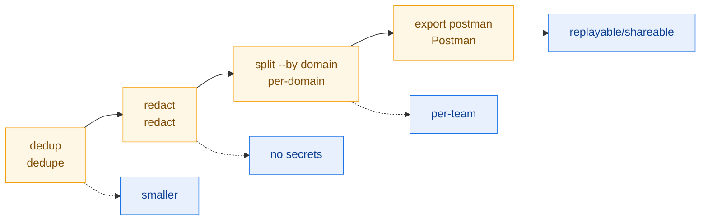

# Data Cleaning & Sharing Workflow

Turn a raw, noisy, sensitive, and bulky capture into a deduplicated, redacted,
per-domain-split, Postman-importable set of artifacts. This workflow chains
dedup, redact, split, and export — each step with its CLI command and SDK
equivalent.

## Workflow Overview

```mermaid
flowchart LR
    RAW["raw.har<br/>bulky/dupes/secrets"]:::input
    DD["1. dedup --remove<br/>deduplicate"]:::step
    DED["deduped.har"]:::art
    RD["2. redact --redact-ips<br/>redact"]:::step
    CL["clean.har"]:::art
    SP["3. split --by domain<br/>split per domain"]:::step
    SH["per-domain_*.har<br/>per-domain files"]:::art
    EX["4. export postman<br/>export collection"]:::step
    COL["collection.json<br/>(Postman)"]:::done

    RAW --> DD --> DED --> RD --> CL --> SP --> SH --> EX --> COL

    classDef input fill:#e8f0fe,stroke:#1a73e8,color:#0b3d91
    classDef step fill:#fff7e6,stroke:#f59e0b,color:#7c4a03
    classDef art fill:#f6f8fa,stroke:#6b7280,color:#24292f
    classDef done fill:#e6f4ea,stroke:#1e8e3e,color:#0d652d
```



::: tip Workflow goal
Turn a raw, noisy, sensitive, and bulky capture into a deduplicated, redacted, per-domain-split, Postman-importable set of artifacts.
:::

| Step | CLI command                                       | SDK method                        |
|------|---------------------------------------------------|-----------------------------------|
| 1    | `har -f raw.har dedup --remove -o deduped.har`    | `h.Deduplicate(opts)`             |
| 2    | `har -f deduped.har redact --redact-ips -o ...`   | `h.Redact(opts)`                  |
| 3    | `har -f clean.har split --by domain -o per-domain`| `h.SplitByDomain()`               |
| 4    | `har -f clean.har export postman -o collection.json` | `h.ToPostmanCollection()`      |

## Step 1: Deduplicate

### CLI

```bash
# Default pattern strategy, ignoring cache-buster params (_, cb, timestamp…),
# keeping the first occurrence
har -f raw.har dedup --remove -o deduped.har

# Find only, don't remove (preview duplicates)
har -f raw.har dedup

# Exact URL matching
har -f raw.har dedup --strategy exact

# Content-hash matching (includes response body)
har -f raw.har dedup --strategy content-hash --compare-body
```

Strategy comparison:

::: info Three dedup strategies
| Strategy           | Match key                        | Use case                              |
|--------------------|----------------------------------|---------------------------------------|
| `exact`            | full URL string                  | strictly identical requests           |
| `pattern` (default)| URL minus ignored params         | same request ignoring cache busters   |
| `content-hash`     | SHA-256 of URL+headers+body      | identical request/response pairs      |

`--ignore-param` adds params to ignore; `--compare-headers`/`--compare-body` broaden the comparison.
:::

### SDK

```go
h, _ := har.ParseHarFile("raw.har")

// Default: pattern strategy + common cache busters
deduped := h.Deduplicate(har.DefaultDeduplicateOptions())

// Custom: exact URL, ignore ts
opts := har.DeduplicateOptions{
    Strategy:     har.DedupExactURL,
    IgnoreParams: []string{"ts"},
}
deduped = h.Deduplicate(opts)

// Find only, don't remove
groups := h.FindDuplicates(opts)
for _, g := range groups {
    fmt.Printf("dup %d times: %s (entries: %v)\n", g.Count, g.Key, g.EntryIndices)
}
```

`Deduplicate` returns a **cloned `*Har`** keeping the **first** entry of each
duplicate group; `FindDuplicates` analyzes without mutating, returning
`[]DuplicateGroup`.

## Step 2: Redact

### CLI

```bash
har -f deduped.har redact --redact-ips -o clean.har
```

Optional: `--header X-Custom`, `--cookie session`, `--query-param token`,
`--post-field secret`, `--replacement "***"`.

### Default redaction targets

| Category       | Default matches (case-insensitive)                          |
|----------------|-------------------------------------------------------------|
| Headers        | Authorization, Proxy-Authorization, WWW-Authenticate, Cookie, Set-Cookie, X-Api-Key, X-Auth-Token, X-CSRF-Token |
| Cookies        | session, token, auth, password, secret, api_key, access_token, refresh_token |
| QueryParams    | password, token, api_key, secret, access_token, refresh_token, private_key, client_secret |
| PostDataFields | same as QueryParams                                         |
| IPs            | `--redact-ips`: IPv4 last octet `.0`, IPv6 last segment `:0`|

### SDK

```go
opts := har.DefaultRedactOptions()
opts.RedactIPs = true
clean := deduped.Redact(opts)   // returns a new *Har; deduped untouched
data, _ := clean.ToJSON(true)
os.WriteFile("clean.har", data, 0644)
```

`Redact` does `Clone()` + `RedactInPlace` internally, so the source is safe. See
[Security Audit Workflow](/en/workflows/security-audit) step 3 for details.

## Step 3: Split by Domain

### CLI

```bash
# Split by domain; outputs per-domain_api.example.com.har, per-domain_static.example.com.har, ...
har -f clean.har split --by domain -o per-domain

# Other dimensions
har -f clean.har split --by page
har -f clean.har split --by time --interval 30m
har -f clean.har split --by size --max-entries 50
har -f clean.har split --by status
har -f clean.har split --by method
```

`-o` is the output prefix; each shard is named `<prefix>_<key>.har`.

### SDK

```go
byDomain := clean.SplitByDomain()   // map[string]*Har
for domain, sub := range byDomain {
    data, _ := sub.ToJSON(true)
    name := fmt.Sprintf("per-domain_%s.har", domain)
    os.WriteFile(name, data, 0644)
}

// Other split dimensions
_ = clean.SplitByPage()                    // map[string]*Har
_ = clean.SplitByTimeRange(time.Hour)      // []*Har
_ = clean.SplitBySize(50)                  // []*Har
_ = clean.SplitByStatusCode()              // map[string]*Har
_ = clean.SplitByMethod()                  // map[string]*Har
```

`SplitByDomain` groups entries by the host of `Request.URL`; each group becomes
an independent `*Har` (carrying the original creator/version metadata), ideal for
distributing to different teams.

## Step 4: Export as a Postman Collection

### CLI

```bash
har -f clean.har export postman -o collection.json
```

Other export formats: `curl`, `wget`, `python`, `xml`, `yaml`, `json`, `jsonl`,
`csv`, `markdown`, `html`, `text`.

### SDK

```go
// ToPostmanCollection returns a Postman v2.1 collection as []byte
data, err := clean.ToPostmanCollection()
if err != nil {
    log.Fatal(err)
}
os.WriteFile("collection.json", data, 0644)
```

The exported collection can be `Import`ed straight into Postman; each entry
becomes a request with method, URL, headers, body. Combined with step 2's
redaction, sharing it with the team is safe.

## End-to-End Script

```bash
#!/usr/bin/env bash
# data-cleaning.sh — dedup → redact → split by domain → export Postman
set -euo pipefail

RAW="${1:?usage: data-cleaning.sh <raw.har>}"
WORKDIR="$(mktemp -d)"
OUTDIR="./cleaned-$(date +%Y%m%d-%H%M%S)"
trap 'rm -rf "$WORKDIR"' EXIT

DEDUPED="$WORKDIR/deduped.har"
CLEAN="$WORKDIR/clean.har"

echo "==> 1/4 dedup (pattern strategy, keep first)"
echo "  duplicate groups: $(har -f "$RAW" dedup | grep -c '^' || echo 0)"
har -f "$RAW" dedup --remove -o "$DEDUPED"
echo "  entries after dedup: $(har -f "$DEDUPED" info --format json | jq -r '.request_count // empty')"

echo "==> 2/4 redact (+ IP anonymization)"
har -f "$DEDUPED" redact --redact-ips -o "$CLEAN"

echo "==> 3/4 split by domain"
mkdir -p "$OUTDIR"
har -f "$CLEAN" split --by domain -o "$OUTDIR/per-domain"
echo "  shard files:"
ls -1 "$OUTDIR"/per-domain_*.har 2>/dev/null | sed 's/^/    /'

echo "==> 4/4 export Postman collection"
har -f "$CLEAN" export postman -o "$OUTDIR/collection.json"

echo "----------------------------------------"
echo "artifacts dir: $OUTDIR"
ls -1 "$OUTDIR"
```

Run it:

```bash
chmod +x data-cleaning.sh
./data-cleaning.sh raw.har
```

## SDK End-to-End Equivalent

```go
package main

import (
    "fmt"
    "log"
    "os"
    "path/filepath"
    har "github.com/waystreamer/har-skills"
)

func main() {
    h, err := har.ParseHarFile("raw.har")
    if err != nil {
        log.Fatal(err)
    }

    // 1. Dedup (pattern strategy + default cache busters)
    deduped := h.Deduplicate(har.DefaultDeduplicateOptions())

    // 2. Redact
    redactOpts := har.DefaultRedactOptions()
    redactOpts.RedactIPs = true
    clean := deduped.Redact(redactOpts)

    // 3. Split by domain
    outDir := "cleaned"
    os.MkdirAll(outDir, 0755)
    for domain, sub := range clean.SplitByDomain() {
        data, _ := sub.ToJSON(true)
        name := filepath.Join(outDir, fmt.Sprintf("per-domain_%s.har", domain))
        os.WriteFile(name, data, 0644)
    }

    // 4. Export Postman
    data, err := clean.ToPostmanCollection()
    if err != nil {
        log.Fatal(err)
    }
    os.WriteFile(filepath.Join(outDir, "collection.json"), data, 0644)
    fmt.Println("cleaned/ directory produced")
}
```

## Output Artifacts

| File                          | Source                  | Use                              |
|-------------------------------|-------------------------|----------------------------------|
| `deduped.har`                 | `dedup --remove`        | Deduplicated intermediate        |
| `clean.har`                   | `redact --redact-ips`   | Safe-to-share HAR                |
| `per-domain_<host>.har`       | `split --by domain`     | Per-team/domain shards           |
| `collection.json`             | `export postman`        | Postman-importable collection    |

## Summary



::: tip Four-step preflight
- **dedup** uses the pattern strategy to filter out cache-buster-induced false duplicates — halving size first.
- **redact** strips Authorization/Cookie/tokens/IPs, cloning so the original is untouched.
- **split --by domain** carves the big file into slices each team cares about.
- **export postman** turns the HAR into a Postman collection for team replay and regression.

Together they turn "one dirty, huge capture" into "a set of clean, least-privilege, replayable artifacts" — the standard preflight for data sharing and regression testing.
:::
