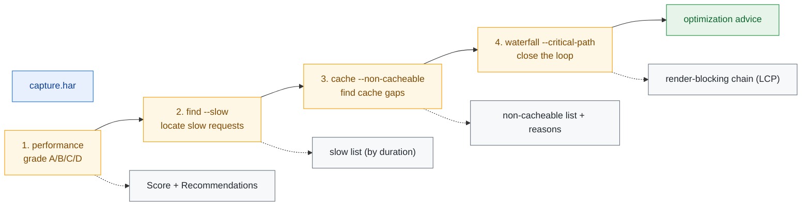
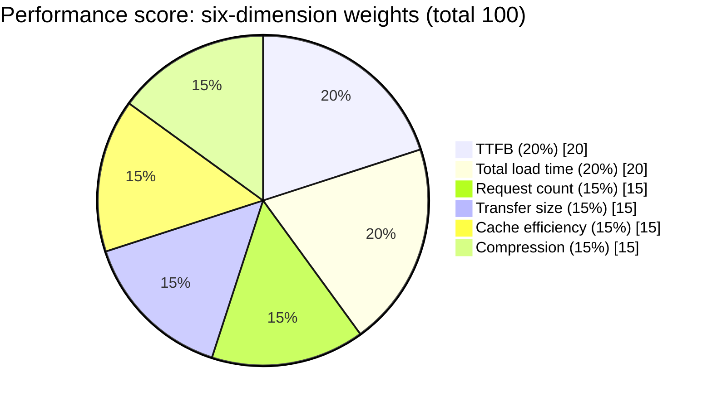
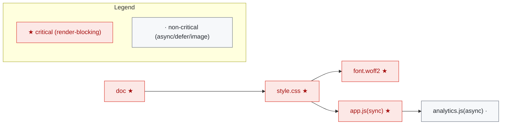
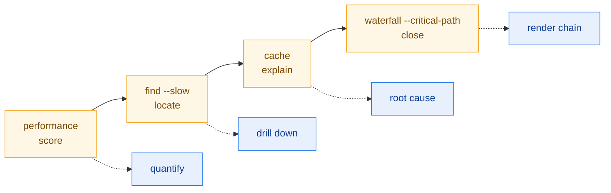

# Performance Optimization Workflow

This workflow scores a capture, locates slow requests, diagnoses cache gaps, and
closes the loop with the waterfall critical path. Lighthouse-style scoring plus
drill-down localization — well suited to regression gates and perf iterations.

## Workflow Overview



::: tip Workflow fit
Lighthouse-style scoring plus drill-down localization — well suited to regression gates and perf iterations.
:::

| Step | CLI command                                            | SDK method                                    |
|------|--------------------------------------------------------|-----------------------------------------------|
| 1    | `har -f capture.har performance`                       | `h.PerformanceScore()`                        |
| 2    | `har -f capture.har find --slow 1000`                  | `h.FindSlowRequests(1000)`                    |
| 3    | `har -f capture.har cache --non-cacheable`             | `h.CacheAnalysis()`                           |
| 4    | `har -f capture.har waterfall --critical-path --page-timings` | `h.Waterfall()` / `h.CriticalPath()` / `h.PageTimingMetrics()` |

## Step 1: Performance Score

### CLI

```bash
har -f capture.har performance              # text: score + advice
har -f capture.har performance --format json
```

### SDK

```go
h, _ := har.ParseHarFile("capture.har")
perf := h.PerformanceScore()        // *PerformanceReport
fmt.Println("Grade:", perf.Grade()) // "A" / "B" / "C" / "D"
fmt.Println("Score:", perf.Score)
```

### Score Composition

Lighthouse-style, weighted:



| Dimension         | Weight | Concern                              |
|-------------------|--------|--------------------------------------|
| TTFB              | 20%    | Time to first byte                   |
| Total load time   | 20%    | earliest start → latest end          |
| Request count     | 15%    | total requests                       |
| Transfer size     | 15%    | total bytes                          |
| Cache efficiency  | 15%    | cacheable fraction                   |
| Compression       | 15%    | gzip/br on text resources            |

`Grade()` maps the numeric score to A/B/C/D; `Recommendations` lists actionable
improvements.

## Step 2: Locate Slow Requests

### CLI

```bash
# Slower than 1s
har -f capture.har find --slow 1000

# Top 10 slowest
har -f capture.har find --slowest 10
```

### SDK

```go
slow := h.FindSlowRequests(1000)   // *FilterResult; threshold in ms
for _, e := range slow.SortByDurationDesc().Limit(10).GetAll() {
    fmt.Printf("%-60s %dms\n", e.Request.URL, int64(e.Time))
}
```

`FindSlowRequests(minDuration float64)` returns a `*FilterResult` that chains with
`SortByDurationDesc().Limit(n)` — har-skills' standard chained filter API.

## Step 3: Cache Analysis

### CLI

```bash
har -f capture.har cache                    # full cache analysis
har -f capture.har cache --non-cacheable    # non-cacheable only
```

### SDK

```go
cache := h.CacheAnalysis()         // *CacheReport
for _, item := range cache.NonCacheable {
    fmt.Printf("non-cacheable: %s  reason: %s\n", item.URL, item.Reason)
}
```

### What it checks

Per entry it evaluates `Cache-Control`, `Expires`, `ETag`, `Last-Modified`,
`Vary` to determine cacheability (`public`/`private`/`no-store`/`no-cache`/
`max-age`, ...), flagging:

- resources that should be cached but use `no-store`;
- static assets missing `Cache-Control`;
- `Vary` misconfiguration hurting hit rate.

## Step 4: Critical Path & Page Timings

### CLI

```bash
har -f capture.har waterfall --critical-path --page-timings
```

### SDK

```go
// Waterfall (with Depth layering)
for _, w := range h.Waterfall() {
    fmt.Printf("%*s[%d] %v\n", w.Depth*2, "", w.Index, w.Duration)
}

// Critical rendering path
cp := h.CriticalPath()

// Page timings
m := h.PageTimingMetrics()
fmt.Printf("TTFB=%v  DCL=%v  OnLoad=%v  Total=%v\n",
    m.TTFB, m.DOMContentLoaded, m.OnLoad, m.TotalTime)
```

### What the critical path is

`CriticalPath()` heuristically selects the **render-blocking** chain:



::: info Heuristics
- **CSS** (`text/css`) → critical;
- **sync JS** (no `async`/`defer`) → critical;
- **fonts** → critical (CSS-referenced);
- images, `async`/`defer` scripts → non-critical.
:::

`Waterfall()` also computes a `Depth` per entry so overlapping requests land on
different layers and don't paint over each other. See
[Waterfall Layering Algorithm](/en/internals/waterfall).

## End-to-End Script

```bash
#!/usr/bin/env bash
# performance.sh — score + slow requests + cache + critical path
set -euo pipefail

HAR="${1:?usage: performance.sh <capture.har>}"
WORKDIR="$(mktemp -d)"
trap 'rm -rf "$WORKDIR"' EXIT

echo "==> 1/4 performance score"
har -f "$HAR" performance --format json -o "$WORKDIR/perf.json"
har -f "$HAR" performance        # console text summary

echo "==> 2/4 slow requests (>1000ms), top 15"
har -f "$HAR" find --slowest 15 -o "$WORKDIR/slow.txt"

echo "==> 3/4 non-cacheable resources"
har -f "$HAR" cache --non-cacheable -o "$WORKDIR/non-cacheable.txt"

echo "==> 4/4 critical path + page timings"
har -f "$HAR" waterfall --critical-path --page-timings -o "$WORKDIR/waterfall.txt"

echo "----------------------------------------"
echo "artifacts:"
ls -1 "$WORKDIR"
cp "$WORKDIR"/* ./ 2>/dev/null || true
echo "perf.json holds Score/Grade/Recommendations — usable as a CI gate"
```

Run it:

```bash
chmod +x performance.sh
./performance.sh capture.har
```

## CI Gate Example

Wire the score into CI so regressions fail the build:

```bash
#!/usr/bin/env bash
set -euo pipefail
HAR="${1:?path to HAR file}"

# 1. Grade must be at least B
GRADE=$(har -f "$HAR" performance --format json | jq -r '.grade // empty')
case "$GRADE" in
    A|B) echo "perf grade $GRADE, passing" ;;
    *)   echo "perf grade $GRADE, below B, CI failing" >&2; exit 1 ;;
esac

# 2. No request slower than 2s
SLOW=$(har -f "$HAR" find --slow 2000 --format json | jq 'length')
if [ "$SLOW" -gt 0 ]; then
    echo "found $SLOW request(s) slower than 2s" >&2
    exit 1
fi
```

## SDK End-to-End Equivalent

```go
package main

import (
    "fmt"
    "log"
    har "github.com/waystreamer/har-skills"
)

func main() {
    h, err := har.ParseHarFile("capture.har")
    if err != nil {
        log.Fatal(err)
    }

    // 1. Score
    perf := h.PerformanceScore()
    fmt.Printf("Grade=%s Score=%d\n", perf.Grade(), perf.Score)

    // 2. Slow requests
    for _, e := range h.FindSlowRequests(1000).SortByDurationDesc().Limit(10).GetAll() {
        fmt.Printf("  slow: %s %dms\n", e.Request.URL, int64(e.Time))
    }

    // 3. Cache
    cache := h.CacheAnalysis()
    fmt.Printf("non-cacheable: %d\n", len(cache.NonCacheable))

    // 4. Critical path + page timings
    cp := h.CriticalPath()
    m := h.PageTimingMetrics()
    fmt.Printf("critical path %d requests, TTFB=%v, OnLoad=%v\n",
        len(cp), m.TTFB, m.OnLoad)
}
```

## Output Artifacts

| File                 | Content                              | Use                |
|----------------------|--------------------------------------|--------------------|
| `perf.json`          | Score/Grade/Recommendations          | CI gate, trends    |
| `slow.txt`           | Top-N slowest requests               | Optimization targets |
| `non-cacheable.txt`  | Non-cacheable resources + reasons    | Cache-policy gaps  |
| `waterfall.txt`      | Waterfall + critical path + timings  | Visualization, reporting |

## Summary



::: tip Four-step loop
- **Score** sets the overall level and grade — good for gating.
- **find --slow** grounds the abstract score in concrete URLs.
- **cache** explains the cache-related portion of "why slow".
- **waterfall --critical-path** closes the loop on the render-blocking chain — the direct lever for LCP/FCP.

Walking the four steps takes you from "the score is bad" to "fix these specific requests" as a complete loop.
:::
