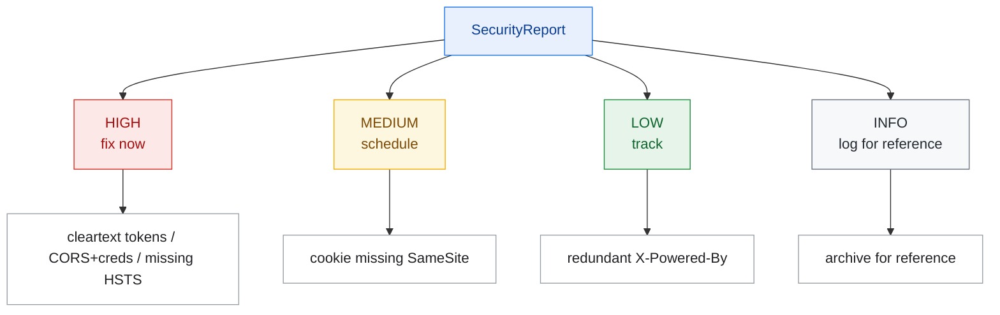
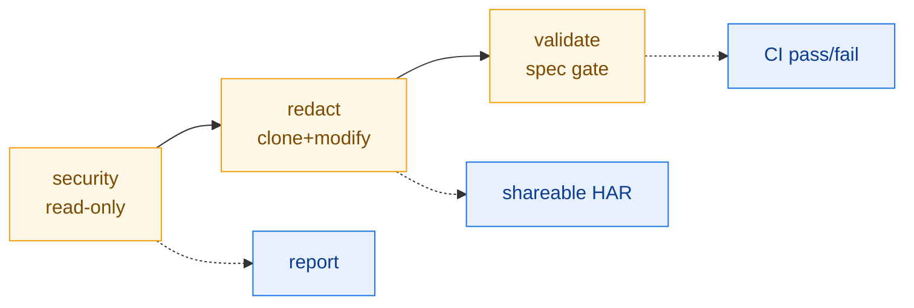

# Security Audit Workflow

From a raw HAR capture to a shareable, redacted, and validated security report —
this workflow chains har-skills' audit, redaction, and validation capabilities.
Each step lists the CLI command, the underlying SDK method, and what is actually
happening.

## Workflow Overview

```mermaid
flowchart LR
    HAR["capture.har<br/>(raw capture)"]:::input
    subgraph S1["1. Audit"]
        A1["har security"]:::step
        A2["Score 0-100<br/>findings × severity"]:::out
    end
    subgraph S2["2. Redact"]
        B1["har redact --redact-ips"]:::step
        B2["redacted.har<br/>secrets stripped"]:::out
    end
    subgraph S3["3. Validate"]
        C1["har validate --strict"]:::step
        C2["pass / fail + errors"]:::out
    end
    HAR --> A1 --> A2
    A2 -- "triage by HIGH/MEDIUM/LOW/INFO" --> B1 --> B2
    B2 --> C1 --> C2
    C2 -. "pass" .-> SHARE["shareable redacted.har"]:::done
    C2 -. "fail" .-> FIX["review redaction config"]:::warn

    classDef input fill:#e8f0fe,stroke:#1a73e8,color:#0b3d91
    classDef step fill:#fff7e6,stroke:#f59e0b,color:#7c4a03
    classDef out fill:#f6f8fa,stroke:#6b7280,color:#24292f
    classDef done fill:#e6f4ea,stroke:#1e8e3e,color:#0d652d
    classDef warn fill:#fce8e6,stroke:#d93025,color:#a50e0e
```



::: tip In one sentence
The raw capture is audited by `security`, triaged by severity, redacted via `redact --redact-ips`, and gated by `validate --strict` — three steps forming a closed loop: **detect → remediate → release**.
:::

| Step | CLI command                               | SDK method                     | Output              |
|------|-------------------------------------------|--------------------------------|---------------------|
| 1    | `har -f capture.har security`             | `h.SecurityAudit()`            | `*SecurityReport`   |
| 2    | Analyze findings by severity              | `report.FindBySeverity(...)`   | Remediation list    |
| 3    | `har -f capture.har redact --redact-ips`  | `h.Redact(opts)`               | `*Har` (redacted)   |
| 4    | `har -f redacted.har validate --strict`   | `har.ValidateStrict(h)`        | `error` list        |

## Step 1: Run the Security Audit

### CLI

```bash
har -f capture.har security --format json -o security-report.json
```

Optional check toggles: `--check-headers`, `--check-cookies`,
`--check-mixed-content`, `--check-sensitive-data`, `--check-cors`,
`--check-info-disclosure`, `--severity high`.

### SDK

```go
h, _ := har.ParseHarFile("capture.har")
report := h.SecurityAudit()            // all default checks
fmt.Println("Score:", report.Score)    // 0-100
high := report.FindBySeverity("high")  // high-severity findings
```

### What it does

`SecurityAudit()` runs the checks from `DefaultSecurityAuditOptions()`:

- **Headers**: missing security headers (`Strict-Transport-Security`,
  `Content-Security-Policy`, `X-Content-Type-Options`, ...), `Server`/
  `X-Powered-By` leakage;
- **Cookies**: missing `Secure`/`HttpOnly`/`SameSite`;
- **Mixed Content**: HTTP subresources on HTTPS pages;
- **Sensitive Data**: secrets/tokens/credit-card patterns in bodies;
- **CORS**: `Access-Control-Allow-Origin: *` combined with credentials;
- **Info Disclosure**: error-page stack traces, version leakage.

Each finding carries a `Severity` (HIGH/MEDIUM/LOW/INFO); they roll up into a
0–100 `Score`.

## Step 2: Triage Findings by Severity



```bash
# High-severity only
har -f capture.har security --severity high --format json
```

On the SDK side, `report.FindBySeverity("high")` returns a slice; iterate it,
print `Title`, `URL`, `Detail`, and feed them into your ticketing system.

## Step 3: Redact Sensitive Data

The audit is read-only. Before sharing the HAR downstream (tickets, third-party
analysis, regression tests), you must **redact**.

### CLI

```bash
# Defaults + IP anonymization, output to a new file (original untouched)
har -f capture.har redact --redact-ips -o redacted.har
```

Common flags: `--header X-Custom`, `--cookie session`, `--query-param token`,
`--post-field secret`, `--replacement "***"`, `--in-place`.

### Default Redaction Targets

| Category       | Default matches (case-insensitive)                          |
|----------------|-------------------------------------------------------------|
| Headers        | Authorization, Proxy-Authorization, WWW-Authenticate, Cookie, Set-Cookie, X-Api-Key, X-Auth-Token, X-CSRF-Token |
| Cookies        | session, token, auth, password, secret, api_key, access_token, refresh_token |
| QueryParams    | password, token, api_key, secret, access_token, refresh_token, private_key, client_secret |
| PostDataFields | same as QueryParams                                         |
| IPs            | with `--redact-ips`: IPv4 last octet → `.0`, IPv6 last segment → `:0` |

Default replacement text is `[REDACTED]`.

### SDK

```go
opts := har.DefaultRedactOptions()
opts.RedactIPs = true                  // anonymize server IPs
opts.Replacement = "[REDACTED]"
redacted := h.Redact(opts)             // returns a new *Har; original untouched
data, _ := redacted.ToJSON(true)
os.WriteFile("redacted.har", data, 0644)
```

`Redact` internally does `Clone()` then `RedactInPlace`, so **the original object
is untouched** — har-skills' standard "return a new instance" convention.

::: warning Redaction is not a substitute for auditing
The audit is read-only and only produces a report; redaction is what actually modifies data. Before passing the HAR downstream you must redact — otherwise Authorization / Cookie / tokens / IPs leak with the file.
:::

### Redaction Coverage (diagram)

::: details Click to expand: fields touched when redacting one Entries
```text
Fields touched when redacting one Entries:

  Request.Headers[*].Value        ← matching header name → replace
  Request.Cookies[*].Value        ← matching cookie name → replace
  Request.QueryString[*].Value    ← matching param name → replace
  Request.URL                     ← parse query string & replace; optional path rules
  Request.PostData.Params[*].Value
  Request.PostData.Text           ← key=value / JSON modes, redact by sensitive key
  Response.Headers[*].Value
  Response.Cookies[*].Value
  ServerIPAddress                 ← anonymized when RedactIPs is set
```

POST body text redaction supports two modes: URL-encoded form (`key=value&`) and
JSON (`"key": "value"`), matching against the `PostDataFields` list.
:::

## Step 4: Strictly Validate the Redacted Output

Redaction may have touched URLs/headers, so confirm the product still conforms to
the HAR spec.

### CLI

```bash
har -f redacted.har validate --strict
```

`--strict` enables the stricter check set; `--timings-tolerance` (default 10ms)
controls the timing-consistency tolerance.

### SDK

```go
rH, _ := har.ParseHarFile("redacted.har")
if err := har.ValidateHarFile(rH); err != nil {
    log.Fatal("basic validation failed: ", err)
}
if err := har.ValidateStrict(rH); err != nil {
    log.Fatal("strict validation failed: ", err)
}
// timing consistency
for _, ve := range har.ValidateTimingsConsistency(rH, 10.0) {
    log.Println(ve)
}
```

`ValidateHarFile` checks required spec fields (version, creator, non-empty
entries, queryString name, postData mimeType, ...); `ValidateStrict` adds pageID
uniqueness, status-code range, cookie SameSite, cache fields, etc.;
`ValidateTimingsConsistency` checks that phase timings sum consistently with
`entry.Time` within tolerance.

## End-to-End Script

```bash
#!/usr/bin/env bash
# security-audit.sh — end-to-end security audit + redaction + validation
set -euo pipefail

HAR="${1:?usage: security-audit.sh <capture.har>}"
WORKDIR="$(mktemp -d)"
trap 'rm -rf "$WORKDIR"' EXIT

echo "==> 1/4 security audit"
har -f "$HAR" security --format json -o "$WORKDIR/security-report.json"
# console: high-severity only
har -f "$HAR" security --severity high

echo "==> 2/4 high-severity finding count"
HIGH_COUNT=$(jq '[.findings[]? | select(.severity=="HIGH")] | length' \
    "$WORKDIR/security-report.json" 2>/dev/null || echo "n/a")
echo "high-severity findings: $HIGH_COUNT"

echo "==> 3/4 redact (+ IP anonymization)"
har -f "$HAR" redact --redact-ips -o "$WORKDIR/redacted.har"

echo "==> 4/4 strict validation of the redacted product"
if har -f "$WORKDIR/redacted.har" validate --strict; then
    echo "validation passed, product: $WORKDIR/redacted.har"
    cp "$WORKDIR/redacted.har" ./redacted.har
    cp "$WORKDIR/security-report.json" ./security-report.json
    echo "done: redacted.har + security-report.json"
else
    echo "validation failed; check redaction config" >&2
    exit 1
fi
```

Run it:

```bash
chmod +x security-audit.sh
./security-audit.sh capture.har
```

## Output Artifacts

| File                    | Source command            | Purpose                       |
|-------------------------|---------------------------|-------------------------------|
| `security-report.json`  | `security --format json`  | Tickets / archive / trends    |
| `redacted.har`          | `redact --redact-ips`     | Safe-to-share capture         |
| Validate exit code      | `validate --strict`       | CI gate (non-zero = fail)     |

## SDK End-to-End Equivalent

```go
package main

import (
    "fmt"
    "log"
    "os"
    har "github.com/waystreamer/har-skills"
)

func main() {
    h, err := har.ParseHarFile("capture.har")
    if err != nil {
        log.Fatal(err)
    }

    // 1. Audit
    report := h.SecurityAudit()
    fmt.Printf("Score=%d  HIGH=%d\n", report.Score, len(report.FindBySeverity("high")))

    // 2. Redact (cloned; original untouched)
    opts := har.DefaultRedactOptions()
    opts.RedactIPs = true
    redacted := h.Redact(opts)

    // 3. Validate
    if err := har.ValidateStrict(redacted); err != nil {
        log.Fatalf("redacted product failed validation: %v", err)
    }

    // 4. Persist
    data, _ := redacted.ToJSON(true)
    if err := os.WriteFile("redacted.har", data, 0644); err != nil {
        log.Fatal(err)
    }
    fmt.Println("redacted.har produced and validated")
}
```

## Summary



::: tip Three-step loop
- **Audit is read-only**: `SecurityAudit()` does not modify the HAR, it only produces a report.
- **Redaction clones**: `Redact()` returns a new `*Har`; the original is safe.
- **Validation is the backstop**: after redaction, `ValidateStrict` gates the product so a broken artifact never reaches downstream tools.

Together they form a closed security loop: **detect → remediate → release**.
:::
