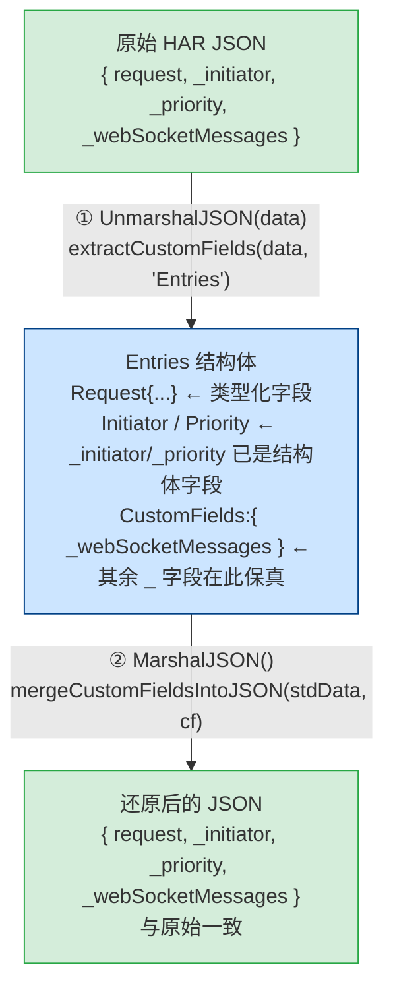
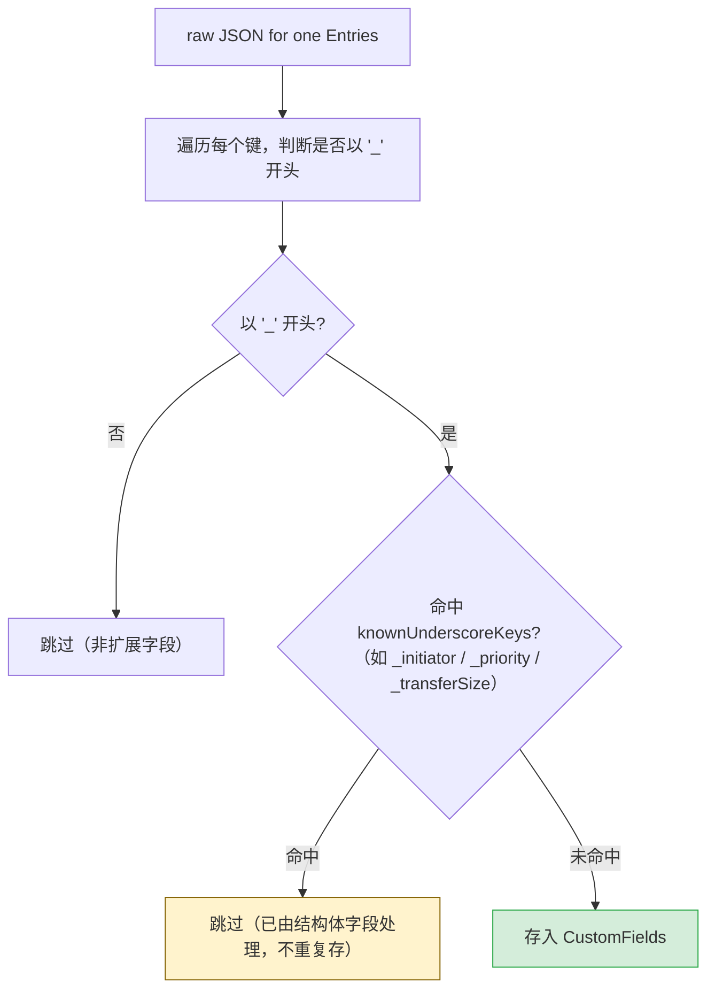
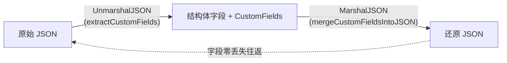

# 扩展字段保真（Custom Fields Round-trip）

HAR 规范允许任意以 `_` 开头的字段作为自定义扩展数据，例如 Chrome DevTools 写入的
`_initiator`、`_priority`、`_resourceType`、`_transferSize`。这些字段对调试和深度分析
极其重要。本页解释 har-skills 如何在不破坏类型安全的前提下，**无损往返（round-trip
保真）** 这些扩展字段。

## 1. 问题：标准 `UnmarshalJSON` 会丢弃未知字段

Go 标准库的 `encoding/json` 在把 JSON 反序列化到结构体时，遇到结构体里没有对应字段
的键，默认行为是**静默丢弃**（除非开启 `DisallowUnknownFields`）。这意味着：

```mermaid
graph LR
  subgraph SRC["原始 HAR JSON"]
    direction TB
    J1["&#34;_initiator&#34;: {...}"]
    J2["&#34;_priority&#34;: &#34;High&#34;"]
    J3["&#34;_resourceType&#34;: &#34;xhr&#34;"]
    J4["&#34;request&#34;: {...}"]
  end
  SRC -->|"json.Unmarshal"| DST
  subgraph DST["解析进 *Har（标准库默认）"]
    direction TB
    D1["// _initiator 丢了！"]:::bad
    D2["// _priority 丢了！"]:::bad
    D3["// _resourceType 丢了！"]:::bad
    D4["Request: Request{...}"]
  end
  classDef bad fill:#f8d7da,stroke:#dc3545
```



对 Chrome HAR 文件而言，这等于扔掉了一半有价值的诊断信息。

## 2. 方案：自定义 `UnmarshalJSON` / `MarshalJSON` + `CustomFields`

har-skills 为以下 9 个核心类型实现了自定义编解码：

| 类型        | 扩展字段载体           | 说明                                  |
|-------------|------------------------|---------------------------------------|
| `Har`       | `Har.CustomFields`     | 顶层对象                              |
| `Log`       | `Log.CustomFields`     | 日志容器                              |
| `Entries`   | `Entries.CustomFields` | 单条请求/响应                          |
| `Request`   | `Request.CustomFields` | 请求侧                                |
| `Response`  | `Response.CustomFields`| 响应侧                                |
| `Content`   | `Content.CustomFields` | 响应体                                |
| `Cookie`    | `Cookie.CustomFields`  | Cookie                                |
| `Pages`     | `Pages.CustomFields`   | 页面                                  |
| `Timings`   | `Timings.CustomFields` | 计时                                  |
| `Cache`     | `Cache.CustomFields`   | 缓存元数据                            |

`CustomFields` 本质就是一个带便捷方法的 map：

```go
// 自定义扩展字段集合：键名以 "_" 开头（符合 HAR 规范）
type CustomFields map[string]interface{}
```

### 2.1 往返保真流程图



<details>
<summary>ASCII 备份图</summary>

```text
        原始 HAR JSON
 ┌───────────────────────────────┐
 │ {                             │
 │   "request": {...},           │   标准 JSON 字段
 │   "_initiator": {...},        │ ├── 已被结构体字段处理 → 进入结构体
 │   "_priority": "High",        │ ├── 其余 _ 字段     → 进入 CustomFields
 │   "_webSocketMessages": [...] │
 │ }                             │
 └───────────────┬───────────────┘
                 │ ① UnmarshalJSON(data)
                 │    extractCustomFields(data, "Entries")
                 ▼
 ┌───────────────────────────────┐
 │ Entries {                     │
 │   Request: Request{...},      │   ← 类型化字段
 │   Initiator: ...,             │   ← _initiator 已是结构体字段
 │   Priority: "High",           │   ← _priority  已是结构体字段
 │   CustomFields: {             │
 │     "_webSocketMessages":...  │   ← 其余 _ 字段在此保真
 │   }                           │
 │ }                             │
 └───────────────┬───────────────┘
                 │ ② MarshalJSON()
                 │    mergeCustomFieldsIntoJSON(stdData, cf)
                 ▼
 ┌───────────────────────────────┐
 │ {                             │
 │   "request": {...},           │   ← 标准字段还原
 │   "_initiator": {...},        │   ← 结构体字段序列化
 │   "_priority": "High",        │
 │   "_webSocketMessages": [...] │   ← CustomFields 合并回去
 │ }                             │
 └───────────────────────────────┘
            还原后的 JSON（与原始一致）
```
</details>

关键点：**没有任何字段被丢弃**，类型化字段与扩展字段各司其职。

## 3. `knownUnderscoreKeys`：避免重复存储

部分 `_` 字段已经被提升为结构体的类型化字段。例如：

- `Response._transferSize` → `Response.TransferSize`（`int64`）
- `Response._error` → `Response.Error`（`string`）
- `Timings._blocked_queueing` → `Timings.BlockedQueueing`
- `Timings._blocked_proxy` → `Timings.BlockedProxy`
- `Entries._initiator` / `_priority` / `_resourceType` → 已有结构体字段

如果这些键**既**进结构体**又**进 `CustomFields`，序列化时就会写出两份，产生重复
键。`knownUnderscoreKeys` 表记录"哪些 `_` 键已被结构体吃掉"，`extractCustomFields`
会跳过它们：

```go
var knownUnderscoreKeys = map[string]map[string]bool{
    "Response": {"_transferSize": true, "_error": true},
    "Timings":  {"_blocked_queueing": true, "_blocked_proxy": true},
    "Entries":  {"_initiator": true, "_priority": true, "_resourceType": true},
}
```



<details>
<summary>ASCII 备份图</summary>

```text
                  raw JSON for one Entries
                            │
                            ▼
        ┌───────────────────┴───────────────────┐
        │  遍历每个键，判断是否以 "_" 开头        │
        └───────────────────┬───────────────────┘
                            │
            ┌───────────────┴───────────────┐
            ▼                               ▼
   命中 knownUnderscoreKeys?         其余 _ 键
   (如 _initiator / _priority)
            │                               │
            ▼                               ▼
        跳过（已由结构体                存入 CustomFields
        字段处理，不重复存）
```
</details>

## 4. 内部函数

### `extractCustomFields(data, typeName)`

从原始 JSON 字节里抽出 `_` 前缀字段，跳过已知键：

```go
func extractCustomFields(data []byte, typeName string) CustomFields {
    var raw map[string]json.RawMessage
    if err := json.Unmarshal(data, &raw); err != nil {
        return nil
    }
    known := knownUnderscoreKeys[typeName]
    cf := make(CustomFields)
    for key, value := range raw {
        if !strings.HasPrefix(key, "_") {
            continue
        }
        if known != nil && known[key] {
            continue // 已被结构体字段处理
        }
        var v interface{}
        if err := json.Unmarshal(value, &v); err != nil {
            cf[key] = string(value) // 解析失败的原始文本兜底
        } else {
            cf[key] = v
        }
    }
    if len(cf) == 0 {
        return nil
    }
    return cf
}
```

### `mergeCustomFieldsIntoJSON(stdData, cf)`

序列化时把 `CustomFields` 合并回标准 JSON：

```go
func mergeCustomFieldsIntoJSON(stdData []byte, cf CustomFields) ([]byte, error) {
    if len(cf) == 0 {
        return stdData, nil
    }
    var result map[string]json.RawMessage
    if err := json.Unmarshal(stdData, &result); err != nil {
        return nil, WrapJSONUnmarshalError(err)
    }
    for key, value := range cf {
        v, err := json.Marshal(value)
        if err != nil {
            return nil, NewJSONParseError("JSON序列化失败", err)
        }
        result[key] = v
    }
    data, _ := json.Marshal(result)
    return data, nil
}
```

每个类型的 `UnmarshalJSON`/`MarshalJSON` 都用**类型别名（alias）技巧**避免递归
调用自身：

```go
func (e *Entries) UnmarshalJSON(data []byte) error {
    type Alias Entries
    aux := &struct{ *Alias }{Alias: (*Alias)(e)}
    if err := json.Unmarshal(data, aux); err != nil {
        return WrapJSONUnmarshalError(err)
    }
    e.CustomFields = extractCustomFields(data, "Entries")
    return nil
}

func (e Entries) MarshalJSON() ([]byte, error) {
    type Alias Entries
    data, err := json.Marshal(Alias(e)) // 用别名走标准序列化，不触发自身
    if err != nil {
        return nil, NewJSONParseError("JSON序列化失败", err)
    }
    return mergeCustomFieldsIntoJSON(data, e.CustomFields)
}
```

> 注意 `MarshalJSON` 用的是**值接收器**，这样 `json.Marshal(h)` 无论 `h` 是值还是
> 指针都能命中自定义逻辑。

## 5. 公开 API：读写扩展字段

所有实现 `CustomFields` 的类型都暴露一致的访问接口：

| 方法                       | 作用                                   |
|----------------------------|----------------------------------------|
| `GetCustomField(name)`     | 取值，不存在返回 `nil`                  |
| `SetCustomField(name, v)`  | 设置（自动初始化 map）                  |
| `HasCustomField(name)`     | 是否存在                                |
| `DeleteCustomField(name)`  | 删除                                    |
| `CustomFieldsKeys()`       | 所有键名                                |

示例：读出 Chrome 写入的 `_webSocketMessages`，再补一个自定义字段。

```go
package main

import (
    "fmt"
    har "github.com/waystreamer/har-skills"
)

func main() {
    h, err := har.ParseHarFile("chrome-capture.har")
    if err != nil {
        panic(err)
    }

    for i := range h.Log.Entries {
        e := &h.Log.Entries[i]

        // 读取浏览器扩展字段
        if v := e.GetCustomField("_webSocketMessages"); v != nil {
            fmt.Printf("[%d] WebSocket 消息: %v\n", i, v)
        }

        // 写入自定义标记字段（自动初始化 CustomFields）
        e.SetCustomField("_analyzedBy", "har-skills/v1")
    }

    // 序列化回 JSON，所有 _ 字段（含新加的）都被保留
    out, _ := h.ToJSON(true)
    _ = out
}
```

## 6. CLI 验证保真

用 `info` 命令可以看到解析正常，再用 `export json` 往返一次比对扩展字段是否还在：

```bash
# 1. 原始 Chrome HAR（含 _initiator / _priority / _resourceType / _transferSize）
har -f chrome.har info

# 2. 导出为 JSON，扩展字段不应丢失
har -f chrome.har export json --index 0 -o entry0.json

# 3. 用 jq 核对 _ 字段
jq 'keys[] | select(startswith("_"))' entry0.json
```

```text
预期输出（示例）：
"_initiator"
"_priority"
"_resourceType"
"_transferSize"
"_error"
```

## 7. 适用场景

| 场景                                 | 价值                                            |
|--------------------------------------|-------------------------------------------------|
| 保留 Chrome DevTools 扩展字段        | 调试页面资源加载顺序、发起者链                  |
| 保留 Firefox `_sec-fetch-*` 等元数据 | 安全分析、指纹研究                              |
| 自定义工具写入 `_analyzedBy` 标记    | 流水线中去重、追溯                              |
| 二次写入 HAR 不丢字段                | 作为中间格式反复处理（redact → transform → …）   |

## 8. 局限与注意

- `CustomFields` 的值类型是 `interface{}`，深层结构会被解析成
  `map[string]interface{}` / `[]interface{}`，使用时需做类型断言。
- `SetCustomField` 不强制键名以 `_` 开头，但 HAR 规范只认 `_` 前缀；写非 `_` 键虽
  不会被丢弃，但下游工具可能不识别。
- 结构体已显式处理的 `_` 键（见 `knownUnderscoreKeys`）**不会**出现在
  `CustomFields` 里，要用对应的类型化字段访问（如 `e.Priority` 而非
  `e.GetCustomField("_priority")`）。

## 小结



通过"类型化字段处理规范键 + `CustomFields` 兜底 `_` 扩展键 +
`knownUnderscoreKeys` 去重"这套机制，har-skills 在保持强类型 API 的同时，实现了
对任意浏览器/工具扩展字段的完整保真。
