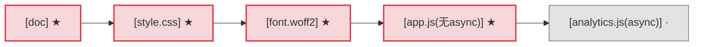
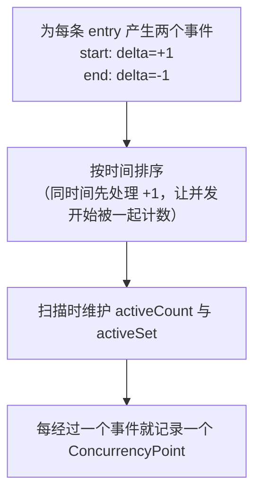
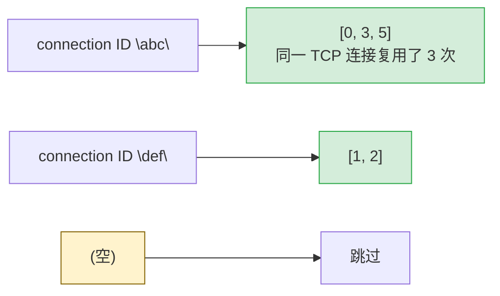

# Waterfall 分层算法

`Waterfall()` 是 har-skills 时间线分析的核心。它把每条 HAR entry 的计时数据重排成
一个带"深度（Depth）"的瀑布图数据结构，让重叠的并发请求**分到不同层**，避免在 ASCII
/可视化里互相压盖。本页拆解分层算法、关键路径、并发时间线、SLA 校验等实现细节。

## 1. 数据结构

```go
// 单条请求的计时分解
type TimingPhases struct {
    DNS, Connect, SSL, Send, Wait, Receive, Blocked time.Duration
}

// 瀑布图的一条记录
type WaterfallEntry struct {
    Index      int           // 在 Log.Entries 中的下标
    URL        string
    Method     string
    StatusCode int
    StartTime  time.Duration // 相对首个请求的偏移
    EndTime    time.Duration
    Duration   time.Duration
    Phases     TimingPhases  // 各阶段计时
    Depth      int           // 用于分层可视化
}
```

所有时间都是**相对首个请求开始时刻的偏移**，便于横向对齐比较。

## 2. Depth 分层算法

### 2.1 直觉

两条请求如果在时间上**重叠**（前一条还没结束、后一条就开始了），就不该画在同一行
——否则会互相遮挡。算法给每条 entry 算一个 `Depth`：**重叠的请求 Depth 不同**。

### 2.2 严格定义

> 对 entry `i`：遍历所有 `j < i`，若 `j` 的 `EndTime > i` 的 `StartTime`（即 `j` 还
> 没结束 `i` 就开始了，二者重叠），则
> `depth_i = max(depth_i, depth_j + 1)`。

源码（`timeline.go`）：

```go
for i := range result {
    depth := 0
    for j := 0; j < i; j++ {
        // j 与 i 重叠 当且仅当 j 的 end > i 的 start
        if result[j].EndTime > result[i].StartTime {
            if result[j].Depth+1 > depth {
                depth = result[j].Depth + 1
            }
        }
    }
    result[i].Depth = depth
}
```

### 2.3 图示：横轴时间，纵轴 Depth

下面 5 条请求，e0 和 e1、e2 都重叠，e2 又与 e3 部分重叠：

```mermaid
gantt
  title 瀑布流分层（横轴时间 ms，纵轴 Depth）
  dateFormat X
  axisFormat %Lms
  section Depth 0
  e0 (t0→t2) :0, 200
  e4 (t6→t7) :0, 600, 700
  section Depth 1
  e1 (t1→t4) :1, 100, 400
  section Depth 2
  e2 (t2→t5) :2, 200, 500
  section Depth 3
  e3 (t4→t6) :3, 400, 600
```



<details>
<summary>ASCII 备份图</summary>

```text
Depth
 3 │              ┌──────┐
 2 │        ┌─────┘ e2  │       ┌──────┐
 1 │  ┌─────┘ e1        │ ┌─────┘ e3   │
 0 │──┘e0               └─┘            │──e4──
   └─────────────────────────────────────────── 时间
     t0    t1    t2    t3    t4    t5    t6
```
</details>

逐步推演：

| entry | StartTime | EndTime | 重叠的 j (EndTime>Start_i) | Depth |
|-------|-----------|---------|----------------------------|-------|
| e0    | t0        | t2      | 无（没有 j<0）             | 0     |
| e1    | t1        | t4      | e0 (End t2 > t1)           | max(0, depth_e0+1)=1 |
| e2    | t2        | t5      | e0(t2>t2? 否), e1(t4>t2)   | max(0, depth_e1+1)=2 |
| e3    | t4        | t6      | e1(t4>t4? 否), e2(t5>t4)   | max(0, depth_e2+1)=3 |
| e4    | t6        | t7      | 无（前述都已结束）         | 0     |

> 注意：判断用的是严格大于 `>`。若 `j` 恰好在 `i` 开始时结束（EndTime == Start），
> 视为不重叠，二者可同层。

## 3. `CriticalPath()` 关键渲染路径

返回 `[]WaterfallEntry`，启发式地挑出**阻塞渲染**的请求链：

1. 首条（文档）请求**始终**在关键路径；
2. 之后逐条判断 `isCriticalResource`：
   - **CSS**（`text/css`）→ 渲染阻塞，关键；
   - **JS**（`javascript`）→ 若无 `async`/`defer` 才关键（解析器阻塞）；
   - **字体**（`font/*`、`.woff2` 等）→ CSS 引用，关键；
   - 图片、`async`/`defer` 脚本 → **不**关键。



> ★ 关键（阻塞渲染，串行影响 LCP），· 非关键

<details>
<summary>ASCII 备份图</summary>

```text
关键路径示例（标 ★ 的为关键，· 为非关键）：

[doc] ──► [style.css] ──► [font.woff2] ──► [app.js(无async)] ──► [analytics.js(async)]
  ★          ★                 ★                ★                      ·
   └─────────┴─────────────────┴────────────────┘
            关键渲染链（阻塞渲染，串行影响 LCP）
```
</details>

`hasAsyncOrDefer` 同时检查请求头 `X-Script-Async`/`X-Script-Defer` 与
`Entries.CustomFields` 里的 `async`/`defer` 布尔标记。

## 4. `ConcurrencyTimeline()` 并发时间线

返回 `[]ConcurrencyPoint`，在每个"请求开始/结束"事件点采样当时的并发数：

```go
type ConcurrencyPoint struct {
    Time          time.Duration
    ActiveCount   int   // 该时刻并发请求数
    ActiveEntries []int // 并发的 entry 下标
}
```

算法用**事件流 + 扫描线**：

```mermaid
gantt
  title 并发时间线（横轴时间，纵轴活跃请求数）
  dateFormat X
  axisFormat %Lms
  section e0
  e0 active :0,0, 200
  section e1
  e1 active :1,100, 400
  section e2
  e2 active :2,200, 500
  section e3
  e3 active :3,400, 600
```





<details>
<summary>ASCII 备份图</summary>

```text
并发数
  3 │         ┌──┐              ← e1/e2/e3 三者重叠的峰值
  2 │    ┌────┘  └────┐
  1 │────┘            └────
  0 └──────────────────────► 时间
       e0              e1 end
         e1 start  e2 start  e3 start
```
</details>

用途：发现瞬时并发尖刺、连接池打满、限流触发点。

## 5. `SLACheck(rules) []SLAResult`

```go
type SLARule struct {
    Name       string        // 规则名
    URLPattern string        // 正则匹配 URL，空=全匹配
    Method     string        // HTTP 方法过滤，空=全匹配
    MaxTime    time.Duration // 允许的最大耗时
}

type SLAResult struct {
    Rule      SLARule
    Entry     Entries
    Actual    time.Duration
    Passed    bool
    Overshoot time.Duration // 超出阈值多少
}
```

对每条 rule，遍历所有匹配 entry（URL 正则 + 方法），比对 `actual = msToDuration(entry.Time)`
与 `rule.MaxTime`，超时则 `Passed=false` 并算出 `Overshoot`。无效正则的 rule 被跳过
（不中断整体校验）。

## 6. `PageTimingMetrics()` 页面计时

```go
type PageTimingMetrics struct {
    TTFB             time.Duration // 首个文档请求的 TTFB
    DOMContentLoaded time.Duration // 来自 Page.PageTimings.OnContentLoad
    OnLoad           time.Duration // 来自 Page.PageTimings.OnLoad
    TotalTime        time.Duration // 最早 start → 最晚 end
    DNSLookup        time.Duration // 所有 entry DNS 累加
    ConnectTime      time.Duration
    SSLTime          time.Duration
}
```

`TTFB` 取首条 entry 的 `Blocked+DNS+Connect+SSL+Send+Wait` 之和（即收到首字节前所有
阶段）。`DOMContentLoaded`/`OnLoad` 从首个 `Pages.PageTimings` 读取。

## 7. `ConnectionReuse()` 连接复用

```go
func (h *Har) ConnectionReuse() map[string][]int
```

按 `Entries.Connection`（连接 ID）分组，值为 entry 下标列表。空连接 ID 的 entry 不
纳入。用于分析 keep-alive 连接池命中、HTTP/2 多路复用。



<details>
<summary>ASCII 备份图</summary>

```text
connection ID "abc"  → [0, 3, 5]   同一 TCP 连接复用了 3 次
connection ID "def"  → [1, 2]
(空)                 → 跳过
```
</details>

## 8. 负值与单位换算

HAR 计时字段以**毫秒浮点数**存储，且用 `-1` 表示"未知"。`msToDuration` 做转换：

```go
func msToDuration(ms float64) time.Duration {
    if ms < 0 {
        return 0 // -1 等未知值统一归零，避免负时长污染瀑布图
    }
    return time.Duration(ms * float64(time.Millisecond))
}
```

## 9. CLI 一览

```bash
# ASCII 瀑布图（含 Depth 分层）
har -f capture.har waterfall

# 关键渲染路径
har -f capture.har waterfall --critical-path

# 并发时间线
har -f capture.har waterfall --concurrency

# 页面计时指标
har -f capture.har waterfall --page-timings

# SLA 校验：name:urlPattern:maxDurationMs
har -f capture.har waterfall --sla "API:/api/:2000" "Static:/static/:500"
```

## 10. SDK 调用示例

```go
package main

import (
    "fmt"
    "time"
    har "github.com/waystreamer/har-skills"
)

func main() {
    h, _ := har.ParseHarFile("capture.har")

    // 瀑布图（带分层 Depth）
    for _, w := range h.Waterfall() {
        fmt.Printf("%*s[%d] %s %dms depth=%d\n",
            w.Depth*2, "", w.Index, w.URL, w.Duration.Milliseconds(), w.Depth)
    }

    // 关键路径
    cp := h.CriticalPath()
    fmt.Printf("关键路径 %d 条请求\n", len(cp))

    // 并发时间线峰值
    var peak int
    for _, p := range h.ConcurrencyTimeline() {
        if p.ActiveCount > peak {
            peak = p.ActiveCount
        }
    }
    fmt.Println("并发峰值:", peak)

    // SLA 校验
    results := h.SLACheck([]har.SLARule{
        {Name: "API", URLPattern: "/api/", MaxTime: 2 * time.Second},
    })
    for _, r := range results {
        if !r.Passed {
            fmt.Printf("SLA 超时: %s %s 超出 %v\n",
                r.Rule.Name, r.Entry.Request.URL, r.Overshoot)
        }
    }
}
```

## 小结

| 能力                    | 数据结构                | 关键算法                       |
|-------------------------|-------------------------|--------------------------------|
| 瀑布分层                | `[]WaterfallEntry`      | `depth_i=max(depth_j+1)` 重叠  |
| 关键路径                | `[]WaterfallEntry`      | CSS/同步JS/字体 启发式         |
| 并发时间线              | `[]ConcurrencyPoint`    | 事件流 + 扫描线                |
| SLA 校验                | `[]SLAResult`           | URL 正则 + 耗时阈值            |
| 页面计时                | `*PageTimingMetrics`    | 首条 TTFB + PageTimings 字段   |
| 连接复用                | `map[string][]int`      | 按 Connection ID 分组          |

核心思想：**用 Depth 把时间重叠的请求分开到不同层**，从而把 HAR 的一维时间序列
重构为一张可读的二维瀑布图。
