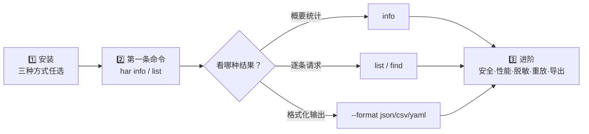

# 快速开始

用三步就能跑通 HAR Skills：装好 `har` 二进制 → 对一个真实 HAR 跑概要命令 → 切换输出格式或走 stdin。下面所有命令都可在仓库根目录直接执行。



## 第一步：安装

任选一种方式，详细对比见 [安装详解](./install.md)。

::: code-group

```bash [go install]
go install github.com/waystreamer/har-skills/cmd/har@latest
```

```bash [预编译二进制（推荐）]
# Linux x86_64
curl -sL https://github.com/waystreamer/har-skills/releases/latest/download/har-skills_0.1.0_linux_x86_64.tar.gz | tar xz
sudo mv har /usr/local/bin/
```

```bash [源码构建]
git clone https://github.com/waystreamer/har-skills.git
cd har-skills
go build -o har ./cmd/har/
```

:::

验证安装：

```bash
har --version
```

::: tip 装好后建议补一下 PATH
预编译二进制方式把 `har` 放到 `/usr/local/bin/`，通常已在 PATH 中；若 `har --version` 报找不到命令，把 `/usr/local/bin` 加入 PATH，或改放 `~/.local/bin`。
:::

## 第二步：第一条命令

仓库自带的 `testdata/example.har` 是一份真实可用的样例文件。先看概要：

```bash
har -f testdata/example.har info
```

`info` 会输出 HAR 版本、创建者、条目数、传输大小、时间分位、状态码分布、方法分布、域名分布、内容类型分布等。

再看前 5 条请求：

```bash
har -f testdata/example.har list --limit 5
```

常用过滤示例：

```bash{1,4}
# 只看 GET 且 200 的请求
har -f testdata/example.har list --method GET --status 200

# 按响应大小降序
har -f testdata/example.har list --sort size --order desc
```

::: warning 别漏 `-f`
`-f` 是全局参数，所有命令都要先指定 HAR 文件（或用 `-f -` 走 stdin）。漏写会得到 "no input file" 的错误。也可以用环境变量 `HAR_FILE` 固定它。
:::

## 第三步：stdin 与输出格式

### 从 stdin 读取

用 `-f -` 或省略 `-f` 直接管道传入：

```bash
cat capture.har | har info
cat capture.har | har list --limit 10
```

这在 CI 流水线里尤其方便——上一步产出 HAR，下一步直接交给 `har` 分析，无需落盘。

### 输出格式

`--format` 控制输出，支持 `text`（默认）、`json`、`csv`、`yaml`：

```bash{1,3}
har -f testdata/example.har info --format json
har -f testdata/example.har list --format csv --no-header
har -f testdata/example.har list --format yaml
```

| 格式 | 适用场景 |
| --- | --- |
| `text`（默认） | 终端人眼阅读、表格化概览 |
| `json` | 喂给 `jq` / 程序消费、对接 API |
| `csv` | 导入 Excel / 表格工具做透视 |
| `yaml` | 配置即数据、Git diff 友好 |

### 写入文件

`-o` / `--output` 把结果写到文件而非 stdout：

```bash{1}
har -f testdata/example.har info --format json -o report.json
har -f testdata/example.har list --format csv -o entries.csv
```

::: tip 环境变量
`HAR_FILE`、`HAR_FORMAT`、`HAR_OUTPUT` 三个环境变量分别等价于 `-f`、`--format`、`-o`，适合在 CI 里固定格式：

```bash
export HAR_FILE=capture.har HAR_FORMAT=json
har info
```
:::

## 下一步

跑通三步后，按你的目标分流继续学习：


- 熟悉全部命令：[CLI 命令参考](./cli/global-flags.md)
- 嵌入 Go 程序：[Go SDK 指南](./sdk/data-structures.md)
- 端到端场景：[安全审计工作流](./workflows/security-audit.md)、[性能优化工作流](./workflows/performance.md)
- 不熟 HAR 字段？先读 [HAR 格式入门](./har-basics.md)
