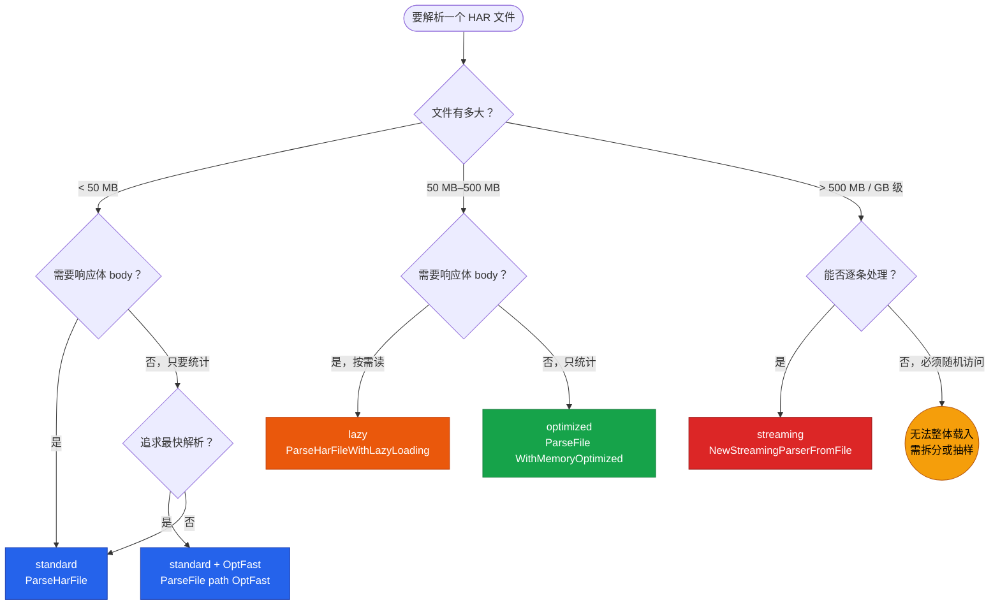
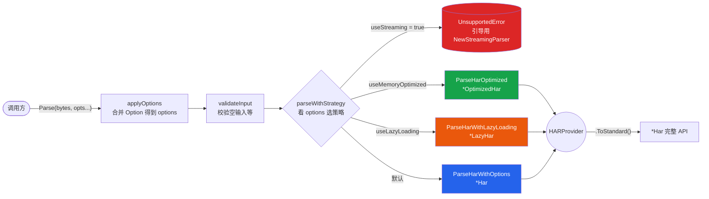

# 解析策略

har-skills 提供四种解析策略，对应不同文件规模与访问模式。它们的返回值都满足 `HARProvider` 接口，但内存占用、解析速度、对响应体的处理时机各不相同。选对策略，能在 GB 级文件下把内存从几十 GB 压到几十 MB。

## 四种策略一览

| 策略 | 入口函数 | 返回类型 | 何时解析 body | 典型场景 |
|------|---------|---------|--------------|---------|
| standard | `ParseHarFile` / `ParseHar` | `*Har` | 立即全量 | 小文件，默认 |
| optimized | `ParseHarOptimized` / `ParseHarFileOptimized` | `*OptimizedHar` | 立即全量 | 大文件统计分析 |
| lazy | `ParseHarWithLazyLoading` / `ParseHarFileWithLazyLoading` | `*LazyHar` | 首次访问时 | body 巨大但只需元数据 |
| streaming | `NewStreamingParser` / `NewStreamingParserFromFile` | `EntryIterator` | 逐条解析 | GB 级超大文件 |

### 策略选择决策图

按"文件大小 → 是否需要 body → 内存约束"三个维度逐层决策，先看下图再对照后面的决策表：



::: details 四种策略并非四套代码
它们是同一套类型在不同存储/访问约定下的实现：standard 直接读写规范结构体；optimized 在其上压缩表示；lazy 把响应体推迟到按需解析；streaming 用 `json.Decoder` 增量推进、根本不构造完整对象。
:::

## standard：零开销直接读

`standard_impl.go` 让 `*Har` 自身实现 `HARProvider`，字段就是规范结构体本身——没有包装、没有转换、没有惰性。这是 `ParseHarFile` 的默认路径，也是所有 `ToStandard()` 的最终归宿。

```go
import har "github.com/waystreamer/har-skills"

// 从文件解析（默认 standard）
h, err := har.ParseHarFile("capture.har")
if err != nil {
    log.Fatal(err)
}
// h 是 *Har，可立即访问全部字段
fmt.Println(h.Log.Creator.Name, len(h.Log.Entries))
```

`standard_impl.go` 里 `*Har` 直接实现接口方法：

```go
func (h *Har) GetVersion() string       { return h.Log.Version }
func (h *Har) GetEntries() []EntryProvider { ... }
func (h *Har) ToStandard() *Har         { return h } // 自己就是标准形态
```

`ToStandard()` 在 standard 实现里是恒等操作（返回自身），这是设计上的"零开销"承诺：当你不需要切换策略时，永远不必为抽象买单。

## optimized：枚举 + map + 指针压缩内存

`memory.go` 与 `optimized_impl.go` 把规范结构体改写成内存更紧凑的 `*OptimizedHar`：

- **HTTPMethod 枚举**：`HTTPMethod` 是 `uint8`，`ParseMethod("GET")` 把字符串映射成小整数。请求方法在高基数文件中重复极多，用 `uint8` 替代 `string` 可显著省内存。
- **Headers 改为 map**：`[]Headers` 变成 `map[string][]string`，按名查找从 O(n) 降到 O(1)，这正是 `FindByHeader` 在大文件上仍快的原因。
- **可选值用指针**：`PostData`、`Cache.BeforeRequest` 等可选字段本就是指针，optimized 把这一思路推广到更多字段，避免"零值 vs 缺省"的歧义。

```go
// 内存优化解析
oh, err := har.ParseHarFileOptimized("large.har")
if err != nil {
    log.Fatal(err)
}
// oh 是 *OptimizedHar，仍满足 HARProvider
fmt.Println(oh.GetVersion(), len(oh.GetEntries()))

// 按方法枚举检索（内部用 uint8，无字符串比较）
gets := oh.SearchByMethod(har.ParseMethod("GET"))
```

`ParseHarOptimized` 的实现是"先标准解析，再转换"——它内部调用 `ParseHar` 得到 `*Har`，再经 `ToOptimizedHar` 压缩。所以 optimized 的解析阶段并不更快，优势在于**后续访问与驻留内存**：做 `Statistics()`、`DomainSummary()`、`FindByDomain()` 这类遍历时，更小的对象意味着更少的 GC 压力和缓存未命中。

需要回到完整 `*Har` API 时调用 `ToStandard()`（或别名 `ToStandardHar()`）。

## lazy：响应体延迟加载

`lazy.go` 与 `lazy_impl.go` 的 `*LazyHar` 只解析元数据，把 `Content.Text`（响应体）的解析推迟到首次访问。它用 `sync.RWMutex` 双检锁保证并发安全且只解析一次。

适用场景：抓包文件里每条响应体几 MB，整个文件几百 MB，但你只关心 URL、状态码、计时——body 永远不会被读到。standard 会把所有 body 一次性载入内存，lazy 则让这部分内存按需分配。

```go
// 懒加载解析
lh, err := har.ParseHarFileWithLazyLoading("big.har")
if err != nil {
    log.Fatal(err)
}

// 此时响应体尚未解析，内存占用主要是元数据
for _, ep := range lh.GetEntries() {
    fmt.Println(ep.GetRequest().GetMethod(), ep.GetResponse().GetStatus())
    // 第一次调用 GetText() 才会真正解析该条目的 body
    // txt := ep.GetResponse().GetContent().GetText()
}
```

`lazyContentWrapper`/`LazyContent` 的 `ToStandard()` 在转换时才触发解析；一旦解析完成，结果被缓存，后续访问直接读缓存。双检锁的模式大致是：

```go
// 概念示意（简化自 lazy_impl.go）
func (c *LazyContent) GetText() string {
    if c.cached != "" {            // 先读锁快速路径
        return c.cached
    }
    c.mu.Lock()
    defer c.mu.Unlock()
    if c.cached != "" {            // 再检：可能已被其他 goroutine 解析
        return c.cached
    }
    c.cached = parseBodyNow(c.raw) // 真正解析
    return c.cached
}
```

## streaming：json.Decoder 增量推进

`streaming.go` 用 `encoding/json` 的 `Decoder.Token()` 增量推进，逐条 yield `*Entries`，**完全不构造顶层 `*Har` 对象**。它返回的是 `EntryIterator` 接口，而非 `HARProvider`——因为流式本质上不支持"获取全部条目"的随机访问。

适用场景：GB 级超大文件、只想逐条处理（例如导入数据库、做合规扫描）、内存极其紧张。

```go
// 流式解析
iter, err := har.NewStreamingParserFromFile("huge.har")
if err != nil {
    log.Fatal(err)
}
defer iter.Close()

var count int
for iter.Next() {
    e := iter.Entry() // *Entries
    if e.Response.Status >= 400 {
        count++
        fmt.Println("error entry:", e.Request.URL)
    }
}
if err := iter.Err(); err != nil { // 始终检查迭代错误
    log.Fatal(err)
}
```

`EntryIterator` 接口（`streaming.go`）：

```go
type EntryIterator interface {
    Next() bool       // 推进到下一条，无更多则返回 false
    Entry() *Entries  // 当前条目
    Err() error       // 迭代过程中出现的错误
    Close() error     // 关闭并释放资源
}
```

::: tip 流式不返回 HARProvider
`streaming` 是唯一不返回 `HARProvider` 的策略。它没有 `GetEntries()` / `ToStandard()`，因为那意味着把所有条目物化到内存——与流式初衷相悖。`Parse([]byte, WithStreaming())` 会返回 `UnsupportedError`，引导你改用 `NewStreamingParser`。
:::

## Parse() 统一入口如何分发

`Parse([]byte, opts ...Option)`（`parse.go`）是函数式风格的统一入口。它根据传入的 `Option` 决定走哪条策略，返回 `HARProvider`。下面的数据流图展示了 `applyOptions` → `validateInput` → `parseWithStrategy` 的分发过程，4 个分支对应 4 种实现：



```go
func Parse(harFileBytes []byte, opts ...Option) (HARProvider, error) {
    options := applyOptions(opts...)
    if err := validateInput(harFileBytes); err != nil {
        return nil, err
    }
    return parseWithStrategy(harFileBytes, options)
}
```

`parseWithStrategy` 的分发逻辑：

```go
func parseWithStrategy(b []byte, o options) (HARProvider, error) {
    if o.useStreaming {
        return nil, NewUnsupportedError("...请使用 NewStreamingParser")
    }
    if o.useMemoryOptimized {
        return ParseHarOptimized(b)   // -> *OptimizedHar
    } else if o.useLazyLoading {
        return ParseHarWithLazyLoading(b) // -> *LazyHar
    }
    return ParseHarWithOptions(b, o.toParseOptions()) // -> *Har
}
```

`ParseFile(path, opts...)` 是 `Parse` 的文件版封装：读文件后委托给 `Parse`，并在错误上附加文件路径上下文。

```go
// 用函数式选项选择策略
p, err := har.ParseFile("capture.har", har.WithMemoryOptimized(), har.WithSkipValidation())
if err != nil {
    log.Fatal(err)
}
// p 是 HARProvider；需要完整 *Har API 时
h := p.ToStandard()
fmt.Println(h.Statistics().TotalEntries)
```

## 选择决策表

| 文件大小 | 需要 body？ | 内存约束 | 推荐策略 | 推荐入口 |
|---------|-----------|---------|---------|---------|
| < 50 MB | 是 | 宽松 | standard | `ParseHarFile` |
| 50 MB–500 MB | 否（只统计） | 中等 | optimized | `ParseFile(path, WithMemoryOptimized())` |
| 50 MB–500 MB | 是（按需） | 中等 | lazy | `ParseHarFileWithLazyLoading` |
| > 500 MB / GB 级 | 否（逐条处理） | 紧张 | streaming | `NewStreamingParserFromFile` |
| 任意 | 是，且需最快 | 宽松 | standard + `OptFast` | `ParseFile(path, OptFast...)` |

几条经验法则：

- **不确定就用 standard**。它是默认，正确性最容易推理，且所有分析方法都直接可用。
- **要做大量统计分析且文件偏大**，优先 optimized。`SearchByMethod`/`SearchByURL`/`SearchByStatusCode` 这类方法在 map 与枚举上更快。
- **body 很大但你大概率不会读**，用 lazy。注意：一旦你调用 `ToStandard()` 且遍历响应体，惰性收益就消失了。
- **文件大到无法整体载入**，只能 streaming。代价是失去随机访问和大部分聚合方法；用 `iter.Next()` 逐条处理，自己累加统计。

## 下一步

- 各策略返回的 `HARProvider`/`EntryProvider` 接口族细节，见 [Provider 接口](./providers)。
- `WithMemoryOptimized`/`WithLazyLoading`/`WithStreaming` 等 Option 与预设组合，见 [函数式选项](./functional-options)。
