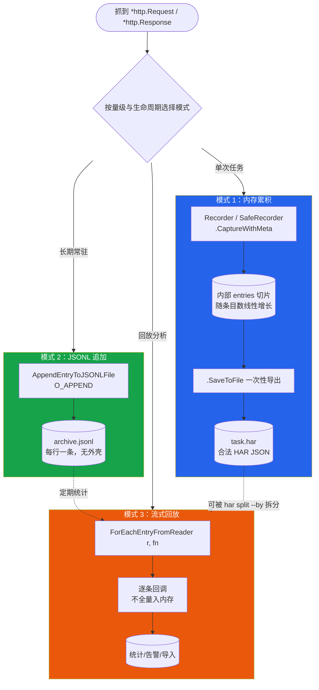
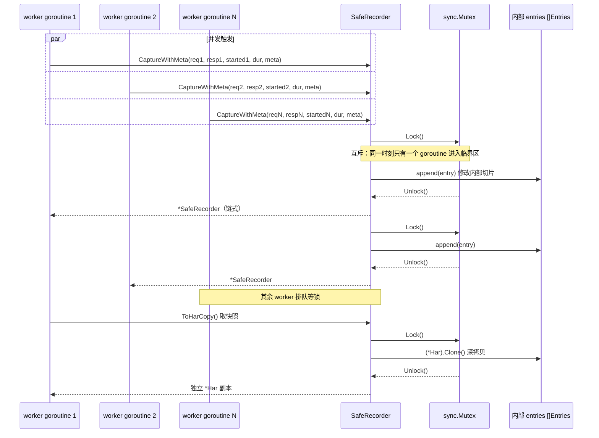
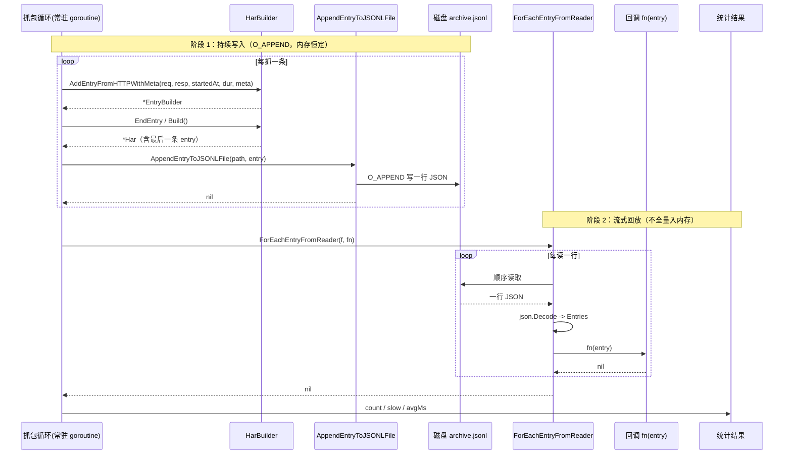

# 请求录制归档

`builder.go` 与 `http_convert.go` 提供了一组专门面向"上层抓包 → 归档成 HAR"场景的 API。本库作为底层库被网络安全/网络空间测绘系统封装时，上层系统抓到 `*http.Request` / `*http.Response` 后，无需手写 HAR 字段映射，调用一行即可落盘成符合 HAR 1.2 规范的条目。围绕"归档"这一核心动作，SDK 提供了内存累积、JSONL 持续追加、流式回放三种互补模式，覆盖单次任务、长期常驻、超大归档三类部署形态。

## 适用场景

本库的典型部署形态不是直接面向终端用户，而是作为**底层库被上层网络安全 / 网络空间测绘系统封装**：

- 上层系统持有自己的抓包通道（被动代理、流量镜像、eBPF 探针、浏览器扩展 CDP……），拿到的就是一对 `*http.Request` / `*http.Response`；
- 上层往往还掌握 req/resp 之外的额外信息——真实请求发起时间、服务器 IP、连接 ID、所属页面、发起来源（script / parser）等——这些无法从 req/resp 反推；
- 归档目标可能是"一次任务一个 HAR 文件"，也可能是"7×24 小时常驻进程持续追加一个 JSONL 归档"。

本页 API 正是为此设计：`AddEntryFromHTTPWithMeta` 接受真实开始时间与元数据；`SafeRecorder` 内置互斥锁支持多协程并发抓包；`AppendEntryToJSONLFile` / `ForEachEntryFromReader` 解决长期归档的内存与回放问题。

## 三种归档模式

按"条目量级 + 进程生命周期"选择模式：

```
┌─────────────────────────────────────────────────────────────────────┐
│                    抓到的 req / resp 往哪里写？                       │
└─────────────────────────────────────────────────────────────────────┘
        │
        │ 条目可控（单次任务 < 数万）？ ─────────── 是 ──→ 模式 1
        │                                              内存累积 + 一次性导出
        │                                              Recorder / SafeRecorder
        │                                              .CaptureWithMeta(...)
        │                                              .SaveToFile("task.har")
        │
        │ 长期常驻、抓一条写一条、内存要恒定？ ── 是 ──→ 模式 2
        │                                              JSONL 持续追加
        │                                              AppendEntryToJSONLFile
        │                                              ("archive.jsonl", entry)
        │
        │ 要回放/分析超大 JSONL 归档？ ─────────── 是 ──→ 模式 3
                                                       流式读取归档
                                                       ForEachEntryFromReader
                                                       (r, fn(entry) error)
```

三种模式对比：

| 维度 | 模式 1 内存累积 | 模式 2 JSONL 追加 | 模式 3 流式回放 |
|------|----------------|------------------|----------------|
| 适用 | 单次任务、条目可控 | 长期常驻、低内存 | 回放/分析超大归档 |
| 核心 API | `Recorder` / `SafeRecorder` | `AppendEntryToJSONLFile` | `ForEachEntryFromReader` |
| 内存 | 随条目数线性增长 | 恒定（单条 entry 大小） | 恒定（单条 entry 大小） |
| 产物 | 合法 HAR JSON（带外壳） | JSONL（每行一条，无外壳） | 不产出，只消费 |
| 写入时机 | 攒完后一次性 `SaveToFile` | 抓一条立即写一条 | 不写，只读 |
| 并发安全 | 用 `SafeRecorder` | 文件级 `O_APPEND` 原子追加 | 单 reader 顺序读 |
| 进程崩溃代价 | 未 `SaveToFile` 的全丢 | 至多丢正在写的那一条 | 只读，无写入风险 |

### 三种模式的数据流对比

把上面的决策树画成 Mermaid，三种模式从"抓到 req/resp"这一共同入口出发，走向不同的存储与回放路径：



::: tip 模式可组合
真实部署常组合使用：常驻进程用模式 2 持续追加 JSONL；定期用模式 3 流式统计；切分任务用 `har split --by` 把 JSONL 转成多个标准 HAR（模式 1 产物）交给下游分析。
:::

## 从 \*http.Request / \*http.Response 归档

`HarBuilder` 提供两个入口，差别在于"能否传真实开始时间与元数据"：

| 入口 | startedDateTime | 元数据 | 返回 | 适用 |
|------|----------------|--------|------|------|
| `AddEntryFromHTTP(req, resp, duration)` | 写死 `time.Now()` | 不接受 | `*HarBuilder` | 快速兼容、不在意时序 |
| `AddEntryFromHTTPWithMeta(req, resp, startedAt, duration, meta)` | 调用方传入真实值 | `EntryMeta` | `*EntryBuilder` | 测绘系统归档（推荐） |

旧入口 `AddEntryFromHTTP` 的致命限制是 `startedDateTime` 取当下——上层抓到 req 时可能已是几百毫秒前，密集抓包时多条目时序会错乱。新入口 `AddEntryFromHTTPWithMeta` 接受 `startedAt`（真正发起请求的时刻）和 `EntryMeta`（服务器 IP / 连接 ID / pageref / initiator / priority / resourceType 等），并返回 `*EntryBuilder` 便于后置定制。

`EntryMeta` 字段一览：

```go
type EntryMeta struct {
    ServerIPAddress string // HAR 字段 serverIPAddress
    Connection      string // HAR 字段 connection，关联复用同一连接的条目
    Pageref         string // 所属页面引用，需与 AddPage 注册的 id 对应
    InitiatorType   string // Chrome 扩展 _initiator.type，如 "script"/"parser"/"other"
    InitiatorURL    string // _initiator.url
    InitiatorLine   int    // _initiator.lineNumber
    Priority        string // Chrome 扩展 _priority，如 "High"/"Low"
    ResourceType    string // Chrome 扩展 _resourceType，如 "xhr"/"script"
    Comment         string // 条目注释
}
```

完整示例——上层有 `req / resp / startedAt / duration`，用新入口归档并后置定制，最后落盘：

```go
package main

import (
    "fmt"
    "net/http"
    "os"
    "time"

    har "github.com/waystreamer/har-skills"
)

// capture 是上层测绘系统抓到的一组数据：req/resp 之外还有真实开始时间、耗时、对端 IP。
type capture struct {
    req       *http.Request
    resp      *http.Response
    startedAt time.Time
    duration  time.Duration
    serverIP  string
    connID    string
}

func archiveOne(c capture) error {
    b := har.NewHarBuilder().
        SetCreator("cyberprobe-agent", "1.4.2").
        SetBrowser("traffic-mirror", "0.3")

    // 新入口：传真实 startedAt + 元数据，返回 *EntryBuilder 便于后置定制
    b.AddEntryFromHTTPWithMeta(
        c.req, c.resp, c.startedAt, c.duration,
        har.EntryMeta{
            ServerIPAddress: c.serverIP,
            Connection:      c.connID,
            ResourceType:    "xhr",
            Priority:        "High",
        },
    ).
        // 后置定制：补一个上层代理注入的追踪头
        AddRequestHeader("X-Probe-Trace", "probe-42").
        EndEntry()

    return b.BuildAndSave("task.har", true)
}

func main() {
    // 假装上层抓到了一条
    req, _ := http.NewRequest("GET", "https://api.example.com/v1/scan", nil)
    req.Header.Set("Authorization", "Bearer secret-token")
    resp := &http.Response{
        StatusCode: 200,
        Proto:      "HTTP/1.1",
        Header:     http.Header{"Content-Type": []string{"application/json"}},
        Body:       http.NoBody,
    }

    if err := archiveOne(capture{
        req:       req,
        resp:      resp,
        startedAt: time.Now().Add(-250 * time.Millisecond),
        duration:  120 * time.Millisecond,
        serverIP:  "203.0.113.10",
        connID:    "conn-7",
    }); err != nil {
        fmt.Fprintln(os.Stderr, err)
        os.Exit(1)
    }
}
```

::: tip Recorder 与 HarBuilder 的关系
`Recorder` 内部持有一个 `HarBuilder`，`Capture*` 系列方法转发给 builder，并额外提供 `SaveToFile` / `EntryCount` / `ToHar` 等便捷封装。但 `Recorder` 不暴露内部 builder，**要拿到 `AddEntryFromHTTPWithMeta` 返回的 `*EntryBuilder` 做后置定制，请直接用 `har.NewHarBuilder()`**——上例即如此。两条路径产物等价，选择哪条取决于你是否需要后置定制 entry。
:::

## 并发归档（SafeRecorder）

网络空间测绘系统通常是**多协程并发抓包**：一个 goroutine 接一路流量镜像，或多个 worker 并行处理不同会话。`Recorder` 内部未加锁，直接并发 `Capture` 会触发 `map`/slice 并发读写崩溃。`SafeRecorder` 在每个读写方法上加 `sync.Mutex`，开箱即用：

下图展示多 goroutine 通过 `CaptureWithMeta` 并发写入时，互斥锁如何串行化对内部 `entries` 切片的访问：



| `SafeRecorder` 方法 | 作用 |
|---------------------|------|
| `NewSafeRecorder() *SafeRecorder` | 创建并发安全录制器 |
| `SetCreator(name, version) *SafeRecorder` | 设置 creator |
| `SetBrowser(name, version) *SafeRecorder` | 设置 browser |
| `Capture(req, resp, duration) *SafeRecorder` | 兼容入口（startedDateTime 取当下） |
| `CaptureWithMeta(req, resp, startedAt, duration, meta) *SafeRecorder` | 携带真实开始时间 + 元数据 |
| `CaptureEntry(entry Entries) *SafeRecorder` | 直接追加预构建条目（不碰任何 body） |
| `EntryCount() int` | 已录制条目数 |
| `ToHar() *Har` | 内部指针（可能被后续 Capture 改，慎用） |
| `ToHarCopy() *Har` | 深拷贝快照（并发场景推荐） |
| `SaveToFile(path) error` | 缩进 JSON 保存 |
| `SaveToFileWithOptions(path, indent, gzip) error` | 可选缩进 + gzip |

完整示例——N 个 worker goroutine 并发抓包，主协程等齐后导出：

```go
package main

import (
    "fmt"
    "net/http"
    "sync"
    "time"

    har "github.com/waystreamer/har-skills"
)

func main() {
    rec := har.NewSafeRecorder().
        SetCreator("cyberprobe-distributed", "2.0").
        SetBrowser("passive-mirror", "0.5")

    const workers = 8
    var wg sync.WaitGroup
    wg.Add(workers)

    for i := 0; i < workers; i++ {
        go func(id int) {
            defer wg.Done()

            // 每个 worker 模拟抓若干条
            for j := 0; j < 50; j++ {
                req, _ := http.NewRequest("GET",
                    fmt.Sprintf("https://api.example.com/scan/%d", j), nil)
                resp := &http.Response{
                    StatusCode: 200,
                    Proto:      "HTTP/1.1",
                    Header:     http.Header{"Content-Type": []string{"application/json"}},
                    Body:       http.NoBody,
                }

                started := time.Now()
                // 多协程安全归档，带真实开始时间 + 元数据
                rec.CaptureWithMeta(
                    req, resp, started, 80*time.Millisecond,
                    har.EntryMeta{
                        ServerIPAddress: fmt.Sprintf("203.0.113.%d", id),
                        Connection:      fmt.Sprintf("conn-%d-%d", id, j%4),
                        ResourceType:    "xhr",
                    },
                )
            }
        }(i)
    }

    wg.Wait()

    fmt.Printf("archived %d entries\n", rec.EntryCount())

    // 一次性导出标准 HAR
    if err := rec.SaveToFile("distributed.har"); err != nil {
        fmt.Println("save failed:", err)
        return
    }

    // 如需在归档过程中取一份稳定快照（不等所有 worker 结束），用 ToHarCopy
    snapshot := rec.ToHarCopy()
    fmt.Printf("snapshot entries: %d\n", len(snapshot.Log.Entries))
}
```

::: warning ToHar vs ToHarCopy
`ToHar()` 返回内部 `*Har` 指针，在锁内取但返回后不再持锁——若此时另一协程 `Capture`，你拿到的切片可能正被改写。**并发场景取快照一律用 `ToHarCopy()`**（内部 `(*Har).Clone()` 深拷贝）。仅在所有抓包协程已停止、确认无人再写时，才用 `ToHar()`。
:::

## 长期持续归档（JSONL 追加）

模式 1 的软肋是"必须攒齐才落盘"：常驻进程跑一周，内存里攒百万条 entry 再 `SaveToFile`，既爆内存又让崩溃代价不可承受——未保存的全部丢失。

模式 2 用 JSON Lines（每行一条 entry 的 JSON 对象）解决：抓一条立即 `O_APPEND` 追加一行，进程崩了至多丢正在写的那一条。核心 API：

| 函数 | 作用 |
|------|------|
| `WriteEntryToWriter(w, entry) error` | 单条 entry 写成 JSONL 一行到任意 `io.Writer` |
| `AppendEntryToJSONLFile(path, entry) error` | `O_APPEND` 追加到文件，文件不存在自动建，内存恒定 |
| `ForEachEntryFromReader(r, fn) error` | 流式读 JSONL，逐条回调，不全量入内存 |
| `ReadEntriesFromReader(r) ([]Entries, error)` | 一次性读全部入切片（小归档才用） |
| `WriteEntriesToWriter(har, w) error` | 把整个 `*Har` 的 entries 写成 JSONL |
| `(*Har).ToJSONLines() (string, error)` | 同上但返回字符串 |

下面的时序图展示"常驻抓包循环 → 写盘 → 后续流式回放"的完整生命周期，写盘与回放是两个独立阶段：



示例——常驻循环抓一条写一条，之后用 `ForEachEntryFromReader` 流式统计：

```go
package main

import (
    "fmt"
    "net/http"
    "os"
    "time"

    har "github.com/waystreamer/har-skills"
)

func main() {
    archivePath := "long-running.jsonl"
    _ = os.Remove(archivePath) // 清理上次

    // 假装这是常驻抓包循环：抓到请求就追加一行
    for i := 0; i < 10000; i++ {
        req, _ := http.NewRequest("GET",
            fmt.Sprintf("https://api.example.com/scan/%d", i), nil)
        resp := &http.Response{
            StatusCode: 200,
            Proto:      "HTTP/1.1",
            Header:     http.Header{"Content-Type": []string{"application/json"}},
            Body:       http.NoBody,
        }

        started := time.Now()
        // 先用 builder 造 entry（会消费 req/resp.body），再追加到文件
        b := har.NewHarBuilder()
        b.AddEntryFromHTTPWithMeta(
            req, resp, started, 50*time.Millisecond,
            har.EntryMeta{
                ServerIPAddress: "203.0.113.10",
                ResourceType:    "xhr",
            },
        ).EndEntry()

        // AddEntryFromHTTPWithMeta 已把 entry 放进 builder 的 har，
        // 这里取最后一条追加到 JSONL 文件
        built := b.Build()
        if err := har.AppendEntryToJSONLFile(
            archivePath, built.Log.Entries[len(built.Log.Entries)-1],
        ); err != nil {
            fmt.Fprintln(os.Stderr, "append failed:", err)
        }
    }

    // 回放：流式统计，不全量入内存
    f, err := os.Open(archivePath)
    if err != nil {
        fmt.Fprintln(os.Stderr, err)
        return
    }
    defer f.Close()

    var count, slow int
    var totalMs float64
    err = har.ForEachEntryFromReader(f, func(e har.Entries) error {
        count++
        totalMs += e.Time
        if e.Time > 40 {
            slow++
        }
        return nil
    })
    if err != nil {
        fmt.Fprintln(os.Stderr, "replay failed:", err)
        return
    }
    fmt.Printf("replayed %d entries, %d slow (>40ms), avg %.1fms\n",
        count, slow, totalMs/float64(count))
}
```

::: tip 写到任意 Writer
`AppendEntryToJSONLFile` 是 `os.OpenFile(O_APPEND)` 的封装；若你的归档后端不是本地文件（如网络套接字、Kafka producer），用更底层的 `WriteEntryToWriter(w, entry)` 直接写一行。
:::

## 二进制响应体处理

归档的响应不总是文本 JSON。图片、字体、视频、`octet-stream` 等二进制 body 若直接 `string(bodyBytes)` 塞进 HAR 的 `Content.Text`，JSON 序列化时会破坏字节、往返后无法还原。

新 API 在 `addEntryFromHTTPImpl` 中自动判别：

```go
// builder.go 内部逻辑（节选）
mimeType := resp.Header.Get("Content-Type")
content := Content{Size: len(bodyBytes), MimeType: mimeType}
if isTextContentType(mimeType) {
    content.Text = string(bodyBytes)          // 文本：原样存
} else {
    content.Text = base64.StdEncoding.EncodeToString(bodyBytes)
    content.Encoding = "base64"              // 二进制：base64 编码
}
```

`isTextContentType` 的判别规则（见 `http_convert.go`）：

| Content-Type | 判定 |
|--------------|------|
| `text/*`、含 `json`/`xml`/`javascript`/`urlencoded`/`form-data` | 文本 |
| `application/*` 且不含 `image`/`audio`/`video`/`font`/`octet-stream`/`pdf`/`zip`/`gzip` | 文本 |
| `image/*`、`audio/*`、`video/*`、`font/*`、`application/octet-stream` 等 | 二进制（base64） |
| 空值 | 按文本（向后兼容） |

调用方无需任何处理——传入 `resp` 即可，SDK 读 body、判别、编码、`Close` 一气呵成。下游读 HAR 时看到 `Content.Encoding == "base64"` 就知道要 `base64.StdDecode` 还原。

## 自行组装 entry

`AddEntryFromHTTPWithMeta` 会消费 `req.Body` / `resp.Body` 并完成全部映射。但有些上层系统已经自己解析好了字段（例如从流量镜像里重组出 headers、cookies、postData），不想让 SDK 再 `io.ReadAll` 一遍。此时用三个导出辅助自行组装：

| 辅助函数 | 输入 | 输出 | 副作用 |
|----------|------|------|--------|
| `HeadersFromHTTP(http.Header) []Headers` | `net/http` 头 | HAR headers 切片（多值展开，保留大小写） | 无 |
| `CookiesFromHTTP([]*http.Cookie) []Cookie` | `net/http` cookies | HAR cookies（Name/Value/Path/Domain/HTTPOnly/Secure） | 无 |
| `PostDataFromRequest(*http.Request) (*PostData, int)` | `http.Request` | PostData + body 字节数 | **会消费并 Close `req.Body`** |

`PostDataFromRequest` 自动识别 `Content-Type`：`application/x-www-form-urlencoded` 解析成 `PostData.Params`，其余存进 `PostData.Text`。

示例——上层已有解析好的字段，手动组装 entry 并追加到 JSONL：

```go
package main

import (
    "bytes"
    "io"
    "net/http"
    "os"
    "time"

    har "github.com/waystreamer/har-skills"
)

func main() {
    // 假装上层已重组好 headers，不希望 SDK 碰 body
    httpReq, _ := http.NewRequest("POST",
        "https://api.example.com/v1/report", nil)
    httpReq.Header = http.Header{
        "Content-Type":  []string{"application/x-www-form-urlencoded"},
        "Authorization": []string{"Bearer xyz"},
    }
    httpReq.Body = io.NopCloser(bytes.NewReader([]byte("id=42&src=probe")))
    // 注意：PostDataFromRequest 会消费 req.Body，这里只是演示

    // 复用导出辅助，不动 entry 的其它字段
    headers := har.HeadersFromHTTP(httpReq.Header)
    postData, bodySize := har.PostDataFromRequest(httpReq)
    cookies := har.CookiesFromHTTP(httpReq.Cookies())

    entry := har.Entries{
        StartedDateTime: time.Now(),
        Time:            42,
        Request: har.Request{
            Method:      httpReq.Method,
            URL:         httpReq.URL.String(),
            HTTPVersion: httpReq.Proto,
            Headers:     headers,
            Cookies:     cookies,
            PostData:    postData,
            HeadersSize: har.EstimateHeaderSize(headers),
            BodySize:    bodySize,
        },
        Response: har.Response{HeadersSize: -1, BodySize: -1},
        Timings:   har.Timings{Wait: 42, Blocked: -1, DNS: -1, Connect: -1, Send: -1, Receive: -1, Ssl: -1},
    }

    // 手动追加到 JSONL 归档
    if err := har.AppendEntryToJSONLFile("manual.jsonl", entry); err != nil {
        os.Exit(1)
    }
}
```

::: tip 为什么 BodySize 要单独拿
`PostDataFromRequest` 返回的第二个值是 body 字节数，正是 `Request.BodySize`。`AddEntryFromHTTPWithMeta` 内部也是这么填的——自行组装时别忘了设这个字段，否则 HAR 的 body 大小会是默认 `-1`。
:::

## 重要注意事项

::: warning AddEntryFromHTTP\* 会消费并关闭 req.Body / resp.Body
`AddEntryFromHTTP` / `AddEntryFromHTTPWithMeta` / `PostDataFromRequest` 内部都会 `io.ReadAll` 后 `Close` 请求体与响应体。**若上层在归档之后仍需响应体（例如做内容匹配、写另一份日志），必须在调用前缓存副本：**

```go
// 缓存 resp.Body 副本，归档用原件、业务用副本
bodyBytes, _ := io.ReadAll(resp.Body)
resp.Body.Close()

// 归档：SDK 会再次读取并 Close 这个已重置的 body
resp.Body = io.NopCloser(bytes.NewReader(bodyBytes))
rec.CaptureWithMeta(req, resp, startedAt, dur, meta)

// 业务侧继续用副本
useBody(bodyBytes)
```

`http.NoBody` 等空 body 不受影响（`isNilReader` 判空后跳过）。
:::

::: warning ToHar() 返回内部指针，并发场景用 ToHarCopy()
`SafeRecorder.ToHar()` 在锁内取指针但返回后不持锁，另一协程的 `Capture` 可能正在改写其底层 slice。**并发归档过程中取快照一律用 `ToHarCopy()`**（内部 `(*Har).Clone()` 深拷贝），仅在确认所有抓包协程已停止时才用 `ToHar()`。
:::

::: warning JSONL 不是合法 HAR JSON
JSONL 归档每行是一个独立的 `Entries` JSON 对象，**没有 HAR 规范要求的 `{"log": {...}}` 外壳**，直接 `har.ParseHarFile()` 解析会失败。JSONL 仅供追加归档与流式回放（`ForEachEntryFromReader` / `ReadEntriesFromReader`）。要产出符合规范、可被任何 HAR 工具消费的标准 HAR 文件，用 `Recorder.SaveToFile` 或 `SafeRecorder.SaveToFile`。
:::

## 下一步

- 把归档产物交给分析模块：见 [过滤与链式结果](./filtering) 找出特定条目，见 [导出能力](./export) 转 curl/Postman。
- 归档后做安全审计：`SecurityAudit()` / `CookieAudit()`，见 [数据结构](./data-structures)。
- 长期归档切分管理：CLI `har split --by time --interval 30m` 把大归档切成可管理的小块。
