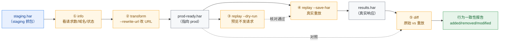
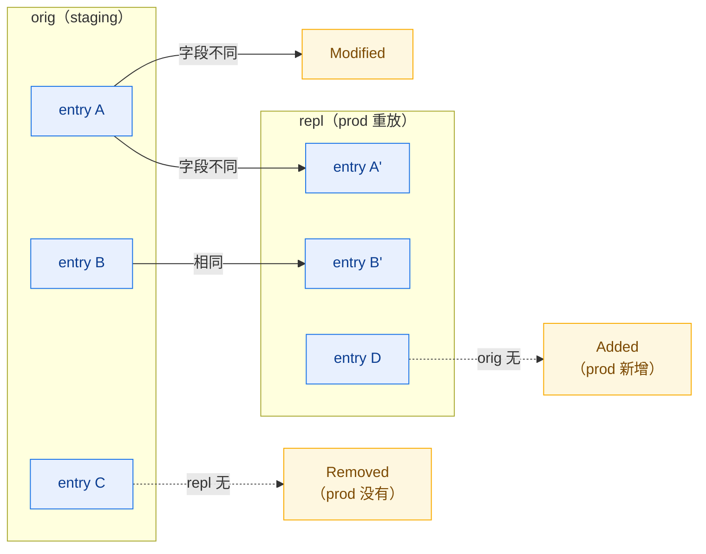
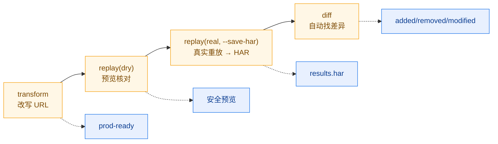

# API 迁移测试工作流

把 staging 环境的抓包改写成指向 prod 的请求，先 dry-run 预览，再真实重放并把结果存成
HAR，最后与原始抓包 diff，自动发现迁移前后的行为差异。本工作流适合 API 版本升级、
域名切换、协议从 HTTP 升 HTTPS 等迁移场景。

## 工作流总览



::: warning 迁移工作流会发真实请求
③ 的 `--dry-run` 不发流量；但 ④ 的 `replay`（无 `--dry-run`）会向 prod 真实发请求。务必先 dry-run 核对 URL/数量，确认无误再实跑。
:::

| 步骤 | CLI 命令                                                       | SDK 方法                          |
|------|----------------------------------------------------------------|-----------------------------------|
| 1    | `har -f staging.har info`                                      | `h.Statistics()` / `h.Summary()`  |
| 2    | `har -f staging.har transform --rewrite-url "a->b" -o ...`     | `h.RewriteURL(from, to)`          |
| 3    | `har -f prod-ready.har replay --dry-run`                       | `e.Replay(opts)`（不发请求）      |
| 4    | `har -f prod-ready.har replay --timeout 10s --save-har ...`    | `e.Replay(opts)`                  |
| 5    | `har diff staging.har results.har --compare-by-url`           | `har.Diff(h1, h2, opts)`          |

## 第 1 步：摸清 staging 抓包

### CLI

```bash
har -f staging.har info              # 概览：请求数、域名、状态码、计时分位
har -f staging.har info --format json
```

### SDK

```go
h, _ := har.ParseHarFile("staging.har")
fmt.Println(h.Summary())             // 文本摘要
stats := h.Statistics()              // 结构化统计
fmt.Printf("请求数=%d 域名数=%d\n", stats.RequestCount, len(stats.Domains))
```

目的：确认抓包完整、请求覆盖了要迁移的 API 路径。

## 第 2 步：改写 URL 指向 prod

### CLI

```bash
har -f staging.har transform \
    --rewrite-url "http://staging.example.com->https://api.example.com" \
    -o prod-ready.har
```

`--rewrite-url` 格式为 `from->to`，对每条 entry 的 URL 做子串替换。可叠加多个
`--rewrite-url`、配合 `--change-scheme "http->https"`、`--remove-header`、
`--add-header "X-Env:prod"` 等。

### SDK

```go
// Rewrites every URL, returns a new *Har (original untouched)
prodReady := h.RewriteURL(
    "http://staging.example.com",
    "https://api.example.com",
)
// 也可叠加其他变换
prodReady = prodReady.RemoveHeaders([]string{"Authorization"})
prodReady = prodReady.AddHeaders(map[string]string{"X-Env": "prod"}, "request")
```

`RewriteURL` 返回**克隆后的新 `*Har`**，原 staging 抓包不被修改——这是 har-skills
"返回新实例"约定的体现。更复杂的批量变换用 `h.Transform(rules)`，传入
`[]TransformRule`（`TransformURLRewrite`/`TransformHeaderRemove`/...）。

## 第 3 步：dry-run 预览（不发请求）

### CLI

```bash
har -f prod-ready.har replay --dry-run
```

`--dry-run` 只把每条 entry 转成 `http.Request` 并打印，**不实际发请求**，用于在重放
前核对 URL/Header/Body 改写是否正确。

### SDK 等价

```go
for i := range prodReady.Log.Entries {
    e := &prodReady.Log.Entries[i]
    req, err := e.ToHTTPRequest()   // 只构造，不发送
    if err != nil {
        log.Printf("[%d] %v", i, err)
        continue
    }
    fmt.Printf("[%d] %s %s\n", i, req.Method, req.URL)
}
```

`ToHTTPRequest()` 是 `Entries` 的方法，把 HAR entry 还原成标准库
`*http.Request`（方法、URL、Header、Cookie、PostData.Body、Content-Type）。

## 第 4 步：真实重放并保存为 HAR

### CLI

```bash
har -f prod-ready.har replay \
    --timeout 10s \
    --skip-ssl \
    --header "Authorization:Bearer ${PROD_TOKEN}" \
    --save-har results.har \
    --filter "api/"
```

关键开关：`--timeout`、`--no-follow-redirects`、`--max-redirects`、`--skip-ssl`、
`--header "K:V"`（覆盖请求头，可多次）、`--index N`（只重放某条）、`--filter pat`
（URL 子串过滤）、`--save-har`（把重放结果写成新 HAR）。

### SDK

```go
opts := har.DefaultReplayOptions()
opts.Timeout = 10 * time.Second
opts.SkipSSLVerify = true
opts.OverrideHeaders = map[string]string{
    "Authorization": "Bearer " + os.Getenv("PROD_TOKEN"),
}

for i := range prodReady.Log.Entries {
    e := &prodReady.Log.Entries[i]
    result, err := e.Replay(opts)   // 真实发送
    if err != nil {
        log.Printf("[%d] %v", i, err)
        continue
    }
    fmt.Printf("[%d] %d  %v\n", i, result.Response.StatusCode, result.Duration)
    _ = result.Response.Body.Close()
}
```

`Replay` 是 `Entries` 方法，返回 `*ReplayResult`：

```go
type ReplayResult struct {
    Entry    *Entries       // 原始 entry
    Response *http.Response // HTTP 响应
    Duration time.Duration  // 实际耗时
    Error    error
    Index    int
}
```

CLI 的 `--save-har` 会把每条 `ReplayResult` 的响应回填成新的 `Entries`，再序列化成
HAR——这正是第 5 步 diff 的输入。

## 第 5 步：diff 原始 vs 重放结果

### CLI

```bash
har diff staging.har results.har --compare-by-url
```

常用开关：`--compare-by-url`（按 URL 匹配而非下标）、`--include-body`（比较响应
体）、`--ignore-headers Cookie,Date`、`--ignore-timings`、`--ignore-dates`。

### SDK

```go
orig, _ := har.ParseHarFile("staging.har")
repl, _ := har.ParseHarFile("results.har")

diffOpts := har.DefaultDiffOptions()
diffOpts.CompareByURL = true
diffOpts.IgnoreHeaders = []string{"Cookie", "Date", "Set-Cookie"}

d := har.Diff(orig, repl, diffOpts)
fmt.Println(d.Report("text"))   // 也可 "json" / "csv" / "markdown"
fmt.Printf("总变更数: %d\n", d.TotalChanges())
```

`Diff` 返回 `*HarDiff`，分类给出 `Added`/`Removed`/`Modified` 三类变更；
`Report(format)` 输出文本/JSON/CSV/Markdown 报告；`HasChanges()` 可直接当 CI
门禁布尔值。

### diff 分类



## 完整端到端脚本

```bash
#!/usr/bin/env bash
# api-migration.sh — staging→prod URL 改写 + dry-run + 重放 + diff
set -euo pipefail

STAGING="${1:?staging.har 路径}"
PROD_BASE="${2:-https://api.example.com}"
STAGING_BASE="${3:-http://staging.example.com}"
WORKDIR="$(mktemp -d)"
trap 'rm -rf "$WORKDIR"' EXIT

PROD_READY="$WORKDIR/prod-ready.har"
RESULTS="$WORKDIR/results.har"
DIFF_REPORT="$WORKDIR/diff.txt"

echo "==> 1/5 staging 概览"
har -f "$STAGING" info

echo "==> 2/5 改写 URL: $STAGING_BASE -> $PROD_BASE"
har -f "$STAGING" transform \
    --rewrite-url "${STAGING_BASE}->${PROD_BASE}" \
    --change-scheme "http->https" \
    -o "$PROD_READY"

echo "==> 3/5 dry-run 预览（不发送请求）"
har -f "$PROD_READY" replay --dry-run | head -20

echo "==> 4/5 真实重放并保存为 HAR"
har -f "$PROD_READY" replay \
    --timeout 10s \
    --skip-ssl \
    --header "Authorization:Bearer ${PROD_TOKEN:-CHANGEME}" \
    --save-har "$RESULTS"

echo "==> 5/5 diff 原始 vs 重放结果（按 URL 匹配）"
har diff "$STAGING" "$RESULTS" \
    --compare-by-url \
    --ignore-headers Cookie,Date,Set-Cookie \
    --ignore-timings \
    | tee "$DIFF_REPORT"

cp "$RESULTS" ./results.har 2>/dev/null || true
cp "$DIFF_REPORT" ./diff.txt 2>/dev/null || true
echo "完成: results.har + diff.txt"

# CI 门禁：有变更则报警
if har diff "$STAGING" "$RESULTS" --compare-by-url >/dev/null 2>&1; then
    :
fi
```

运行：

```bash
export PROD_TOKEN="eyJhbGciOi..."
./api-migration.sh staging.har https://api.example.com http://staging.example.com
```

## CI 门禁示例

把"迁移不能引入行为变更"做成 CI 检查：

```bash
#!/usr/bin/env bash
set -euo pipefail
STAGING="$1"; RESULTS="$2"

d=$(har diff "$STAGING" "$RESULTS" --compare-by-url --ignore-timings)
echo "$d"
if echo "$d" | har diff "$STAGING" "$RESULTS" --compare-by-url >/dev/null; then
    : # diff 命令成功退出不代表无变更
fi
# 用 SDK 侧 HasChanges() 更可靠；CLI 侧可通过报告非空判断
```

::: warning CLI diff 退出码不可靠
CLI `diff` 不论有无变更都返回 0，不能直接当门禁。要严格门禁，推荐用 SDK 的 `HasChanges()`，见下方 SDK 等价端到端。
:::

## SDK 等价端到端

```go
package main

import (
    "fmt"
    "log"
    "os"
    "time"
    har "github.com/waystreamer/har-skills"
)

func main() {
    // 1. 解析 staging
    staging, err := har.ParseHarFile("staging.har")
    if err != nil {
        log.Fatal(err)
    }

    // 2. 改写 URL（克隆，不改原对象）
    prodReady := staging.RewriteURL(
        "http://staging.example.com",
        "https://api.example.com",
    )

    // 3 & 4. 重放
    opts := har.DefaultReplayOptions()
    opts.Timeout = 10 * time.Second
    opts.OverrideHeaders = map[string]string{
        "Authorization": "Bearer " + os.Getenv("PROD_TOKEN"),
    }
    for i := range prodReady.Log.Entries {
        e := &prodReady.Log.Entries[i]
        res, err := e.Replay(opts)
        if err != nil {
            log.Printf("[%d] %v", i, err)
            continue
        }
        fmt.Printf("[%d] %d %v\n", i, res.Response.StatusCode, res.Duration)
        res.Response.Body.Close()
    }

    // 5. diff（这里用原始 staging 与 prodReady 的概念差异；
    //    真实重放结果需先用 --save-har 产物）
    repl, _ := har.ParseHarFile("results.har")
    diffOpts := har.DefaultDiffOptions()
    diffOpts.CompareByURL = true
    d := har.Diff(staging, repl, diffOpts)
    fmt.Println(d.Report("text"))
    if d.HasChanges() {
        fmt.Printf("迁移引入 %d 处变更\n", d.TotalChanges())
    }
}
```

## 输出物清单

| 文件             | 来源                          | 用途                      |
|------------------|-------------------------------|---------------------------|
| `prod-ready.har` | `transform --rewrite-url`     | 指向 prod 的可重放抓包    |
| `results.har`    | `replay --save-har`           | prod 真实响应记录         |
| `diff.txt`       | `har diff`                    | 迁移前后行为差异报告      |

## 小结



::: tip 四步自动化
- **transform** 把抓包从 staging 域改写到 prod 域，全程克隆不改原件；
- **replay --dry-run** 是"扣扳机前的最后一道核对"；
- **replay --save-har** 把真实 prod 响应固化为可 diff 的 HAR；
- **diff** 用 URL 匹配自动比对，让"迁移有没有改变行为"可量化。

四步组合，把"迁移"从人工核对变成可重复、可门禁的自动化流水线。
:::
