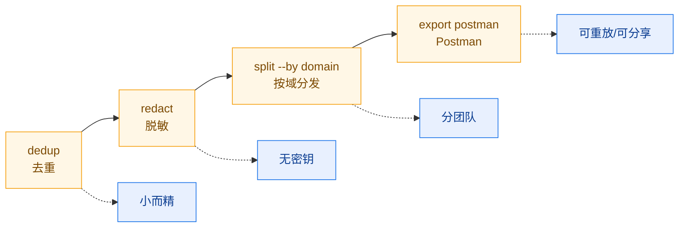

# 数据清洗与分享工作流

把一份原始、杂乱、含敏感信息且体积庞大的抓包，清洗成"去重、脱敏、按域拆分、可导入
Postman"的工单友好产物。本工作流串联 dedup、redact、split、export 四步，每步都给 CLI
与对应 SDK 方法。

## 工作流总览

```mermaid
flowchart LR
    RAW["raw.har<br/>体积大/重复多/含密钥"]:::input
    DD["① dedup --remove<br/>去重"]:::step
    DED["deduped.har"]:::art
    RD["② redact --redact-ips<br/>脱敏"]:::step
    CL["clean.har"]:::art
    SP["③ split --by domain<br/>按域拆分"]:::step
    SH["per-domain_*.har<br/>按域分文件"]:::art
    EX["④ export postman<br/>导出集合"]:::step
    COL["collection.json<br/>（Postman）"]:::done

    RAW --> DD --> DED --> RD --> CL --> SP --> SH --> EX --> COL

    classDef input fill:#e8f0fe,stroke:#1a73e8,color:#0b3d91
    classDef step fill:#fff7e6,stroke:#f59e0b,color:#7c4a03
    classDef art fill:#f6f8fa,stroke:#6b7280,color:#24292f
    classDef done fill:#e6f4ea,stroke:#1e8e3e,color:#0d652d
```



::: tip 工作流目标
把一份原始、杂乱、含敏感信息且体积庞大的抓包，清洗成"去重、脱敏、按域拆分、可导入 Postman"的工单友好产物。
:::

| 步骤 | CLI 命令                                         | SDK 方法                          |
|------|--------------------------------------------------|-----------------------------------|
| 1    | `har -f raw.har dedup --remove -o deduped.har`   | `h.Deduplicate(opts)`             |
| 2    | `har -f deduped.har redact --redact-ips -o ...`  | `h.Redact(opts)`                  |
| 3    | `har -f clean.har split --by domain -o per-domain` | `h.SplitByDomain()`             |
| 4    | `har -f clean.har export postman -o collection.json` | `h.ToPostmanCollection()`     |

## 第 1 步：去重

### CLI

```bash
# 默认 pattern 策略，忽略缓存破坏器参数（_、cb、timestamp…），保留首次出现
har -f raw.har dedup --remove -o deduped.har

# 仅查找不删除（预览重复情况）
har -f raw.har dedup

# 精确 URL 匹配
har -f raw.har dedup --strategy exact

# 内容哈希匹配（含响应体）
har -f raw.har dedup --strategy content-hash --compare-body
```

三种策略对比：

::: info 三种去重策略
| 策略               | 匹配键                      | 适用场景                       |
|--------------------|-----------------------------|--------------------------------|
| `exact`            | 完整 URL 串                 | 严格相同请求（含所有参数）    |
| `pattern`（默认）  | URL + 去掉忽略参数          | 排除缓存破坏器后的同义请求    |
| `content-hash`     | URL+headers+body 的 SHA-256 | 完全相同的请求/响应对          |

`--ignore-param` 可追加要忽略的参数；`--compare-headers`/`--compare-body` 扩大比较面。
:::

### SDK

```go
h, _ := har.ParseHarFile("raw.har")

// 默认：pattern 策略 + 常见缓存破坏器
deduped := h.Deduplicate(har.DefaultDeduplicateOptions())

// 自定义：精确 URL，忽略 ts 参数
opts := har.DeduplicateOptions{
    Strategy:     har.DedupExactURL,
    IgnoreParams: []string{"ts"},
}
deduped = h.Deduplicate(opts)

// 只查找不删除
groups := h.FindDuplicates(opts)
for _, g := range groups {
    fmt.Printf("重复 %d 次: %s (entries: %v)\n", g.Count, g.Key, g.EntryIndices)
}
```

`Deduplicate` 返回**克隆后的新 `*Har`**，保留每组重复里**首次出现**的 entry；
`FindDuplicates` 只分析不动数据，返回 `[]DuplicateGroup`。

## 第 2 步：脱敏

### CLI

```bash
har -f deduped.har redact --redact-ips -o clean.har
```

可选：`--header X-Custom`、`--cookie session`、`--query-param token`、
`--post-field secret`、`--replacement "***"`。

### 默认脱敏目标

| 类别           | 默认匹配项（大小写不敏感）                                   |
|----------------|--------------------------------------------------------------|
| Headers        | Authorization、Proxy-Authorization、WWW-Authenticate、Cookie、Set-Cookie、X-Api-Key、X-Auth-Token、X-CSRF-Token |
| Cookies        | session、token、auth、password、secret、api_key、access_token、refresh_token |
| QueryParams    | password、token、api_key、secret、access_token、refresh_token、private_key、client_secret |
| PostDataFields | 同 QueryParams                                               |
| IPs            | `--redact-ips`：IPv4 末段 `.0`，IPv6 末段 `:0`               |

### SDK

```go
opts := har.DefaultRedactOptions()
opts.RedactIPs = true
clean := deduped.Redact(opts)   // 返回新 *Har，deduped 不变
data, _ := clean.ToJSON(true)
os.WriteFile("clean.har", data, 0644)
```

`Redact` 内部 `Clone()` + `RedactInPlace`，原件安全。详见
[安全审计工作流](/zh/workflows/security-audit) 第三步。

## 第 3 步：按域拆分

### CLI

```bash
# 按域拆分，输出 per-domain_api.example.com.har / per-domain_static.example.com.har ...
har -f clean.har split --by domain -o per-domain

# 其他维度
har -f clean.har split --by page
har -f clean.har split --by time --interval 30m
har -f clean.har split --by size --max-entries 50
har -f clean.har split --by status
har -f clean.har split --by method
```

`-o` 是输出前缀，每个分片文件名形如 `<prefix>_<key>.har`。

### SDK

```go
byDomain := clean.SplitByDomain()   // map[string]*Har
for domain, sub := range byDomain {
    data, _ := sub.ToJSON(true)
    name := fmt.Sprintf("per-domain_%s.har", domain)
    os.WriteFile(name, data, 0644)
}

// 其他拆分维度
_ = clean.SplitByPage()                    // map[string]*Har
_ = clean.SplitByTimeRange(time.Hour)      // []*Har
_ = clean.SplitBySize(50)                  // []*Har
_ = clean.SplitByStatusCode()              // map[string]*Har
_ = clean.SplitByMethod()                  // map[string]*Har
```

`SplitByDomain` 把 entries 按 `Request.URL` 的 host 分组，每个分组是一个独立的
`*Har`（带原 HAR 的 creator/version 元数据），适合分发给不同团队。

## 第 4 步：导出为 Postman 集合

### CLI

```bash
har -f clean.har export postman -o collection.json
```

其他导出格式：`curl`、`wget`、`python`、`xml`、`yaml`、`json`、`jsonl`、`csv`、
`markdown`、`html`、`text`。

### SDK

```go
// ToPostmanCollection 返回 Postman v2.1 集合的 []byte
data, err := clean.ToPostmanCollection()
if err != nil {
    log.Fatal(err)
}
os.WriteFile("collection.json", data, 0644)
```

导出的集合可直接 `Import` 进 Postman，每条 entry 变成一个 request，带 method、URL、
headers、body。配合第 2 步的脱敏，分享给团队是安全的。

## 完整端到端脚本

```bash
#!/usr/bin/env bash
# data-cleaning.sh — 去重 → 脱敏 → 按域拆分 → 导出 Postman
set -euo pipefail

RAW="${1:?用法: data-cleaning.sh <raw.har>}"
WORKDIR="$(mktemp -d)"
OUTDIR="./cleaned-$(date +%Y%m%d-%H%M%S)"
trap 'rm -rf "$WORKDIR"' EXIT

DEDUPED="$WORKDIR/deduped.har"
CLEAN="$WORKDIR/clean.har"

echo "==> 1/4 去重 (pattern 策略, 保留首次)"
# 先预览重复情况
echo "  重复组数: $(har -f "$RAW" dedup | grep -c '^' || echo 0)"
har -f "$RAW" dedup --remove -o "$DEDUPED"
echo "  去重后 entry 数: $(har -f "$DEDUPED" info --format json | jq -r '.request_count // empty')"

echo "==> 2/4 脱敏 (+ IP 匿名)"
har -f "$DEDUPED" redact --redact-ips -o "$CLEAN"

echo "==> 3/4 按域拆分"
mkdir -p "$OUTDIR"
har -f "$CLEAN" split --by domain -o "$OUTDIR/per-domain"
echo "  分片文件:"
ls -1 "$OUTDIR"/per-domain_*.har 2>/dev/null | sed 's/^/    /'

echo "==> 4/4 导出 Postman 集合"
har -f "$CLEAN" export postman -o "$OUTDIR/collection.json"

echo "----------------------------------------"
echo "产物目录: $OUTDIR"
ls -1 "$OUTDIR"
```

运行：

```bash
chmod +x data-cleaning.sh
./data-cleaning.sh raw.har
```

## SDK 等价端到端

```go
package main

import (
    "fmt"
    "log"
    "os"
    "path/filepath"
    har "github.com/waystreamer/har-skills"
)

func main() {
    h, err := har.ParseHarFile("raw.har")
    if err != nil {
        log.Fatal(err)
    }

    // 1. 去重（pattern 策略 + 默认缓存破坏器）
    deduped := h.Deduplicate(har.DefaultDeduplicateOptions())

    // 2. 脱敏
    redactOpts := har.DefaultRedactOptions()
    redactOpts.RedactIPs = true
    clean := deduped.Redact(redactOpts)

    // 3. 按域拆分
    outDir := "cleaned"
    os.MkdirAll(outDir, 0755)
    for domain, sub := range clean.SplitByDomain() {
        data, _ := sub.ToJSON(true)
        name := filepath.Join(outDir, fmt.Sprintf("per-domain_%s.har", domain))
        os.WriteFile(name, data, 0644)
    }

    // 4. 导出 Postman
    data, err := clean.ToPostmanCollection()
    if err != nil {
        log.Fatal(err)
    }
    os.WriteFile(filepath.Join(outDir, "collection.json"), data, 0644)
    fmt.Println("cleaned/ 目录已生成")
}
```

## 输出物清单

| 文件                          | 来源                    | 用途                          |
|-------------------------------|-------------------------|-------------------------------|
| `deduped.har`                 | `dedup --remove`        | 去重后的中间产物              |
| `clean.har`                   | `redact --redact-ips`   | 可安全分享的 HAR              |
| `per-domain_<host>.har`       | `split --by domain`     | 按团队/域名分发的分片         |
| `collection.json`             | `export postman`        | Postman 可导入集合            |

## 小结



::: tip 四步前置流程
- **dedup** 用 pattern 策略滤掉缓存破坏器导致的伪重复，体积先减半；
- **redact** 抹掉 Authorization/Cookie/令牌/IP，原件克隆不改；
- **split --by domain** 把大文件切成各团队关心的切片；
- **export postman** 把 HAR 转成 Postman 集合，便于团队重放与回归。

四步组合，把"一份脏而大的抓包"变成"一组干净、分权、可重放的产物"，是数据分享与回归测试的标准前置流程。
:::
