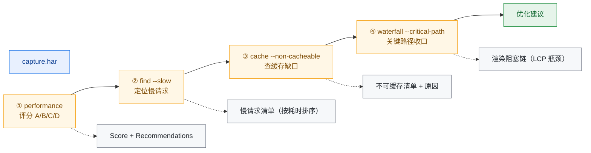
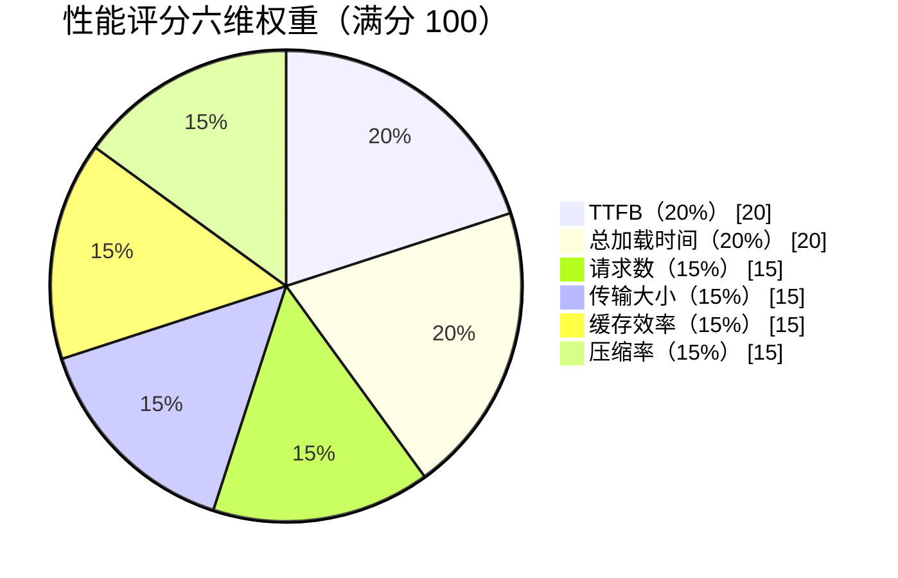
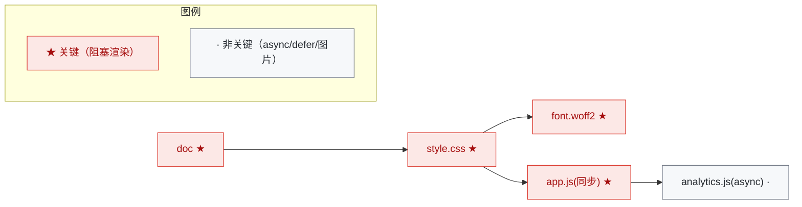
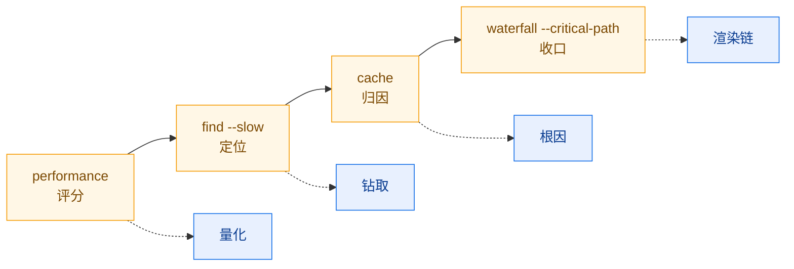

# 性能优化工作流

本工作流用 har-skills 给一份抓包打性能分、定位慢请求、诊断缓存缺口、再用水fall 关键
路径收口。Lighthouse 风格的评分 + 钻取式定位，适合回归门禁和性能优化迭代。

## 工作流总览



::: tip 工作流定位
Lighthouse 风格评分 + 钻取式定位，适合回归门禁和性能优化迭代。
:::

| 步骤 | CLI 命令                                              | SDK 方法                          |
|------|-------------------------------------------------------|-----------------------------------|
| 1    | `har -f capture.har performance`                      | `h.PerformanceScore()`            |
| 2    | `har -f capture.har find --slow 1000`                 | `h.FindSlowRequests(1000)`        |
| 3    | `har -f capture.har cache --non-cacheable`            | `h.CacheAnalysis()`               |
| 4    | `har -f capture.har waterfall --critical-path --page-timings` | `h.Waterfall()` / `h.CriticalPath()` / `h.PageTimingMetrics()` |

## 第 1 步：性能评分

### CLI

```bash
har -f capture.har performance              # 文本：评分 + 建议
har -f capture.har performance --format json
```

### SDK

```go
h, _ := har.ParseHarFile("capture.har")
perf := h.PerformanceScore()        // *PerformanceReport
fmt.Println("等级:", perf.Grade())  // "A" / "B" / "C" / "D"
fmt.Println("评分:", perf.Score)
```

### 评分构成

Lighthouse 风格，按权重加权：



| 维度              | 权重 | 关注点                                |
|-------------------|------|---------------------------------------|
| TTFB              | 20%  | 首字节时间                            |
| 总加载时间        | 20%  | 最早 start → 最晚 end                 |
| 请求数            | 15%  | 请求总数                              |
| 传输大小          | 15%  | 总字节数                              |
| 缓存效率          | 15%  | 可缓存比例                            |
| 压缩              | 15%  | 文本资源是否启用 gzip/br              |

`Grade()` 把数值映射到 A/B/C/D 等级，`Recommendations` 给出可执行的改进建议。

## 第 2 步：定位慢请求

### CLI

```bash
# 慢于 1s 的请求
har -f capture.har find --slow 1000

# 最慢的 10 条
har -f capture.har find --slowest 10
```

### SDK

```go
slow := h.FindSlowRequests(1000)   // *FilterResult, 阈值单位 ms
for _, e := range slow.SortByDurationDesc().Limit(10).GetAll() {
    fmt.Printf("%-60s %dms\n", e.Request.URL, int64(e.Time))
}
```

`FindSlowRequests(minDuration float64)` 返回 `*FilterResult`，可链式
`SortByDurationDesc().Limit(n)`。这是 har-skills 过滤结果的标准链式 API。

## 第 3 步：缓存分析

### CLI

```bash
har -f capture.har cache                    # 全量缓存分析
har -f capture.har cache --non-cacheable    # 只看不可缓存的
```

### SDK

```go
cache := h.CacheAnalysis()         // *CacheReport
for _, item := range cache.NonCacheable {
    fmt.Printf("不可缓存: %s  原因: %s\n", item.URL, item.Reason)
}
```

### 它检查什么

逐条评估 `Cache-Control`、`Expires`、`ETag`、`Last-Modified`、`Vary`，判定可缓存
性（`public`/`private`/`no-store`/`no-cache`/`max-age` 等），并标记：

- 应缓存却 `no-store` 的资源；
- 缺 `Cache-Control` 的静态资源；
- `Vary` 配置不当导致缓存命中率下降。

## 第 4 步：关键路径与页面计时

### CLI

```bash
har -f capture.har waterfall --critical-path --page-timings
```

### SDK

```go
// 瀑布图（带 Depth 分层）
for _, w := range h.Waterfall() {
    fmt.Printf("%*s[%d] %v\n", w.Depth*2, "", w.Index, w.Duration)
}

// 关键渲染路径
cp := h.CriticalPath()

// 页面计时
m := h.PageTimingMetrics()
fmt.Printf("TTFB=%v  DCL=%v  OnLoad=%v  Total=%v\n",
    m.TTFB, m.DOMContentLoaded, m.OnLoad, m.TotalTime)
```

### 关键路径是什么

`CriticalPath()` 用启发式挑出**阻塞渲染**的请求链：



::: info 启发式判定
- **CSS** (`text/css`) → 关键；
- **同步 JS**（无 `async`/`defer`）→ 关键；
- **字体** → 关键（CSS 引用）；
- 图片、`async`/`defer` 脚本 → 非关键。
:::

`Waterfall()` 还给每条 entry 算 `Depth`：重叠请求分到不同层，避免可视化压盖。详见
[Waterfall 分层算法](/zh/internals/waterfall)。

## 完整端到端脚本

```bash
#!/usr/bin/env bash
# performance.sh — 性能评分 + 慢请求 + 缓存 + 关键路径
set -euo pipefail

HAR="${1:?用法: performance.sh <capture.har>}"
WORKDIR="$(mktemp -d)"
trap 'rm -rf "$WORKDIR"' EXIT

echo "==> 1/4 性能评分"
har -f "$HAR" performance --format json -o "$WORKDIR/perf.json"
har -f "$HAR" performance        # 控制台文本摘要

echo "==> 2/4 慢请求 (>1000ms), 取最慢 15 条"
har -f "$HAR" find --slowest 15 -o "$WORKDIR/slow.txt"

echo "==> 3/4 不可缓存资源"
har -f "$HAR" cache --non-cacheable -o "$WORKDIR/non-cacheable.txt"

echo "==> 4/4 关键路径 + 页面计时"
har -f "$HAR" waterfall --critical-path --page-timings -o "$WORKDIR/waterfall.txt"

echo "----------------------------------------"
echo "产物:"
ls -1 "$WORKDIR"
cp "$WORKDIR"/* ./ 2>/dev/null || true
echo "perf.json 含 Score/Grade/Recommendations，可用于 CI 门禁"
```

运行：

```bash
chmod +x performance.sh
./performance.sh capture.har
```

## CI 门禁示例

把性能评分接入 CI，退化即失败：

```bash
#!/usr/bin/env bash
set -euo pipefail
HAR="${1:?HAR 文件路径}"

# 1. 评分不能低于 B
GRADE=$(har -f "$HAR" performance --format json | jq -r '.grade // empty')
case "$GRADE" in
    A|B) echo "性能等级 $GRADE，通过" ;;
    *)   echo "性能等级 $GRADE，未达 B 级，CI 失败" >&2; exit 1 ;;
esac

# 2. 不允许有 >2s 的请求
SLOW=$(har -f "$HAR" find --slow 2000 --format json | jq 'length')
if [ "$SLOW" -gt 0 ]; then
    echo "发现 $SLOW 条 >2s 的请求" >&2
    exit 1
fi
```

## SDK 等价端到端

```go
package main

import (
    "fmt"
    "log"
    har "github.com/waystreamer/har-skills"
)

func main() {
    h, err := har.ParseHarFile("capture.har")
    if err != nil {
        log.Fatal(err)
    }

    // 1. 评分
    perf := h.PerformanceScore()
    fmt.Printf("Grade=%s Score=%d\n", perf.Grade(), perf.Score)

    // 2. 慢请求
    for _, e := range h.FindSlowRequests(1000).SortByDurationDesc().Limit(10).GetAll() {
        fmt.Printf("  slow: %s %dms\n", e.Request.URL, int64(e.Time))
    }

    // 3. 缓存
    cache := h.CacheAnalysis()
    fmt.Printf("不可缓存: %d 条\n", len(cache.NonCacheable))

    // 4. 关键路径 + 页面计时
    cp := h.CriticalPath()
    m := h.PageTimingMetrics()
    fmt.Printf("关键路径 %d 条, TTFB=%v, OnLoad=%v\n",
        len(cp), m.TTFB, m.OnLoad)
}
```

## 输出物清单

| 文件                 | 内容                              | 用途               |
|----------------------|-----------------------------------|--------------------|
| `perf.json`          | Score/Grade/Recommendations       | CI 门禁、趋势对比  |
| `slow.txt`           | 最慢 N 条请求                     | 优化目标排序       |
| `non-cacheable.txt`  | 不可缓存资源 + 原因               | 缓存策略补漏       |
| `waterfall.txt`      | 瀑布图 + 关键路径 + 页面计时      | 可视化、汇报       |

## 小结



::: tip 四步闭环
- **打分**给出整体水位和等级，适合做门禁；
- **find --slow** 把抽象分数落到具体 URL；
- **cache** 解释"为什么慢"里跟缓存相关的部分；
- **waterfall --critical-path** 收口到渲染阻塞链，是 LCP/FCP 优化的直接抓手。

四步走完，从"分数不行"到"改哪几条请求"形成完整闭环。
:::
