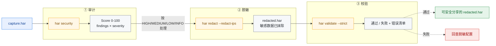
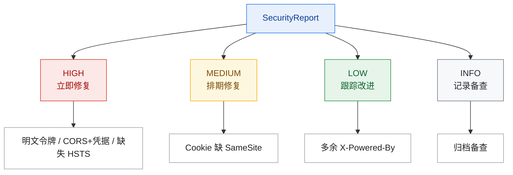
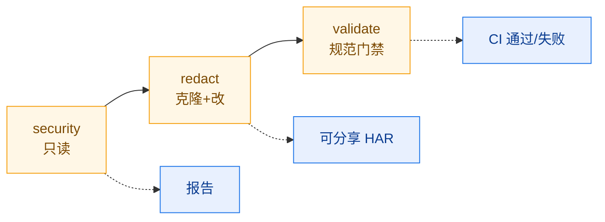

# 安全审计工作流

从一份原始 HAR 抓包，到产出可对外分享的"已脱敏且校验通过"的安全报告，本工作流串起
har-skills 的安全审计、脱敏、校验三大能力。每一步都给出 CLI 命令、对应 SDK 方法、
以及背后在做什么。

## 工作流总览



::: tip 端到端一句话
原始抓包经 `security` 出报告、按严重度处置、`redact --redact-ips` 脱敏、`validate --strict` 把关，三步串成"发现 → 处置 → 放行"的安全闭环。
:::

| 步骤 | CLI 命令                                  | SDK 方法                       | 产出                |
|------|-------------------------------------------|--------------------------------|---------------------|
| 1    | `har -f capture.har security`             | `h.SecurityAudit()`            | `*SecurityReport`   |
| 2    | 分析 findings，按 severity 处理           | `report.FindBySeverity(...)`   | 修复清单            |
| 3    | `har -f capture.har redact --redact-ips`  | `h.Redact(opts)`               | `*Har`（脱敏后）    |
| 4    | `har -f redacted.har validate --strict`   | `har.ValidateStrict(h)`        | `error` 清单        |

## 第 1 步：跑安全审计

### CLI

```bash
har -f capture.har security --format json -o security-report.json
```

可选的检查开关：`--check-headers`、`--check-cookies`、`--check-mixed-content`、
`--check-sensitive-data`、`--check-cors`、`--check-info-disclosure`、
`--severity high`。

### SDK

```go
h, _ := har.ParseHarFile("capture.har")
report := h.SecurityAudit()           // 默认全量检查
fmt.Println("安全评分:", report.Score) // 0-100
high := report.FindBySeverity("high") // 取高危
```

### 背后做什么

`SecurityAudit()` 按 `DefaultSecurityAuditOptions()` 逐项扫描：

- **Headers**：缺失安全头（`Strict-Transport-Security`、`Content-Security-Policy`、
  `X-Content-Type-Options` 等）、`Server`/`X-Powered-By` 信息泄露；
- **Cookies**：缺 `Secure`/`HttpOnly`/`SameSite`；
- **Mixed Content**：HTTPS 页面里的 HTTP 子资源；
- **Sensitive Data**：响应体里的密钥、令牌、信用卡号模式；
- **CORS**：`Access-Control-Allow-Origin: *` 配合凭据；
- **Info Disclosure**：错误页堆栈、版本号泄露。

每条 finding 带 `Severity`（HIGH/MEDIUM/LOW/INFO），最终聚合为 0–100 的
`Score`。

## 第 2 步：分析 findings 并按严重度处理



```bash
# 只看高危
har -f capture.har security --severity high --format json
```

SDK 侧可用 `report.FindBySeverity("high")` 拿到切片，逐条打印 `Title`、`URL`、
`Detail`，挂进工单系统。

## 第 3 步：脱敏敏感数据

审计只读不改。在把 HAR 交给下游（工单、第三方分析、回归测试）之前，必须**脱敏**。

### CLI

```bash
# 默认脱敏 + 匿名化 IP，产出新文件（不动原文件）
har -f capture.har redact --redact-ips -o redacted.har
```

常用开关：`--header X-Custom`、`--cookie session`、`--query-param token`、
`--post-field secret`、`--replacement "***"`、`--in-place`。

### 默认脱敏目标

| 类别           | 默认匹配项（大小写不敏感）                                   |
|----------------|--------------------------------------------------------------|
| Headers        | Authorization、Proxy-Authorization、WWW-Authenticate、Cookie、Set-Cookie、X-Api-Key、X-Auth-Token、X-CSRF-Token |
| Cookies        | session、token、auth、password、secret、api_key、access_token、refresh_token |
| QueryParams    | password、token、api_key、secret、access_token、refresh_token、private_key、client_secret |
| PostDataFields | 同 QueryParams                                               |
| IPs            | `--redact-ips` 时，IPv4 末段置 `.0`，IPv6 末段置 `:0`        |

替换文本默认 `[REDACTED]`。

### SDK

```go
opts := har.DefaultRedactOptions()
opts.RedactIPs = true                  // 匿名化服务器 IP
opts.Replacement = "[REDACTED]"
redacted := h.Redact(opts)             // 返回新 *Har，原 h 不变
data, _ := redacted.ToJSON(true)
os.WriteFile("redacted.har", data, 0644)
```

`Redact` 内部先 `Clone()` 再 `RedactInPlace`，所以**原对象不受影响**——这是
har-skills 一贯的"返回新实例"约定。

::: warning 脱敏不是审计的替代
审计只读、只产报告；脱敏才动数据。把 HAR 交给下游前必须走脱敏，否则 Authorization / Cookie / 令牌 / IP 等敏感数据会随 HAR 外泄。
:::

### 脱敏覆盖范围（一图）

::: details 点开看：一条 Entries 被脱敏时触及的字段
```text
一条 Entries 被脱敏时触及的字段：

  Request.Headers[*].Value        ← 命中 header 名 → 替换
  Request.Cookies[*].Value        ← 命中 cookie 名 → 替换
  Request.QueryString[*].Value    ← 命中 param 名 → 替换
  Request.URL                     ← 解析 query 串并替换；可选 path 规则
  Request.PostData.Params[*].Value
  Request.PostData.Text           ← key=value / JSON 两种模式按敏感键替换
  Response.Headers[*].Value
  Response.Cookies[*].Value
  ServerIPAddress                 ← RedactIPs 时匿名化
```

POST body 文本脱敏支持两种模式：URL 编码表单（`key=value&`）与 JSON
（`"key": "value"`），都按 `PostDataFields` 名单匹配。
:::

## 第 4 步：严格校验脱敏后的文件

脱敏可能动了 URL/headers，需确认产物仍符合 HAR 规范。

### CLI

```bash
har -f redacted.har validate --strict
```

`--strict` 开启更严格的检查集合；`--timings-tolerance`（默认 10ms）控制计时一致性
容差。

### SDK

```go
rH, _ := har.ParseHarFile("redacted.har")
if err := har.ValidateHarFile(rH); err != nil {
    log.Fatal("基础校验失败: ", err)
}
if err := har.ValidateStrict(rH); err != nil {
    log.Fatal("严格校验失败: ", err)
}
// 计时一致性
for _, ve := range har.ValidateTimingsConsistency(rH, 10.0) {
    log.Println(ve)
}
```

`ValidateHarFile` 检查规范必需字段（版本、creator、entries 非空、queryString 有
name、postData 有 mimeType 等）；`ValidateStrict` 额外检查 pageID 唯一、状态码范围、
Cookie SameSite、缓存字段等；`ValidateTimingsConsistency` 校验各阶段计时之和与
`entry.Time` 是否在容差内一致。

## 完整端到端脚本

```bash
#!/usr/bin/env bash
# security-audit.sh — 端到端安全审计 + 脱敏 + 校验
set -euo pipefail

HAR="${1:?用法: security-audit.sh <capture.har>}"
WORKDIR="$(mktemp -d)"
trap 'rm -rf "$WORKDIR"' EXIT

echo "==> 1/4 安全审计 (security)"
har -f "$HAR" security --format json -o "$WORKDIR/security-report.json"
# 控制台只看高危
har -f "$HAR" security --severity high

echo "==> 2/4 高危 findings 统计"
# 用 jq 数 HIGH 条数（jq 未安装时可用 har security --severity high 文本输出）
HIGH_COUNT=$(jq '[.findings[]? | select(.severity=="HIGH")] | length' \
    "$WORKDIR/security-report.json" 2>/dev/null || echo "n/a")
echo "高危 findings: $HIGH_COUNT"

echo "==> 3/4 脱敏 (redact + IP 匿名)"
har -f "$HAR" redact --redact-ips -o "$WORKDIR/redacted.har"

echo "==> 4/4 严格校验脱敏产物"
if har -f "$WORKDIR/redacted.har" validate --strict; then
    echo "校验通过，产物: $WORKDIR/redacted.har"
    cp "$WORKDIR/redacted.har" ./redacted.har
    cp "$WORKDIR/security-report.json" ./security-report.json
    echo "完成: redacted.har + security-report.json"
else
    echo "校验失败，请检查脱敏配置" >&2
    exit 1
fi
```

运行：

```bash
chmod +x security-audit.sh
./security-audit.sh capture.har
```

## 输出物清单

| 文件                    | 来源命令                  | 用途                     |
|-------------------------|---------------------------|--------------------------|
| `security-report.json`  | `security --format json`  | 工单/归档/趋势对比       |
| `redacted.har`          | `redact --redact-ips`     | 可安全分享的抓包         |
| 校验退出码              | `validate --strict`       | CI 门禁（非零即失败）    |

## SDK 等价端到端

```go
package main

import (
    "fmt"
    "log"
    "os"
    har "github.com/waystreamer/har-skills"
)

func main() {
    h, err := har.ParseHarFile("capture.har")
    if err != nil {
        log.Fatal(err)
    }

    // 1. 审计
    report := h.SecurityAudit()
    fmt.Printf("Score=%d  HIGH=%d\n", report.Score, len(report.FindBySeverity("high")))

    // 2. 脱敏（克隆，不改原对象）
    opts := har.DefaultRedactOptions()
    opts.RedactIPs = true
    redacted := h.Redact(opts)

    // 3. 校验
    if err := har.ValidateStrict(redacted); err != nil {
        log.Fatalf("脱敏产物校验失败: %v", err)
    }

    // 4. 落盘
    data, _ := redacted.ToJSON(true)
    if err := os.WriteFile("redacted.har", data, 0644); err != nil {
        log.Fatal(err)
    }
    fmt.Println("redacted.har 已生成且校验通过")
}
```

## 小结



::: tip 三步闭环
- **审计只读**：`SecurityAudit()` 不修改 HAR，只产报告；
- **脱敏克隆**：`Redact()` 返回新 `*Har`，原件安全；
- **校验兜底**：脱敏后用 `ValidateStrict` 把关，避免产物破坏下游工具。

三者组合，构成"发现 → 处置 → 放行"的安全闭环。
:::
